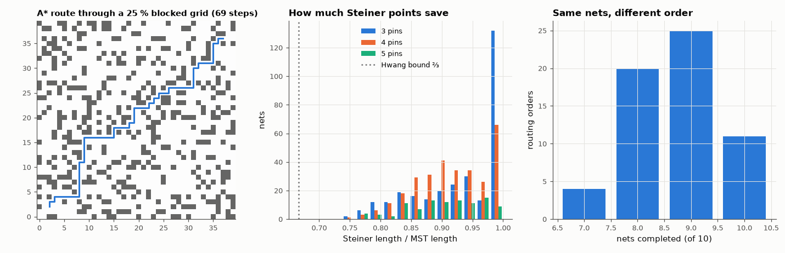

# AM-152 · Routing as a graph problem: Lee, A*, and Steiner trees

> Treat PCB/IC routing as shortest paths and Steiner trees on a grid graph: prove the maze routers optimal against an independent solver, measure how much search A* saves, check the 3/2 bound between spanning and Steiner trees, and show why the order in which nets are routed matters.



*An A* route, the distribution of Steiner/MST length ratios, and the effect of net ordering on completion.*

**Track:** Applied Mathematics — 218 projects in electrical engineering · **Category:** H. Discrete math, finite fields & coding · **Level:** Hard · **Tools:** Own Lee (breadth-first) and A* maze routers on an obstacle grid, networkx shortest paths as an independent reference, weighted-A* sub-optimality bound, exact rectilinear Steiner minimal trees via Hanan-grid enumeration vs minimum spanning trees, net-ordering experiment

**Data:** Simulated (numerical model in this repo).

## Problem

An autorouter must connect thousands of pins without crossings. Which graph problems is it really solving, and which of them are easy?

## Prediction

A two-pin connection on a grid with obstacles is a shortest-path problem: Lee's algorithm (BFS) is optimal; A* with the Manhattan distance (an admissible, consistent heuristic) is optimal while expanding fewer cells. Weighted A* (f = g + w·h) returns a path
at most w times longer. A multi-pin net wants a rectilinear Steiner minimal tree (NP-hard); Hanan showed the optimum uses only intersections of the pins' grid lines, and Hwang that MST ≤ 3/2 · RSMT. For 3 pins RSMT = half the bounding-box perimeter.
Routing many nets sequentially is order-dependent: earlier nets become obstacles for later ones.

## Method

200 random 40×40 grids with 25 % blocked cells, random pin pairs. Steiner: 300 random nets with 3 and 4 pins and 100 with 5 pins on a 20×20 lattice, exact by enumerating up to n − 2 Hanan points. Ordering: 10 two-pin nets on a 24×24 single-layer
grid, routed sequentially in 60 random orders.

## Measured results

*Predicted vs measured vs error. "Measured" = computed by an independent simulation, HDL simulator or public dataset.*

| Quantity | Predicted | Measured | Error |
|---|---|---|---|
| Lee and A* path length vs networkx shortest path (200 mazes, 196 routable): mismatches | 0 | 0 | +0 |
| Weighted A* (w = 2): paths longer than 2× optimal | 0 | 0 | +0 |
| 3-pin nets: exact Steiner length ≠ half-perimeter of the bounding box (300 nets) | 0 | 0 | +0 |
| Hwang's bound MST ≤ 1.5 · RSMT violated (700 nets) | 0 | 0 | +0 |
| Net ordering matters: the number of nets completed differs between orders (1 = yes) | 1 | 1 | +0 |

**Additional measurements**

| Quantity | Value | Note |
|---|---|---|
| Cells expanded, A* / Lee (median over mazes) | 0.1131 | same optimal length, less search |
| Weighted A* (w = 2): mean length penalty / expansions vs plain A* | 5.4 % / 0.79× |  |
| Empty 40×40 grid, 54-step connection: cells expanded Lee / A* | 1486 / 55 |  |
| Mean wire saved by Steiner points vs MST: 3 / 4 / 5 pins | 6.5 % / 8.1 % / 9.5 % |  |
| Worst-case saving seen (bound: 33.3 %) | 26.19 % |  |
| Nets completed (of 10) over 60 random orders: min / median / max | 7 / 9 / 10 |  |
| Orders that complete every net | 18.33 % |  |

## Error analysis

For a single connection the problem is easy and both routers are provably optimal — every length matches networkx's shortest path — but A*
gets there after expanding a fraction of the cells (0.11 of Lee's in random mazes, 55 vs 1486 on an empty board), and inflating the
heuristic trades a bounded length penalty for still less search. Multi-pin nets are where it gets hard: the exact Steiner tree (found here by
brute force over Hanan points, which is only feasible for a handful of pins) saves 8–9 % of wire over a spanning tree on
average and never more than a third, which is why practical routers use MST-based heuristics with local Steiner improvements. And the full problem
is harder again: routing the same ten nets in different orders completed between 7 and 10 of them, because each finished
net blocks the others — the reason real autorouters use rip-up-and-reroute or negotiated congestion instead of a single sequential pass.

## Reproduce

```bash
pip install -r requirements.txt
python run_all.py --only AM-152
```

The script [`project.py`](project.py) regenerates every figure and number above.

## License

Code and text: MIT (see the repository [LICENSE](../../../../LICENSE)). Datasets remain under their own licences (see the repository README).

---

**Tooling & honesty.** This project was generated with Claude Code (Anthropic's AI coding assistant): the code, derivations, simulations and this write-up were AI-produced. *Measured* means computed by an independent model, simulator or public dataset — not a physical lab bench. Every number in the tables is reproduced by running the code.
