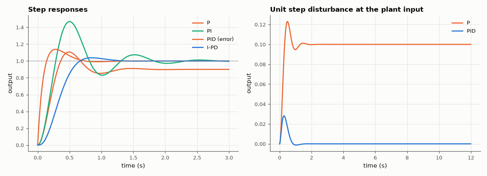

# AM-153 · PID control analysed with Laplace transforms

> Predict what each PID term does from the closed-loop transfer function — steady-state error from the final-value theorem, ramp error from the velocity constant, pole locations from coefficient matching — and check every prediction against simulated step, ramp and disturbance responses.



*Reference and disturbance step responses for P, PI, PID and I-PD control of the same plant.*

**Track:** Applied Mathematics — 218 projects in electrical engineering · **Category:** I. Control theory · **Level:** Moderate · **Tools:** Closed-loop transfer functions by polynomial algebra, final-value theorem, analytic pole placement for a PID on a second-order plant, time-domain simulation (scipy.signal.lsim), set-point weighting (I-PD), disturbance rejection

**Data:** Simulated (numerical model in this repo).

## Problem

Tuning a PID by trial and error works; but what do P, I and D each do to the closed-loop poles and errors, exactly?

## Prediction

Plant $G=\frac{5}{(s+1)(s+5)}$. **P**: $e_{ss}=\frac{1}{1+K_pG(0)}$; characteristic $s^2+6s+5+5K_p$ gives ζ and the overshoot $e^{-πζ/\sqrt{1-ζ^2}}$. **PI**: step error 0; ramp error $1/K_v$ with $K_v=K_iG(0)$.
**PID**: characteristic $s^3+(6+5K_d)s^2+(5+5K_p)s+5K_i$ — three gains place three poles anywhere: matching $(s^2+2ζω_ns+ω_n^2)(s+a)$ gives the gains in closed form. The PID's zeros appear in the reference response and add overshoot; feeding the
reference only through the integrator (I-PD) removes them so the response is the all-pole one. A step disturbance at the plant input leaves $G(0)/(1+K_pG(0))$ with P only and zero with integral action.

## Method

Simulations with scipy.signal.lsim on the closed-loop transfer functions (5 ms step). Gains: P: K_p = 9; PI: K_p = 9, K_i = 20; PID placed at ζ = 0.7, ω_n = 6 rad/s, third pole a = 12. Closed-loop poles recovered from the polynomial and the
dominant pair also fitted from the simulated I-PD response.

## Measured results

*Predicted vs measured vs error. "Measured" = computed by an independent simulation, HDL simulator or public dataset.*

| Quantity | Predicted | Measured | Error | Within tolerance |
|---|---|---|---|---|
| P control: steady-state error 1/(1 + K_p·G(0)) | 0.1 | 0.1 | -0.00 % | yes |
| P control: overshoot from ζ of s² + 6s + 5 + 5K_p | 22.95 % | 22.95 % | -0.000231 pp | yes |
| PI control: steady-state step error | 0 | -4.1627e-12 | -4.1627e-12 | yes |
| PI control: ramp-following error 1/K_v = 1/(K_i·G(0)) | 0.05 | 0.05 | -0.00 % | yes |
| PID pole placement: max distance between achieved and requested poles | 0 rad/s | 7.1607e-15 rad/s | +7.1607e-15 rad/s | yes |
| PID on the error: overshoot vs the dominant-pair formula (the controller zeros are ignored by the formula) | 4.599 % | 13.87 % | +9.27 pp | **no** |
| I-PD (reference only through the integrator): overshoot vs the formula | 4.599 % | 3.788 % | -0.811 pp | yes |
| Decay rate fitted from the simulated response = ζω_n | 4.2 1/s | 4.2 1/s | -0.00 % | yes |
| Oscillation frequency fitted from the response = ω_n√(1−ζ²) | 4.285 rad/s | 4.285 rad/s | -0.00 % | yes |
| Step disturbance, P only: residual output G(0)/(1 + K_pG(0)) | 0.1 | 0.1 | +0.00 % | yes |
| Step disturbance, PID: residual output | 0 | 5.4421e-16 | +5.4421e-16 | yes |

**Additional measurements**

| Quantity | Value | Note |
|---|---|---|
| PID gains from coefficient matching (K_p, K_i, K_d) | 26.36, 86.4, 2.88 |  |
| Peak output deviation for a unit disturbance, P / PID | 0.123 / 0.028 |  |

## Error analysis

Each term does what the algebra says. Proportional control leaves the error 1/(1 + K_pG(0)) = 10 % and an overshoot set by the damping of
s² + 6s + 5 + 5K_p. Adding the integrator removes the step error and leaves a ramp error of exactly 1/K_v. With all three terms the three
characteristic-polynomial coefficients are free, so the poles land precisely where requested. The instructive discrepancy is the overshoot:
the dominant-pair formula predicts 4.6 %, but the PID acting on the error gives 13.9 %, because the controller contributes two
closed-loop *zeros* that the formula ignores. Routing the reference through the integrator only (I-PD) keeps the same poles — the same disturbance
rejection and robustness — without the zeros, and the overshoot drops to 3.8 %, at or below the formula (the third pole slows it slightly).
Poles set stability and decay; zeros shape how a particular input excites them.

## Reproduce

```bash
pip install -r requirements.txt
python run_all.py --only AM-153
```

The script [`project.py`](project.py) regenerates every figure and number above.

## License

Code and text: MIT (see the repository [LICENSE](../../../../LICENSE)). Datasets remain under their own licences (see the repository README).

---

**Tooling & honesty.** This project was generated with Claude Code (Anthropic's AI coding assistant): the code, derivations, simulations and this write-up were AI-produced. *Measured* means computed by an independent model, simulator or public dataset — not a physical lab bench. Every number in the tables is reproduced by running the code.
