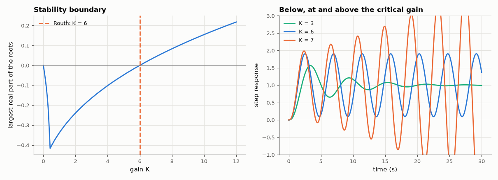

# AM-154 · Routh–Hurwitz: stability without finding the roots

> Count right-half-plane roots from the signs in the first column of the Routh array, verify against computed roots for 5000 random polynomials, handle the two special cases, and use the array to predict the gain and frequency at which a feedback loop starts to oscillate.



*Largest real part of the closed-loop poles versus gain, and step responses around the Routh stability limit.*

**Track:** Applied Mathematics — 218 projects in electrical engineering · **Category:** I. Control theory · **Level:** Moderate · **Tools:** Own Routh array (exact rational arithmetic, with the ε rule for a zero pivot and the auxiliary-polynomial rule for a zero row), Hurwitz determinants, comparison with numerically computed roots on thousands of random polynomials, critical-gain prediction checked by simulation

**Data:** Simulated (numerical model in this repo).

## Problem

Is this characteristic polynomial stable — and for which range of a gain K — without solving it?

## Prediction

The number of sign changes in the first column of the Routh array equals the number of roots with positive real part. A zero pivot is replaced by ε → 0⁺; an all-zero row signals roots symmetric about the origin (e.g. a pair on the jω axis) and is replaced by the
derivative of the auxiliary polynomial from the row above. Equivalent: all Hurwitz determinants positive. For $s^3+3s^2+2s+K$ the array gives stability for $0<K<6$; at K = 6 the auxiliary polynomial $3s^2+6$ gives oscillation at $ω=\sqrt2$ rad/s.

## Method

5000 polynomials of degree 2–8 built from random roots (kept away from the imaginary axis), floating-point Routh array vs numpy.roots. Special cases in exact arithmetic: s⁵+2s⁴+2s³+4s²+11s+10 (zero pivot; 2 RHP roots) and s⁵+7s⁴+6s³+42s²+8s+56
(zero row; roots ±j√2, ±j2). Critical gain by root sweep and oscillation period from a simulated step response at K = 6.

## Measured results

*Predicted vs measured vs error. "Measured" = computed by an independent simulation, HDL simulator or public dataset.*

| Quantity | Predicted | Measured | Error | Within tolerance |
|---|---|---|---|---|
| Routh sign changes vs number of RHP roots from numpy.roots (5000 random polynomials, degree 2–8): mismatches | 0 | 0 | +0 |  |
| Hurwitz determinant test disagrees with the roots (same polynomials) | 0 | 0 | +0 |  |
| Zero pivot (ε rule): RHP roots of s⁵+2s⁴+2s³+4s²+11s+10 | 2 | 2 | +0 |  |
| Zero row detected for s⁵+7s⁴+6s³+42s²+8s+56 (1 = yes) | 1 | 1 | +0 |  |
| … and no sign changes (no RHP roots; the roots of the auxiliary polynomial sit on the jω axis) | 0 | 0 | +0 |  |
| Auxiliary polynomial 7s⁴+42s²+56: largest root magnitude (±j2) | 2 rad/s | 2 rad/s | +0.00 % | yes |
| s³+3s²+2s+K: critical gain from the Routh array (K = 6) vs root sweep | 6 | 6 | -0.00 % | yes |
| Routh array says stable at K = 5.9 and unstable at K = 6.1 (sign changes 0 and 2) | 2 | 2 | +0 |  |
| K = 6: period of the sustained oscillation = 2π/√2 | 4.443 s | 4.443 s | +0.00 % | yes |
| K = 6: oscillation neither grows nor decays (amplitude ratio late/early) | 1 | 1 | -0.00 % | yes |

## Routh array for s³ + 3s² + 2s + K

| row | | |
|---|---|---|
| s³ | 1 | 2 |
| s² | 3 | K |
| s¹ | (6 − K)/3 | |
| s⁰ | K | |

Stable iff 6 − K > 0 and K > 0.

## Error analysis

The array's sign changes matched the true count of right-half-plane roots for all 5000 random polynomials, and the Hurwitz determinants agreed —
two views of the same test. The special cases behave as the textbook says when done in exact arithmetic: the ε rule recovers the two unstable
roots behind a zero pivot, and a zero row flags purely imaginary root pairs, located by the auxiliary polynomial. The real value of the method is
parametric: a symbolic gain K in the array gives the stability range 0 < K < 6 and the oscillation frequency √2 rad/s at the limit directly, both
confirmed by a root sweep and by a simulated response that neither grows nor decays at K = 6. Floating-point Routh arrays are fragile near zero
pivots — for plain yes/no questions on numeric polynomials, computing the roots is now cheaper; Routh remains the tool for design inequalities.

## Reproduce

```bash
pip install -r requirements.txt
python run_all.py --only AM-154
```

The script [`project.py`](project.py) regenerates every figure and number above.

## License

Code and text: MIT (see the repository [LICENSE](../../../../LICENSE)). Datasets remain under their own licences (see the repository README).

---

**Tooling & honesty.** This project was generated with Claude Code (Anthropic's AI coding assistant): the code, derivations, simulations and this write-up were AI-produced. *Measured* means computed by an independent model, simulator or public dataset — not a physical lab bench. Every number in the tables is reproduced by running the code.
