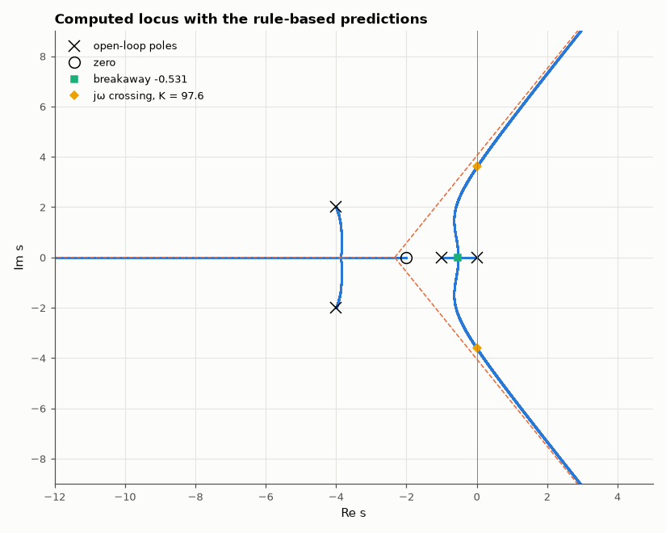

# AM-155 · Root-locus construction rules, checked against the computed locus

> Sketching rules let an engineer draw how closed-loop poles move with gain without a computer. Here each rule is turned into a numerical prediction for a fourth-order loop and compared with the locus actually computed from the characteristic polynomial.



*Numerically computed root locus with asymptotes, breakaway point and imaginary-axis crossing predicted by the sketching rules.*

**Track:** Applied Mathematics — 218 projects in electrical engineering · **Category:** I. Control theory · **Level:** Moderate · **Tools:** Numerical root locus (polynomial roots over a dense gain sweep), rule-based predictions (real-axis segments, asymptote angles and centroid, breakaway point from dK/ds = 0, jω-axis crossing from the Routh array, angle of departure), branch tracking

**Data:** Simulated (numerical model in this repo).

## Problem

Where do the closed-loop poles go as the gain is raised — and can six sketching rules really predict it?

## Prediction

$L(s)=K\frac{s+2}{s(s+1)(s^2+8s+20)}$: n = 4 poles (0, −1, −4 ± 2j), m = 1 zero (−2). Rules: (1) real-axis points left of an odd number of real poles/zeros are on the locus: (−1, 0) and (−∞, −2); (2) n − m = 3 asymptotes at ±60°, 180° from the
centroid $σ=\frac{\sum p-\sum z}{n-m}=-\frac73$; (3) breakaway where $dK/ds=0$ on (−1, 0); (4) imaginary-axis crossing: $s^4+9s^3+28s^2+(20+K)s+2K$ with s = jω gives $ω^2=5+\sqrt{65}$, $K=9ω^2-20≈97.6$; (5) departure angle from −4 + 2j:
$180°-\sum∠(p-p_i)+\sum∠(p-z_i)≈-74.7°$.

## Method

Roots of the characteristic polynomial for 40 000 gains from 10⁻⁴ to 10⁶ (log-spaced). Measurements: real-root positions, merge point of the two real branches, gain where a pole pair crosses the axis, direction of the first
small step away from the complex pole, mean and angles of the three far roots at K = 10⁶.

## Measured results

*Predicted vs measured vs error. "Measured" = computed by an independent simulation, HDL simulator or public dataset.*

| Quantity | Predicted | Measured | Error | Within tolerance |
|---|---|---|---|---|
| Real-axis rule: real closed-loop poles found outside (−1, 0) ∪ (−∞, −2) | 0 | 0 | +0 |  |
| Breakaway point on (−1, 0) from dK/ds = 0 | -0.5309 | -0.5309 | +0.00 % | yes |
| Gain at breakaway | 2.718 | 2.717 | -0.04 % | yes |
| jω-axis crossing gain (Routh): K = 9ω² − 20 | 97.56 | 97.59 | +0.03 % | yes |
| Crossing frequency ω = √(5 + √65) | 3.614 rad/s | 3.615 rad/s | +0.01 % | yes |
| Angle of departure from the pole −4 + 2j | -74.74 ° | -74.75 ° | -2.7038e-04 ° | yes |
| Asymptote centroid (Σpoles − Σzeros)/(n − m) vs mean of the three far roots at K = 10⁶ | -2.333 | -2.333 | +0.00 % | yes |
| Asymptote angles ±60°, 180°: largest deviation | 0 ° | 0.003862 ° | +0.003862 ° | yes |
| The fourth branch ends on the zero at −2 (position at K = 10⁶) | -2 | -2 | -0.00 % | yes |

## Error analysis

Every construction rule lands on the computed locus: real poles appear only on the predicted real-axis segments, the two real branches meet
and leave the axis at s = -0.531 (K = 2.718), the complex poles depart at -74.7°, the loop goes unstable at K = 97.6 with the poles
crossing at ±j3.61, and for large gain three branches run out along the ±60°/180° asymptotes from the centroid −7/3 while the fourth
ends on the zero. None of this needed the roots — only the open-loop poles and zeros — which is what made root locus a design tool: it
shows at a glance that adding gain alone can never give this loop both speed and damping, and where a compensator zero would have to go to bend
the branches left.

## Reproduce

```bash
pip install -r requirements.txt
python run_all.py --only AM-155
```

The script [`project.py`](project.py) regenerates every figure and number above.

## License

Code and text: MIT (see the repository [LICENSE](../../../../LICENSE)). Datasets remain under their own licences (see the repository README).

---

**Tooling & honesty.** This project was generated with Claude Code (Anthropic's AI coding assistant): the code, derivations, simulations and this write-up were AI-produced. *Measured* means computed by an independent model, simulator or public dataset — not a physical lab bench. Every number in the tables is reproduced by running the code.
