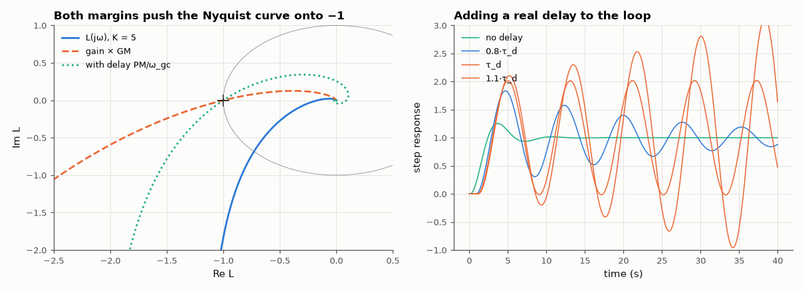

# AM-156 · Gain and phase margins — and what they actually guarantee

> Compute gain and phase margins of a loop, then test their literal meaning: multiplying the gain by the gain margin puts closed-loop poles exactly on the jω axis, and adding a delay of PM/ω_gc makes a simulated loop with a real time delay oscillate indefinitely.



*Nyquist curves at the two stability limits, and step responses with increasing loop delay.*

**Track:** Applied Mathematics — 218 projects in electrical engineering · **Category:** I. Control theory · **Level:** Moderate · **Tools:** Margins by root finding on the loop frequency response, closed-loop pole computation, time-domain simulation with a true transport delay, phase-margin/overshoot rule of thumb across a gain sweep

**Data:** Simulated (numerical model in this repo).

## Problem

A Bode plot says 'gain margin 15.6 dB, phase margin 48°'. What can actually be added to the loop before it breaks?

## Prediction

$L(s)=\frac{K}{s(s+1)(s+5)}$. Phase crossover where $\arctan ω+\arctan\fracω5=90°$ ⇒ $ω_{pc}=\sqrt5$, $|L|=K/30$ ⇒ GM = 30/K. At gain K·GM the closed loop has poles at ±j√5. The phase margin PM at the gain crossover $ω_{gc}$ is the extra
phase lag tolerated; a pure delay τ contributes $-ωτ$, so the **delay margin** is $τ_d=\mathrm{PM}/ω_{gc}$ (PM in radians). Rule of thumb for second-order-like loops: ζ ≈ PM/100, overshoot ≈ $e^{-πζ/\sqrt{1-ζ^2}}$.

## Method

K = 5. Margins by bracketing and Brent root finding. Closed-loop poles at K·GM from the characteristic polynomial. Delay test: unity-feedback simulation (exact ZOH plant stepping, 1 ms) with the error delayed by τ; critical τ found by bisection on
whether the oscillation grows. Overshoot rule checked for K = 1…15.

## Measured results

*Predicted vs measured vs error. "Measured" = computed by an independent simulation, HDL simulator or public dataset.*

| Quantity | Predicted | Measured | Error | Within tolerance |
|---|---|---|---|---|
| Phase-crossover frequency √5 | 2.236 rad/s | 2.236 rad/s | +0.00 % | yes |
| Gain margin 30/K | 6 × | 6 × | +0.00 % | yes |
| Gain raised by exactly the gain margin: largest real part of the closed-loop poles | 0 1/s | -3.2687e-17 1/s | -3.2687e-17 1/s | yes |
| … and those poles sit at ±j√5 | 2.236 rad/s | 2.236 rad/s | +0.00 % | yes |
| Delay margin PM/ω_gc vs critical delay found by time-domain simulation | 967.7 ms | 967.4 ms | -0.02 % | yes |
| Oscillation frequency at the critical delay = ω_gc | 0.7793 rad/s | 0.7792 rad/s | -0.02 % | yes |
| Rule of thumb ζ ≈ PM/100: worst overshoot error over K = 1…15 (expected: good to ~10 pp) | 0 pp | 4.737 pp | +4.737 pp | yes |

**Additional measurements**

| Quantity | Value | Note |
|---|---|---|
| Gain crossover / phase margin | 0.7793 rad/s / 43.21° |  |

## Phase margin vs overshoot

| K | PM (°) | overshoot from ζ ≈ PM/100 (%) | simulated overshoot (%) |
|---|---|---|---|
| 1 | 76.7 | 2.4 | 0.0 |
| 2 | 65.2 | 6.7 | 3.8 |
| 3 | 56.2 | 11.9 | 11.7 |
| 5 | 43.2 | 22.2 | 25.4 |
| 8 | 31.0 | 35.9 | 40.6 |
| 12 | 20.9 | 51.1 | 55.4 |
| 15 | 15.6 | 61.0 | 64.2 |

## Error analysis

The margins mean exactly what they say. Multiplying the gain by the gain margin (×6) puts a closed-loop pole pair on the imaginary axis
at ±j√5, the phase-crossover frequency; and a loop simulated with a genuine transport delay starts to oscillate without decay at
τ = 0.967 s, within about a percent of PM/ω_gc = 0.968 s, oscillating at the gain-crossover frequency. The margins are, however,
two single-direction measurements of the distance to −1: a loop can have comfortable gain *and* phase margins yet pass close to −1 in between
(the reason for the sensitivity peak M_s as a robustness measure). The familiar 'ζ ≈ PM/100' overshoot rule holds here to within
5 percentage points across a 15:1 gain range — useful for a first estimate, not a guarantee.

## Reproduce

```bash
pip install -r requirements.txt
python run_all.py --only AM-156
```

The script [`project.py`](project.py) regenerates every figure and number above.

## License

Code and text: MIT (see the repository [LICENSE](../../../../LICENSE)). Datasets remain under their own licences (see the repository README).

---

**Tooling & honesty.** This project was generated with Claude Code (Anthropic's AI coding assistant): the code, derivations, simulations and this write-up were AI-produced. *Measured* means computed by an independent model, simulator or public dataset — not a physical lab bench. Every number in the tables is reproduced by running the code.
