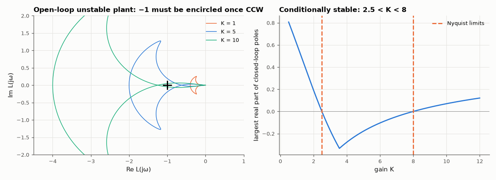

# AM-157 · The Nyquist criterion: counting encirclements

> Apply the argument principle numerically: the number of closed-loop right-half-plane poles equals the open-loop count plus the clockwise encirclements of −1. Verified on 2000 random loops, then used to predict the two-sided gain range of a conditionally stable, open-loop-unstable system.



*Nyquist plots for three gains of an open-loop-unstable plant and the resulting stability window.*

**Track:** Applied Mathematics — 218 projects in electrical engineering · **Category:** I. Control theory · **Level:** Hard · **Tools:** Numerical winding number of 1 + L(jω) over the whole imaginary axis (tangent frequency mapping, phase unwrapping), comparison with closed-loop pole counts for 2000 random loops including open-loop-unstable ones, real-axis crossings for a conditionally stable loop

**Data:** Simulated (numerical model in this repo).

## Problem

How can a plot of the open-loop frequency response tell whether the closed loop is stable — even when the open loop itself is unstable?

## Prediction

Argument principle on $F(s)=1+L(s)$ around the right half-plane: $Z=N+P$, with P open-loop RHP poles, N clockwise encirclements of −1 by $L(jω)$, Z closed-loop RHP poles. For strictly proper L the infinite arc maps to the origin, so N follows from the
change of $\arg(1+L(jω))$ over $ω∈(-∞,∞)$. Example $L=K\frac{s+2}{(s-1)(s^2+2s+5)}$ (P = 1): stability needs one *counter-clockwise* encirclement, i.e. −1 must lie between the two negative-real-axis crossings of L/K, giving $2.5<K<8$ (Routh:
$s^3+s^2+(3+K)s+2K-5$).

## Method

Random loops: 2–5 poles (each in the RHP with probability ¼, none within 0.05 of the axis), 0 to n − 1 zeros, random gain; cases where |1 + L| comes within 10⁻³ of zero are discarded as marginal. ω = tan θ with 400 001 points.
Conditionally stable example: crossings by root finding on Im L(jω) = 0; stability range compared with a root sweep over K.

## Measured results

*Predicted vs measured vs error. "Measured" = computed by an independent simulation, HDL simulator or public dataset.*

| Quantity | Predicted | Measured | Error | Within tolerance |
|---|---|---|---|---|
| Z = N + P from the encirclement count vs closed-loop RHP poles from the roots (2000 random loops): mismatches | 0 | 0 | +0 |  |
| Real-axis crossing at ω = 0: L(0)/K = −2/5 | -0.4 | -0.4 | +0.00 % | yes |
| Second crossing of the negative real axis: −1/8 | -0.125 | -0.125 | +0.00 % | yes |
| Lower stability limit K = −1/x₀ (Nyquist) vs root sweep | 2.5 | 2.505 | +0.20 % | yes |
| Upper stability limit K = −1/x₁ (Nyquist) vs root sweep | 8 | 8 | +0.00 % | yes |
| K = 1: closed-loop RHP poles predicted by Z = P − (CCW encirclements) | 1 | 1 | +0 |  |
| K = 5: closed-loop RHP poles predicted by Z = P − (CCW encirclements) | 0 | 0 | +0 |  |
| K = 10: closed-loop RHP poles predicted by Z = P − (CCW encirclements) | 2 | 2 | +0 |  |

**Additional measurements**

| Quantity | Value | Note |
|---|---|---|
| Of those: open-loop unstable / closed-loop stable | 1001 / 739 |  |
| Frequency of the second crossing | 3.317 rad/s |  |

## Error analysis

Counting encirclements of −1 predicted the number of unstable closed-loop poles correctly for all 2000 random loops, 1001 of which
were open-loop unstable — the cases where Bode-plot intuition ('stay away from −180° at unity gain') gives the wrong answer and the full
criterion is needed. The example shows why: with one unstable open-loop pole the Nyquist curve *must* encircle −1 once counter-clockwise, which
happens only while −1 lies between the two real-axis crossings at −0.4K and −0.125K. That gives the window 2.5 < K < 8, confirmed by the root
sweep: too little gain fails to stabilise the plant, too much destabilises it again, and 'gain margin' has to be quoted in both directions.

## Reproduce

```bash
pip install -r requirements.txt
python run_all.py --only AM-157
```

The script [`project.py`](project.py) regenerates every figure and number above.

## License

Code and text: MIT (see the repository [LICENSE](../../../../LICENSE)). Datasets remain under their own licences (see the repository README).

---

**Tooling & honesty.** This project was generated with Claude Code (Anthropic's AI coding assistant): the code, derivations, simulations and this write-up were AI-produced. *Measured* means computed by an independent model, simulator or public dataset — not a physical lab bench. Every number in the tables is reproduced by running the code.
