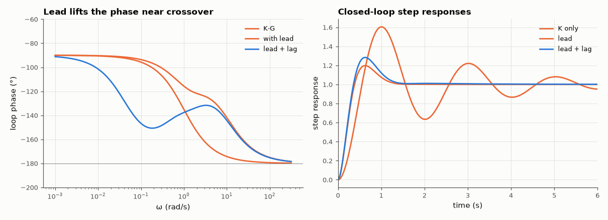

# AM-158 · Lead–lag compensator design in the frequency domain

> Design a lead compensator to raise the phase margin of a type-1 plant from 18° to a 50° target, then a lag section to multiply the velocity constant by ten, and verify the achieved margins, overshoot and ramp-tracking error against the design equations.



*Loop phase before and after compensation, and the corresponding step responses.*

**Track:** Applied Mathematics — 218 projects in electrical engineering · **Category:** I. Control theory · **Level:** Moderate · **Tools:** Classical Bode-based design procedure coded step by step (static gain for K_v, lead for phase margin, lag for low-frequency gain), margins by root finding, closed-loop step and ramp simulations

**Data:** Simulated (numerical model in this repo).

## Problem

The plant needs K_v = 10 but is nearly unstable at that gain. How do lead and lag networks buy back stability and accuracy?

## Prediction

Plant $G=\frac{1}{s(s+1)}$, K = 10 ⇒ $K_v=10$, PM ≈ 18°. Lead $C=\frac{αTs+1}{Ts+1}$ adds at most $φ_m=\arcsin\frac{α-1}{α+1}$ at $ω_m=\frac{1}{T\sqrtα}$ with gain $\sqrtα$ there. Procedure: needed phase = target − PM + margin ⇒ α; new crossover
where $|KG|=1/\sqrtα$; set $ω_m$ to it. Lag $\frac{s+z}{s+z/β}$ multiplies low-frequency gain by β with a phase cost of about $\arctan\frac{(β-1)\,z/ω_{gc}}{1+β (z/ω_{gc})^2}$ at crossover (≈ 5° for z = ω_gc/10). Ramp error = 1/K_v.

## Method

Target PM 50°, safety margin 8°. Lag: β = 10, zero a decade below crossover. Verification: exact margins of each loop, closed-loop step responses (overshoot), ramp response over 400 s (error → 1/K_v).

## Measured results

*Predicted vs measured vs error. "Measured" = computed by an independent simulation, HDL simulator or public dataset.*

| Quantity | Predicted | Measured | Error | Within tolerance |
|---|---|---|---|---|
| Uncompensated phase margin 180° − 90° − arctan ω_gc | 17.96 ° | 17.96 ° | +0 ° | yes |
| Lead: new gain crossover lands on ω_m | 4.579 rad/s | 4.579 rad/s | -0.00 % | yes |
| Lead: achieved phase margin vs the 50° target | 50 ° | 52.35 ° | +2.355 ° | yes |
| Lead: phase margin predicted from plant phase at ω_m + φ_m | 52.35 ° | 52.35 ° | +1.2790e-13 ° | yes |
| Lag: phase margin lost = arctan(ω/p) − arctan(ω/z) at the crossover | 47.24 ° | 47.19 ° | -0.04464 ° | yes |
| Overshoot drops from ≈ 60 % to ≈ 20 % with the lead (ζ ≈ PM/100 estimate for PM = 50°: 16 %) | 16.3 % | 19.81 % | +3.51 pp | yes |
| Ramp-following error with lead: 1/K_v | 0.1 | 0.1 | -0.00 % | yes |
| Ramp-following error with lead + lag: 1/K_v | 0.01 | 0.01 | +0.00 % | yes |

**Additional measurements**

| Quantity | Value | Note |
|---|---|---|
| Overshoot: K only / lead / lead + lag | 60.5 % / 19.8 % / 28.4 % |  |
| Lead parameters | α = 4.61, T = 0.1018 s (zero 2.13, pole 9.83 rad/s) |  |
| Closed-loop −3 dB bandwidth: K only / lead | 4.83 / 7.47 |  |

## Error analysis

The textbook procedure works as advertised. The lead network (α = 4.6) moves the crossover to its centre frequency and delivers a phase
margin of 52.4° against the 50° target — the 8° safety allowance almost exactly pays for the extra plant lag at the higher crossover — and
overshoot falls from 60 % to 20 %. The lag section then multiplies the low-frequency gain by ten: the ramp error drops from 1/10 to 1/100 exactly,
at a cost of 5.2° of phase margin, as the design formula predicts. What the Bode procedure hides is visible in the step response: the
lag's slow pole–zero pair raises the overshoot again to 28 % and leaves a slow tail — more than the 5° of lost phase margin alone
would suggest, and the price of accuracy bought at low frequency.

## Reproduce

```bash
pip install -r requirements.txt
python run_all.py --only AM-158
```

The script [`project.py`](project.py) regenerates every figure and number above.

## License

Code and text: MIT (see the repository [LICENSE](../../../../LICENSE)). Datasets remain under their own licences (see the repository README).

---

**Tooling & honesty.** This project was generated with Claude Code (Anthropic's AI coding assistant): the code, derivations, simulations and this write-up were AI-produced. *Measured* means computed by an independent model, simulator or public dataset — not a physical lab bench. Every number in the tables is reproduced by running the code.
