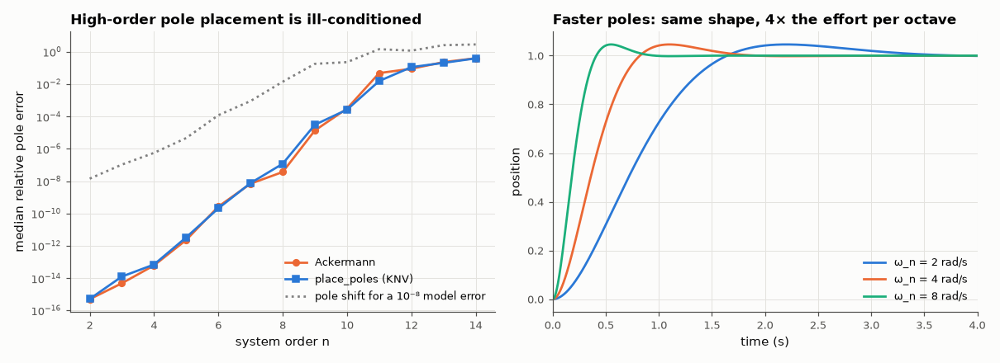

# AM-159 · State-feedback pole placement with Ackermann's formula

> Place closed-loop poles anywhere with u = −Kx using Ackermann's formula, verify against an independent algorithm, show what happens for an uncontrollable system, measure how the accuracy of pole placement collapses with system order, and quantify the price of fast poles in actuator effort.



*Pole-placement accuracy versus system order, and servo step responses for three pole speeds.*

**Track:** Applied Mathematics — 218 projects in electrical engineering · **Category:** I. Control theory · **Level:** Hard · **Tools:** Own Ackermann implementation (controllability matrix, matrix polynomial), comparison with scipy.signal.place_poles, controllability rank test, conditioning study versus system order, servo example with settling-time and control-effort predictions

**Data:** Simulated (numerical model in this repo).

## Problem

If every state is measured, feedback can put the poles anywhere. How — and what stops us from making the system arbitrarily fast?

## Prediction

For a controllable pair (A, b): $K=[0\;\dots\;0\;1]\;\mathcal C^{-1}\,φ(A)$ with $\mathcal C=[b\;Ab\;\dots\;A^{n-1}b]$ and φ the desired characteristic polynomial. If rank 𝒞 < n some modes cannot be moved. The formula inverts 𝒞, whose condition number
grows with n — accurate for small systems, poor beyond n ≈ 10; orthogonal-transformation methods (Kautsky–Nichols–Van Dooren, used by SciPy) avoid that inversion, and I expected them to stay accurate. For a double-integrator servo with poles at $ω_n$, ζ: settling time ≈ 4/(ζω_n),
and the gains — hence the peak actuator effort for a step — scale with $ω_n^2$.

## Method

200 random controllable systems (n = 2…6): eigenvalues of A − bK vs requested. Random systems n = 2…14 for the conditioning study (median pole error of 20 systems each). Uncontrollable example with a decoupled mode.
Servo ẍ = u: ω_n = 2, 4, 8 rad/s, ζ = 0.7; step response via matrix exponential.

## Measured results

*Predicted vs measured vs error. "Measured" = computed by an independent simulation, HDL simulator or public dataset.*

| Quantity | Predicted | Measured | Error | Within tolerance |
|---|---|---|---|---|
| Ackermann: worst relative pole error over 200 random systems (n = 2…6) | 0 | 5.0485e-07 | +5.0485e-07 | yes |
| Ackermann gain vs scipy.signal.place_poles (worst relative difference) | 0 | 9.3590e-09 | +9.3590e-09 | yes |
| Uncontrollable example (unstable mode decoupled from the input): rank of the controllability matrix | 2 | 2 | +0 |  |
| … its unstable eigenvalue +1 survives any feedback gain | 1 | 1 | +0.00 % | yes |
| Accuracy collapses with order: Ackermann pole error at n = 14 exceeds 1 % (1 = yes) | 1 | 1 | +0 |  |
| I expected the orthogonal method (place_poles) to stay accurate at n = 14 (error < 10⁻⁶; 1 = yes) | 1 | 0 | -1 |  |
| ω_n = 2: gains [ω_n², 2ζω_n] | 4 | 4 | +0.00 % | yes |
| ω_n = 4: gains [ω_n², 2ζω_n] | 16 | 16 | +0.00 % | yes |
| ω_n = 8: gains [ω_n², 2ζω_n] | 64 | 64 | +0.00 % | yes |
| Settling time (2 %) at ω_n = 4: ≈ 4/(ζω_n) | 1.429 s | 1.495 s | +4.65 % | yes |
| Peak actuator effort ratio when ω_n doubles (4 → 8): 4× | 4 × | 4 × | +0.00 % | yes |

**Additional measurements**

| Quantity | Value | Note |
|---|---|---|
| Median pole error, Ackermann, n = 4 / 8 / 12 / 14 | 6.1e-14 / 3.7e-08 / 9.0e-02 / 4.0e-01 |  |
| Median pole error, place_poles, n = 4 / 8 / 12 / 14 | 7.0e-14 / 1.2e-07 / 1.1e-01 / 4.0e-01 |  |
| Condition number of the closed-loop eigenvector matrix, n = 4 / 8 / 14 | 4.3e+02 / 1.4e+07 / 2.9e+10 | how much the placed poles move per unit perturbation of A − bK |
| Pole shift caused by a 10⁻⁸ perturbation of A, n = 4 / 8 / 14 | 5.6e-07 / 1.4e-02 / 2.9e+00 | relative to the pole magnitudes |
| Median condition number of the controllability matrix, n = 4 / 14 | 2.0e+01 / 8.9e+03 |  |

## Error analysis

For small systems Ackermann's formula does exactly what it promises — the closed-loop eigenvalues match the requested ones to round-off and the gain
agrees with SciPy's independent algorithm. Its limits are equally clear. A mode that the input cannot reach (rank-deficient controllability matrix)
stays where it is whatever the gain. And accuracy collapses with order: the median pole error is 4e-08 at n = 8 and 4e-01 at n = 14.
Here my prediction was wrong in an instructive way. I expected the orthogonal-transformation method behind place_poles to stay accurate where
Ackermann fails; it does no better (4e-01 at n = 14). The culprit is not the formula but the problem: with a single input the gain is unique,
and the closed-loop matrix that realises fourteen prescribed real poles has an eigenvector condition number of 3e+10 — a model error of one part
in 10⁸ already moves the poles by 3e+00. No algorithm can deliver poles that the matrix itself does not hold still (a known result: pole
placement is intrinsically ill-conditioned for large single-input systems). Finally, 'place the poles anywhere' ignores the actuator: the servo's
gains are ω_n² and 2ζω_n, so every doubling of speed quadruples the peak control effort. Both limits point the same way — choose poles the plant
and its uncertainty can support, which is the question LQR (AM-160) answers systematically.

## Reproduce

```bash
pip install -r requirements.txt
python run_all.py --only AM-159
```

The script [`project.py`](project.py) regenerates every figure and number above.

## License

Code and text: MIT (see the repository [LICENSE](../../../../LICENSE)). Datasets remain under their own licences (see the repository README).

---

**Tooling & honesty.** This project was generated with Claude Code (Anthropic's AI coding assistant): the code, derivations, simulations and this write-up were AI-produced. *Measured* means computed by an independent model, simulator or public dataset — not a physical lab bench. Every number in the tables is reproduced by running the code.
