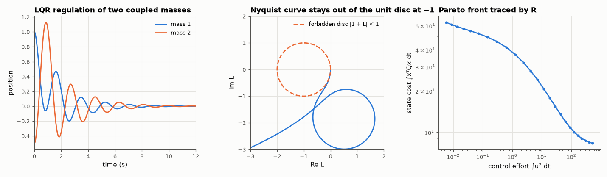

# AM-160 · LQR: optimal state feedback from the Riccati equation

> Solve the continuous-time LQR problem from scratch, confirm that the predicted optimal cost x₀ᵀPx₀ is what a simulation accumulates, that no perturbed gain does better, and that the optimal loop has the guaranteed ≥ 60° phase margin; then trace the trade-off between regulation and effort.



*Closed-loop response, Nyquist plot of the LQR loop gain, and the regulation/effort trade-off.*

**Track:** Applied Mathematics — 218 projects in electrical engineering · **Category:** I. Control theory · **Level:** Hard · **Tools:** Own algebraic-Riccati solver (stable invariant subspace of the Hamiltonian matrix), SciPy's solver as reference, closed-loop cost by Lyapunov equation and by time-domain integration, random gain perturbations, loop-gain robustness (Kalman inequality), Q/R trade-off curve

**Data:** Simulated (numerical model in this repo).

## Problem

Pole placement asks where the poles should go. What if we instead state what we care about — error versus effort — and let the mathematics choose?

## Prediction

Minimise $J=\int_0^\infty(x^TQx+u^TRu)\,dt$ for $\dot x=Ax+Bu$: $u=-Kx$, $K=R^{-1}B^TP$, where P solves $A^TP+PA-PBR^{-1}B^TP+Q=0$; the optimal cost is $x_0^TPx_0$. P comes from the stable eigenvectors $[X_1;X_2]$ of the Hamiltonian
$\begin{bmatrix}A&-BR^{-1}B^T\\-Q&-A^T\end{bmatrix}$: $P=X_2X_1^{-1}$. For any stabilising gain the cost is $x_0^TSx_0$ with $(A-BK)^TS+S(A-BK)+Q+K^TRK=0$. Single-input LQR loops satisfy $|1+K(jωI-A)^{-1}B|\ge1$: the Nyquist curve avoids the unit disc
around −1, so PM ≥ 60° and the gain can be raised without limit or halved.

## Method

Plant: two masses coupled by a spring and damper, force on the first (4 states). Q = diag(10, 1, 10, 1), R = 1. Cost by integrating the simulated closed loop (matrix exponential steps, 2 ms, 60 s). 500 random gain perturbations of 1–20 %.
Return difference evaluated on 20 000 frequencies. Trade-off: R swept over 6 decades.

## Measured results

*Predicted vs measured vs error. "Measured" = computed by an independent simulation, HDL simulator or public dataset.*

| Quantity | Predicted | Measured | Error | Within tolerance |
|---|---|---|---|---|
| Own Hamiltonian-eigenvector Riccati solution vs scipy (max relative difference) | 0 | 7.8957e-16 | +7.8957e-16 | yes |
| Riccati residual ‖AᵀP + PA − PBR⁻¹BᵀP + Q‖ / ‖Q‖ | 0 | 5.3426e-15 | +5.3426e-15 | yes |
| Cost accumulated by the simulated closed loop vs x₀ᵀPx₀ | 31.31 | 31.31 | +0.00 % | yes |
| Randomly perturbed gains (500) that achieve a lower cost than the LQR gain | 0 | 0 | +0 |  |
| Kalman inequality: min over ω of |1 + L(jω)| ≥ 1 | 1 | 1 | +0.00 % | yes |
| Smallest phase margin over all gain crossovers ≥ 60° (1 = yes) | 1 | 1 | +0 |  |
| Loop still stable with gain × 0.51 (1 = yes) | 1 | 1 | +0 |  |
| Loop still stable with gain × 100 (1 = yes) | 1 | 1 | +0 |  |
| Trade-off curve is monotonic: cheaper control (smaller R) always gives lower state cost and higher effort (violations) | 0 | 0 | +0 |  |

**Additional measurements**

| Quantity | Value | Note |
|---|---|---|
| Median cost penalty of a ~10 % gain error | 0.7549 % | the optimum is flat: first-order insensitive to gain errors |
| Phase margin(s) of the LQR loop | 85.4°, 131.5°, 68.2° |  |

## Error analysis

The Riccati solution built from the Hamiltonian's stable eigenvectors matches SciPy's to round-off, and the closed loop it defines accumulates
exactly the predicted cost x₀ᵀPx₀ = 31.312. None of 500 randomly perturbed gains did better, and a 10 % gain error costs only
0.75 % — the optimum is a flat minimum. The robustness guarantee is visible in the Nyquist plot: the loop never enters the unit
disc around −1, so the phase margin is at least 60° and the loop survives a 100-fold gain increase or a halving. Sweeping R traces the whole
Pareto front between regulation and effort — the designer picks a point on it instead of guessing pole locations. The guarantee holds only with
full state measurement; with an observer in the loop it can vanish (Doyle's 'guaranteed margins for LQG: there are none').

## Reproduce

```bash
pip install -r requirements.txt
python run_all.py --only AM-160
```

The script [`project.py`](project.py) regenerates every figure and number above.

## License

Code and text: MIT (see the repository [LICENSE](../../../../LICENSE)). Datasets remain under their own licences (see the repository README).

---

**Tooling & honesty.** This project was generated with Claude Code (Anthropic's AI coding assistant): the code, derivations, simulations and this write-up were AI-produced. *Measured* means computed by an independent model, simulator or public dataset — not a physical lab bench. Every number in the tables is reproduced by running the code.
