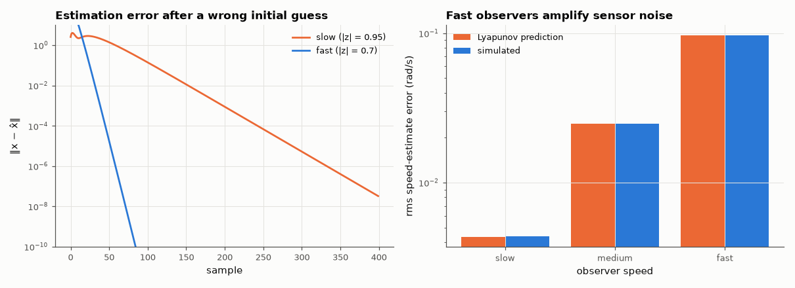

# AM-161 · Observer design and the separation principle

> Reconstruct unmeasured states from the output with a Luenberger observer, verify that the observer-based controller's poles are exactly the union of the state-feedback and observer poles, that the estimation error decays at the designed rate, and quantify the speed-versus-noise trade-off.



*Convergence of the state estimate for two observer speeds, and the noise each design lets through.*

**Track:** Applied Mathematics — 218 projects in electrical engineering · **Category:** I. Control theory · **Level:** Hard · **Tools:** Discrete-time Luenberger observer by duality with pole placement, combined controller–observer eigenvalues, estimation-error decay fitted from simulation, steady-state error covariance from a discrete Lyapunov equation versus Monte-Carlo with sensor noise

**Data:** Simulated (numerical model in this repo).

## Problem

State feedback needs every state, but only the position is measured. Can an estimate be used instead — and how fast should the estimator be?

## Prediction

Plant $x^+=Ax+Bu$, $y=Cx+v$. Observer $\hat x^+=A\hat x+Bu+L(y-C\hat x)$ gives error dynamics $e^+=(A-LC)e-Lv$, independent of u. With $u=-K\hat x$ the closed-loop matrix is block-triangular in (x, e): its eigenvalues are
eig(A − BK) ∪ eig(A − LC) — controller and observer can be designed separately. L follows from pole placement on the dual pair (Aᵀ, Cᵀ). With sensor-noise variance R the steady-state error covariance solves $Σ=(A-LC)Σ(A-LC)^T+LRL^T$:
faster observer poles ⇒ larger L ⇒ more noise passed into the estimate.

## Method

DC-motor position servo (states: angle, speed, current), sampled at 1 kHz by exact ZOH; only the angle is measured. Controller poles at radius ≈ 0.98; observer: two real poles at radius 0.95 / 0.85 / 0.7 (slow / medium / fast) — all faster than the plant's mechanical modes (z = 1 and 0.973) — with the third pole left next to the plant's own electrical mode (z ≈ 0.62).
Error decay from a noiseless simulation with a wrong initial estimate; noise study with σ = 1 mrad over 200 000 steps.

## Measured results

*Predicted vs measured vs error. "Measured" = computed by an independent simulation, HDL simulator or public dataset.*

| Quantity | Predicted | Measured | Error | Within tolerance |
|---|---|---|---|---|
| Separation principle: eigenvalues of the observer-based loop vs eig(A−BK) ∪ eig(A−LC) (worst distance, 3 designs) | 0 | 2.0128e-13 | +2.0128e-13 | yes |
| slow observer: estimation-error decay per step = spectral radius of A − LC | 0.95 | 0.95 | +0.00 % | yes |
| fast observer: estimation-error decay per step = spectral radius of A − LC | 0.7 | 0.7055 | +0.78 % | yes |
| slow observer: rms speed-estimate error from sensor noise (Lyapunov vs simulation) | 0.004355 rad/s | 0.004363 rad/s | +0.18 % | yes |
| medium observer: rms speed-estimate error from sensor noise (Lyapunov vs simulation) | 0.02487 rad/s | 0.02482 rad/s | -0.19 % | yes |
| fast observer: rms speed-estimate error from sensor noise (Lyapunov vs simulation) | 0.09665 rad/s | 0.0968 rad/s | +0.15 % | yes |
| Noise amplification: fast observer's speed-estimate error is larger than the slow one's (ratio > 5; 1 = yes) | 1 | 1 | +0 |  |

**Additional measurements**

| Quantity | Value | Note |
|---|---|---|
| First attempt: all three observer poles at radius 0.95 (slower than the plant's own electrical mode) | ‖L‖ = 183, rms speed error 0.299 rad/s | slow poles but a large gain and more noise than the faster designs |
| rms speed-estimate error, slow / medium / fast | 0.00436 / 0.0248 / 0.0968 | for 1 mrad rms angle noise |
| Observer gain ‖L‖, slow / fast | 5.13 / 84.1 |  |

## Error analysis

The combined controller–observer loop has exactly the six eigenvalues that were designed separately — three from state feedback, three from the
observer — so estimation and control really can be designed independently. The estimation error decays at the observer's spectral radius whatever
the control input does. What separation does *not* say is how fast the observer should be: moving its dominant poles from radius 0.95 to 0.7 multiplies
the sensor noise reaching the speed estimate by 22×, exactly as the Lyapunov equation predicts. A fast observer
forgets wrong initial conditions quickly but believes every noisy sample. My first set of designs taught a second lesson: I put all three observer
poles at the same radius, and the 'slow' design (0.95) turned out to need a *larger* gain and pass *more* noise than faster ones — because it
dragged the plant's naturally fast electrical mode (z ≈ 0.62) to a slower location, which costs gain just as speeding a mode up does. Observer poles
should be placed relative to the plant's own modes, not on a uniform circle. Choosing that compromise optimally, given the actual noise levels, is
the Kalman filter (AM-162).

## Reproduce

```bash
pip install -r requirements.txt
python run_all.py --only AM-161
```

The script [`project.py`](project.py) regenerates every figure and number above.

## License

Code and text: MIT (see the repository [LICENSE](../../../../LICENSE)). Datasets remain under their own licences (see the repository README).

---

**Tooling & honesty.** This project was generated with Claude Code (Anthropic's AI coding assistant): the code, derivations, simulations and this write-up were AI-produced. *Measured* means computed by an independent model, simulator or public dataset — not a physical lab bench. Every number in the tables is reproduced by running the code.
