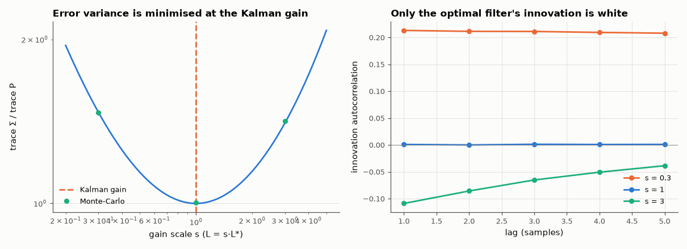

# AM-162 · The Kalman filter as the optimal observer

> Among all observer gains, the steady-state Kalman gain minimises the estimation-error variance for given process and sensor noise. Show it: the Riccati recursion converges to the DARE solution, no perturbed gain gives a smaller error, simulation matches the predicted covariance, and only the optimal filter leaves a white innovation.



*Estimation-error variance versus observer gain, and innovation autocorrelation for three gains.*

**Track:** Applied Mathematics — 218 projects in electrical engineering · **Category:** I. Control theory · **Level:** Hard · **Tools:** Riccati recursion iterated to steady state (own) vs scipy's DARE, error covariance of an arbitrary observer gain from a discrete Lyapunov equation, gain-scaling sweep and random gain perturbations, Monte-Carlo simulation, innovation whiteness test

**Data:** Simulated (numerical model in this repo).

## Problem

An observer can be made fast (noisy) or slow (sluggish against disturbances). Is there a best gain — and how would we recognise it in data?

## Prediction

$x^+=Ax+w$, $y=Cx+v$, cov(w) = W, cov(v) = R. For a predictor-form observer with gain L the error covariance obeys $Σ=(A-LC)Σ(A-LC)^T+W+LRL^T$. Minimising trace Σ over L gives $L^*=APC^T(CPC^T+R)^{-1}$ where P solves the Riccati
equation $P=APA^T-APC^T(CPC^T+R)^{-1}CPA^T+W$; then Σ = P. The innovation $y-C\hat x$ is white iff the gain is optimal — any remaining correlation is information the filter failed to use.

## Method

Constant-acceleration-disturbance tracking model (position, velocity; 10 ms sample, random acceleration σ_a = 2 m/s², position sensor σ = 5 cm). Riccati recursion from P = I for 2000 steps. Sweep L = s·L* for s = 0.2…5 and 1000 random
perturbations. Monte-Carlo: 400 000 steps. Innovation autocorrelation at lags 1–5 for s = 0.3, 1, 3.

## Measured results

*Predicted vs measured vs error. "Measured" = computed by an independent simulation, HDL simulator or public dataset.*

| Quantity | Predicted | Measured | Error | Within tolerance |
|---|---|---|---|---|
| Riccati recursion iterated to steady state vs scipy DARE (max relative difference) | 0 | 1.0811e-14 | +1.0811e-14 | yes |
| Lyapunov covariance of the observer with gain L* equals the Riccati solution (trace ratio) | 1 | 1 | +0.00 % | yes |
| Gain scale s that minimises trace Σ(s·L*) | 1 | 1 | +0.00 % | yes |
| Random gain perturbations (1000) giving a smaller position or velocity error variance | 0 | 0 | +0 |  |
| Monte-Carlo position-error variance with the Kalman gain vs P₁₁ | 2.3389e-04 m² | 2.3471e-04 m² | +0.35 % | yes |
| Monte-Carlo velocity-error variance with the Kalman gain vs P₂₂ | 0.009147 (m/s)² | 0.009173 (m/s)² | +0.29 % | yes |
| Innovation lag-1 autocorrelation with the Kalman gain (white ⇒ 0) | 0 | 9.0570e-04 | +9.0570e-04 | yes |
| Sub-optimal gains leave a coloured innovation: |lag-1 autocorrelation| > 0.05 for s = 0.3 and s = 3 (1 = yes) | 1 | 1 | +0 |  |

**Additional measurements**

| Quantity | Value | Note |
|---|---|---|
| Innovation lag-1 autocorrelation, s = 0.3 / 1 / 3 | +0.213 / +0.001 / -0.109 | positive: filter too slow; negative: too fast |
| rms position error: raw sensor / Kalman estimate | 5.0 cm / 1.53 cm |  |
| Kalman gain L* and observer pole radius | [0.0894, 0.383], |z| = 0.9563 |  |

## Error analysis

The steady-state Kalman gain is simply the best observer gain for the stated noise levels. Iterating the Riccati recursion lands on SciPy's DARE
solution; the Lyapunov covariance of an observer using that gain equals the Riccati P; scaling the gain either way, or perturbing it at random a
thousand times, never reduced the error; and a 400 000-step simulation reproduces the predicted variances. The estimate is
3.3× better than the raw sensor. The innovation test is the practical pay-off: a filter that is too slow leaves positively
correlated innovations (it keeps being surprised in the same direction), one that is too fast leaves negatively correlated ones (it chases noise),
and only the optimal gain leaves them white. On real data, where W and R are never known exactly, that is how a Kalman filter is tuned.

## Reproduce

```bash
pip install -r requirements.txt
python run_all.py --only AM-162
```

The script [`project.py`](project.py) regenerates every figure and number above.

## License

Code and text: MIT (see the repository [LICENSE](../../../../LICENSE)). Datasets remain under their own licences (see the repository README).

---

**Tooling & honesty.** This project was generated with Claude Code (Anthropic's AI coding assistant): the code, derivations, simulations and this write-up were AI-produced. *Measured* means computed by an independent model, simulator or public dataset — not a physical lab bench. Every number in the tables is reproduced by running the code.
