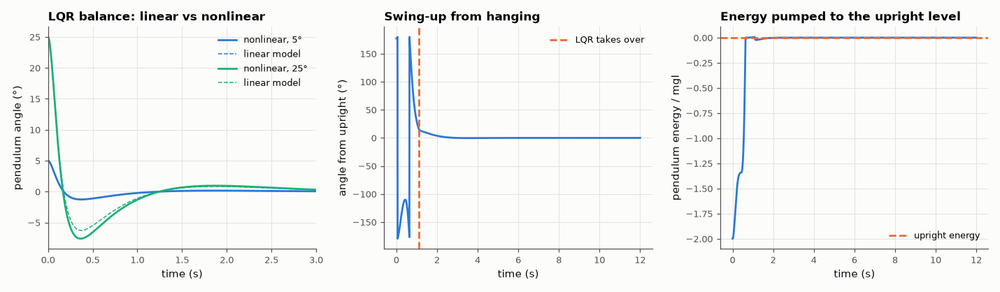

# AM-163 · Inverted pendulum on a cart: linear design, nonlinear reality

> Derive and simulate the nonlinear cart–pendulum, check that it falls at the rate the linearisation predicts, stabilise it with LQR, measure how far from upright the linear controller still works (with and without force limits), and swing it up from hanging with an energy controller.



*Balancing responses of the linear and nonlinear models, and an energy-based swing-up with LQR catch.*

**Track:** Applied Mathematics — 218 projects in electrical engineering · **Category:** I. Control theory · **Level:** Hard · **Tools:** Lagrangian cart–pole model integrated with RK45, linearisation and open-loop pole prediction, LQR balance controller, comparison of linear and nonlinear closed-loop responses, region-of-attraction search with actuator limits, energy-based swing-up with LQR catch

**Data:** Simulated (numerical model in this repo).

## Problem

A controller designed on a linearised model has to work on the real nonlinear system. How far does the linear design's validity extend?

## Prediction

Cart mass M, bob mass m, rod length l, angle θ from upright, force F: $\ddot x=\frac{F+m\sinθ\,(l\dotθ^2-g\cosθ)}{M+m\sin^2θ}$, $\ddotθ=\frac{g\sinθ-\ddot x\cosθ}{l}$. Linearised: $\ddotθ=\frac{(M+m)g}{Ml}θ-\frac{F}{Ml}$ ⇒ unstable pole
$+\sqrt{(M+m)g/(Ml)}$. LQR on the linear model gives F = −Kx. Pendulum energy $E=\tfrac12ml^2\dotθ^2+mgl(\cosθ-1)$ obeys $\dot E=-ml\,a\,\dotθ\cosθ$ for cart acceleration a, so $a=kE\,\dotθ\cosθ$ pumps E monotonically to 0 (the upright level): swing-up.

## Method

M = 0.5 kg, m = 0.2 kg, l = 0.3 m. Divergence rate fitted on the free nonlinear fall from 10⁻⁴ rad. LQR: Q = diag(10, 1, 100, 1), R = 0.1. Linear vs nonlinear response from 5° and 25°. Region of attraction: bisection on the initial angle
(cart at rest), with unlimited force and with |F| ≤ 10 N. Swing-up: a ≤ 12 m/s², hand-over to LQR inside |θ| < 0.3 rad.

## Measured results

*Predicted vs measured vs error. "Measured" = computed by an independent simulation, HDL simulator or public dataset.*

| Quantity | Predicted | Measured | Error | Within tolerance |
|---|---|---|---|---|
| Unstable pole of the linearisation √((M+m)g/(Ml)) vs eigenvalue of A | 6.766 1/s | 6.766 1/s | +0.00 % | yes |
| Divergence rate of the free nonlinear fall (fit of ln θ) | 6.766 1/s | 6.764 1/s | -0.03 % | yes |
| From 5°: largest difference between nonlinear and linear angle responses (fraction of the initial angle) | 0 | 0.001993 | +0.001993 | yes |
| The linear design's region of attraction is finite: recoverable angle < 90° even with unlimited force (1 = yes) | 1 | 1 | +0 |  |
| Actuator saturation shrinks it further (1 = yes) | 1 | 1 | +0 |  |
| Swing-up from hanging: pendulum upright and at rest at t = 12 s (|θ| < 1°, |x| < 5 cm; 1 = yes) | 1 | 1 | +0 |  |
| Energy pumping is monotonic before the catch: largest drop of E between samples (≈ 0) | 0 | 1.2780e-04 | +1.2780e-04 | yes |

**Additional measurements**

| Quantity | Value | Note |
|---|---|---|
| LQR gain [x, ẋ, θ, θ̇] | -10.00, -10.53, -56.31, -8.34 |  |
| Same from 25° | 5.464 % of the initial angle | the linear model degrades gracefully, then fails |
| Largest initial angle recovered: unlimited force / |F| ≤ 10 N | 65.8° / 47.5° |  |
| Time at which the balance controller takes over | 1.095 s |  |
| Cart travel used during swing-up | 877.2 mm |  |

## Error analysis

The nonlinear pendulum falls at 6.77 s⁻¹, exactly the unstable pole of the linearisation, and near upright the LQR designed on the linear model
controls the real equations almost perfectly (difference below 1 % of the initial angle from 5°). The agreement degrades with angle —
5 % from 25° — and the design has a hard limit: with unlimited force the controller recovers from 66°, and with a realistic
10 N limit only from 47°. 'Stable' in the linear sense means stable *near the equilibrium*; how near is a property of the nonlinear system
and the actuator. Beyond that region a different idea is needed: the energy controller ignores the angle itself and pumps the pendulum's energy to
the upright level, after which the linear controller catches it at t = 1.1 s — two controllers, each used where its model is valid.

## Reproduce

```bash
pip install -r requirements.txt
python run_all.py --only AM-163
```

The script [`project.py`](project.py) regenerates every figure and number above.

## License

Code and text: MIT (see the repository [LICENSE](../../../../LICENSE)). Datasets remain under their own licences (see the repository README).

---

**Tooling & honesty.** This project was generated with Claude Code (Anthropic's AI coding assistant): the code, derivations, simulations and this write-up were AI-produced. *Measured* means computed by an independent model, simulator or public dataset — not a physical lab bench. Every number in the tables is reproduced by running the code.
