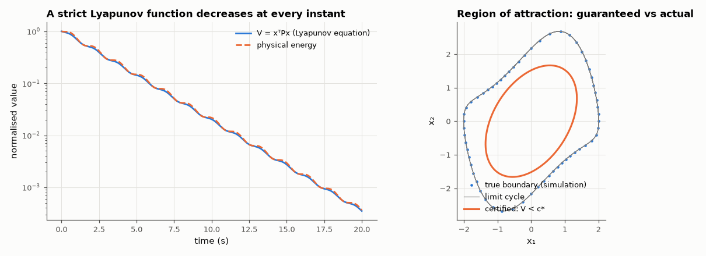

# AM-164 · Lyapunov stability: proving convergence without solving the equations

> Use energy-like functions to certify stability: for linear systems the Lyapunov equation has a positive-definite solution exactly when the system is stable; for a nonlinear oscillator a quadratic V gives a guaranteed — and measurably conservative — estimate of the region of attraction.



*A Lyapunov function along a trajectory, and the certified versus true region of attraction of a nonlinear oscillator.*

**Track:** Applied Mathematics — 218 projects in electrical engineering · **Category:** I. Control theory · **Level:** Hard · **Tools:** Own Lyapunov-equation solver (Kronecker form) vs SciPy, positive-definiteness test against eigenvalues on random matrices, monotone decrease of V along simulated trajectories, region-of-attraction estimate for a nonlinear system from a quadratic Lyapunov function, brute-force simulation of the true region

**Data:** Simulated (numerical model in this repo).

## Problem

How can we prove that every trajectory starting near an equilibrium converges to it, without computing a single trajectory?

## Prediction

If $V(x)>0$ and $\dot V(x)<0$ away from the origin, the origin is asymptotically stable. Linear: $V=x^TPx$ with $A^TP+PA=-Q$ (Q > 0) — a solution P > 0 exists iff A is Hurwitz; then $V(x(t))$ decreases monotonically and
$\dot V=-x^TQx$. Nonlinear: the time-reversed Van der Pol oscillator $\dot x_1=-x_2$, $\dot x_2=x_1-(1-x_1^2)x_2$ has a stable origin surrounded by an unstable limit cycle (the true boundary of the region of attraction). With P from the linearisation,
the largest level set $\{V<c\}$ on which $\dot V<0$ is a guaranteed subset of that region — never an overestimate.

## Method

2000 random 2–6-dimensional matrices (about half stable): P > 0 (Cholesky) vs eigenvalues. Own solver: vec form (I⊗Aᵀ + Aᵀ⊗I) vec P = −vec Q. Nonlinear: V̇ evaluated on level-set contours (720 points each) to find the largest certified c;
the true region from 3600 simulated initial conditions on a polar grid.

## Measured results

*Predicted vs measured vs error. "Measured" = computed by an independent simulation, HDL simulator or public dataset.*

| Quantity | Predicted | Measured | Error | Within tolerance |
|---|---|---|---|---|
| 'P > 0' vs 'all eigenvalues in the left half-plane' on 2000 random matrices (848 stable): disagreements | 0 | 0 | +0 |  |
| Own Kronecker-form solver vs scipy.linalg.solve_continuous_lyapunov (worst relative difference) | 0 | 1.2783e-13 | +1.2783e-13 | yes |
| Lightly damped oscillator: V = xᵀPx never increases along the trajectory (largest upward step / V₀) | 0 | 0 | +0 | yes |
| dV/dt measured along the trajectory vs −xᵀQx (worst relative error) | 0 | 3.5458e-05 | +3.5458e-05 | yes |
| Initial conditions on the certified level set V = 0.98·c* that fail to converge (60 tested) | 0 | 0 | +0 |  |
| The certified ellipse lies inside the true region of attraction (area ratio ≤ 1; 1 = yes) | 1 | 1 | +0 |  |
| True boundary = the Van der Pol limit cycle (amplitude ≈ 2.0): largest |x₁| on the simulated boundary | 2.009 | 2.008 | -0.01 % | yes |

**Additional measurements**

| Quantity | Value | Note |
|---|---|---|
| For comparison, the physical energy ½v² + 2x² has dE/dt = −0.4v² ≤ 0 | zero whenever v = 0 | non-increasing but not strictly decreasing: needs LaSalle; the Lyapunov-equation V avoids that |
| Certified level c* / area of the estimate / true area | 2.305 / 6.48 / 13.72 | the quadratic estimate captures 47 % of the true region |

## Error analysis

For linear systems the Lyapunov equation is a complete stability test: over 2000 random matrices 'P positive definite' and 'eigenvalues in
the left half-plane' never disagreed, and along a simulated trajectory V = xᵀPx falls at exactly −xᵀQx — strictly, at every instant, unlike the
physical energy, which stalls whenever the velocity is zero. For the nonlinear oscillator the same quadratic function certifies convergence
inside the level set V < 2.30, and every tested initial condition on that set did converge. The certificate is safe but conservative: the
ellipse covers 47 % of the true region of attraction, whose boundary is the unstable limit cycle. That gap is the general
experience with Lyapunov methods — a guarantee obtained without solving the equations, at the price of not being tight; better-shaped
functions (higher-order polynomials, sum-of-squares programming) shrink it.

## Reproduce

```bash
pip install -r requirements.txt
python run_all.py --only AM-164
```

The script [`project.py`](project.py) regenerates every figure and number above.

## License

Code and text: MIT (see the repository [LICENSE](../../../../LICENSE)). Datasets remain under their own licences (see the repository README).

---

**Tooling & honesty.** This project was generated with Claude Code (Anthropic's AI coding assistant): the code, derivations, simulations and this write-up were AI-produced. *Measured* means computed by an independent model, simulator or public dataset — not a physical lab bench. Every number in the tables is reproduced by running the code.
