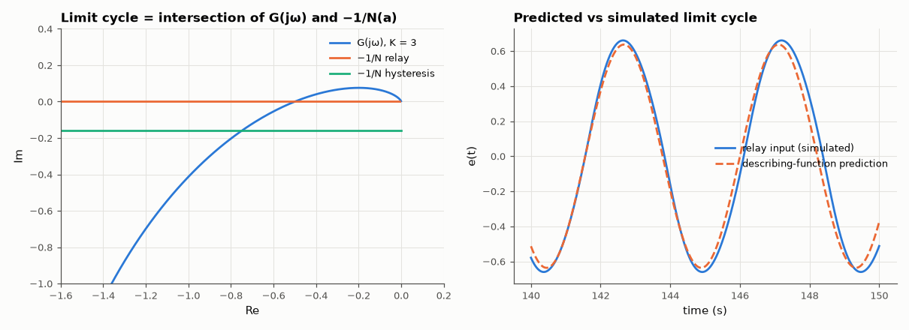

# AM-165 · Describing functions: predicting limit cycles in nonlinear loops

> Replace a nonlinearity by its amplitude-dependent gain for sinusoids and solve for the oscillation that sustains itself. Compare the predicted amplitude and frequency of limit cycles with simulation for three nonlinearities, and tie the prediction error to how well the plant filters harmonics.



*Harmonic-balance construction on the Nyquist plane and the simulated relay limit cycle against its prediction.*

**Track:** Applied Mathematics — 218 projects in electrical engineering · **Category:** I. Control theory · **Level:** Hard · **Tools:** Describing functions of the ideal relay, relay with hysteresis and saturation; harmonic-balance solution G(jω)N(a) = −1; time-domain simulation with exact plant stepping; measured amplitude and frequency; harmonic content at the nonlinearity input

**Data:** Simulated (numerical model in this repo).

## Problem

A loop with a relay or a saturating amplifier oscillates. Linear theory cannot say at what amplitude — what can?

## Prediction

Assume the input to the nonlinearity is $a\sin ωt$ and keep only the fundamental of its output: gain $N(a)$. A limit cycle needs $G(jω)=-1/N(a)$. Plant $G=\frac{K}{s(s+1)(s+2)}$: phase −180° at $ω=\sqrt2$, where $|G|=K/6$.
**Relay** ±M: $N=\frac{4M}{πa}$ ⇒ $a=\frac{2MK}{3π}$, ω = √2. **Relay with hysteresis** h: $-1/N=-\frac{π}{4M}\left(\sqrt{a^2-h^2}+jh\right)$ ⇒ $\mathrm{Im}\,G(jω)=-\frac{πh}{4M}$ fixes ω (lower than √2), then a. **Saturation** (unit slope, limit 1):
$N=\frac2π\left(\arcsin\frac1a+\frac1a\sqrt{1-\frac1{a^2}}\right)$ for a > 1; a limit cycle exists only if K > 6, with $N(a)=6/K$. Accuracy rests on the plant attenuating the 3rd harmonic.

## Method

Simulation: exact zero-order-hold stepping (0.5 ms) with the nonlinearity evaluated each step, 150 s, measurements over the last 40 s (amplitude = half peak-to-peak of the nonlinearity input, frequency from zero crossings).
Cases: relay M = 1, K = 3; hysteresis h = 0.2; saturation with K = 9 and K = 5; a second-order plant 2/(s(s+1)) with the hysteresis relay. Third-harmonic ratio from an FFT.

## Measured results

*Predicted vs measured vs error. "Measured" = computed by an independent simulation, HDL simulator or public dataset.*

| Quantity | Predicted | Measured | Error | Within tolerance |
|---|---|---|---|---|
| Ideal relay: limit-cycle frequency √2 | 1.414 rad/s | 1.38 rad/s | -2.40 % | yes |
| Ideal relay: amplitude 2MK/(3π) | 0.6366 | 0.6604 | +3.73 % | yes |
| Third harmonic at the relay input relative to the fundamental: ⅓·|G(3jω)|/|G(jω)| | 0.02306 | 0.02222 | -3.63 % | yes |
| Relay with hysteresis: frequency from Im G(jω) = −πh/4M | 1.133 rad/s | 1.111 rad/s | -1.93 % | yes |
| Relay with hysteresis: amplitude | 0.9703 | 1.001 | +3.21 % | yes |
| Saturation, K = 9 (> 6): amplitude from N(a) = 6/K | 1.807 | 1.832 | +1.34 % | yes |
| Saturation, K = 9: frequency √2 | 1.414 rad/s | 1.402 rad/s | -0.83 % | yes |
| Saturation, K = 5 (< 6): no limit cycle — the oscillation dies out (amplitude after 110 s below 1 % of the initial swing; 1 = yes) | 1 | 1 | +0 |  |
| Second-order plant 2/(s(s+1)) with the hysteresis relay: limit-cycle frequency | 2.193 rad/s | 2.206 rad/s | +0.62 % | yes |
| … and amplitude | 0.482 | 0.4691 | -2.66 % | yes |

**Additional measurements**

| Quantity | Value | Note |
|---|---|---|
| … amplitude in the first 15 s / last 40 s | 2.20 / 0.0067 |  |
| Third-harmonic content at the nonlinearity input: third-order plant / second-order plant | 2.2 % / 4.2 % |  |

## Error analysis

Harmonic balance predicts all three oscillations to within a few percent: the relay loop cycles at 1.380 rad/s with amplitude 0.660
(predicted 1.414 and 0.637); hysteresis lowers the frequency exactly as the shifted −1/N locus says; and the saturating loop oscillates only when
the linear gain exceeds the gain margin of 6, at the amplitude where the *effective* gain has dropped back to 6/K. With K = 5 the same loop simply
settles. The method is approximate because it ignores harmonics: here the third harmonic at the relay input is 2.2 % of the fundamental
(the third-order plant attenuates it), and the predictions are off by a similar few percent. I expected a second-order plant, which filters
harmonics less (4.2 % third harmonic), to be predicted visibly worse; it was not — 0.6 % in frequency and 2.7 % in
amplitude. The harmonic content sets the *scale* of the describing-function error, not a strict ordering: how the neglected harmonics shift the
switching instants also matters. For exact answers with relays, Tsypkin's method sums all harmonics.

## Reproduce

```bash
pip install -r requirements.txt
python run_all.py --only AM-165
```

The script [`project.py`](project.py) regenerates every figure and number above.

## License

Code and text: MIT (see the repository [LICENSE](../../../../LICENSE)). Datasets remain under their own licences (see the repository README).

---

**Tooling & honesty.** This project was generated with Claude Code (Anthropic's AI coding assistant): the code, derivations, simulations and this write-up were AI-produced. *Measured* means computed by an independent model, simulator or public dataset — not a physical lab bench. Every number in the tables is reproduced by running the code.
