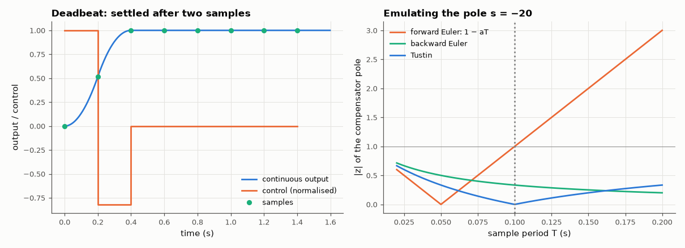

# AM-166 · Discrete-time control: ZOH models, deadbeat response and controller emulation

> Model a continuous plant as seen by a computer, design a deadbeat controller that settles in exactly n samples (something no continuous linear controller can do), look between the samples, and show how the choice of discretisation rule decides whether an emulated analog controller stays stable.



*Deadbeat response with inter-sample behaviour, and the magnitude of an emulated compensator pole under three discretisation rules.*

**Track:** Applied Mathematics — 218 projects in electrical engineering · **Category:** I. Control theory · **Level:** Hard · **Tools:** Exact zero-order-hold discretisation (matrix exponential) checked against scipy.signal.cont2discrete, pole mapping z = e^{sT}, deadbeat state feedback by discrete Ackermann, inter-sample simulation of the continuous plant, forward-Euler / backward-Euler / Tustin emulation of a continuous compensator

**Data:** Simulated (numerical model in this repo).

## Problem

A digital controller only sees samples and only changes its output at sample instants. What is the plant from its point of view, and what can it do that an analog one cannot?

## Prediction

With a zero-order hold, $x_{k+1}=e^{AT}x_k+\int_0^Te^{Aτ}dτ\,B\,u_k$ exactly; poles map as $z=e^{sT}$. State feedback placing all n poles at z = 0 makes $(A_d-B_dK)^n=0$: any initial state is driven to zero in n steps (deadbeat). The required
effort grows roughly as $1/T^2$ for a double-integrator-like plant. Emulating a compensator pole s = −a: forward Euler $z=1-aT$ (unstable for $aT>2$), backward Euler $z=1/(1+aT)$ and Tustin $z=\frac{1-aT/2}{1+aT/2}$ (always stable).

## Method

Plant $G=rac{1}{s(s+1)}$ (motor with inertia), T = 0.2 s. Deadbeat gain by Ackermann on (A_d, B_d); plant simulated continuously between samples (100 sub-steps). Effort scaling for T = 0.2, 0.1, 0.05. Emulation: lead compensator
$C=rac{10(s+1)}{s+20}$ at T = 0.02…0.2 s with the three rules; stability of the discrete compensator and of the closed loop.

## Measured results

*Predicted vs measured vs error. "Measured" = computed by an independent simulation, HDL simulator or public dataset.*

| Quantity | Predicted | Measured | Error | Within tolerance |
|---|---|---|---|---|
| Own ZOH discretisation vs scipy.signal.cont2discrete (max difference) | 0 | 0 | +0 | yes |
| Discrete poles = e^{sT}: second pole e^{−T} | 0.8187 | 0.8187 | +0.00 % | yes |
| ZOH adds a sampling zero: zero of the pulse transfer function (≈ −1 for small T; exact value from the formula) | -0.9355 | -0.9355 | +0.00 % | yes |
| Deadbeat: (A_d − B_dK)² = 0 (largest element) | 0 | 9.9920e-16 | +9.9920e-16 | yes |
| Deadbeat step: position error after exactly 2 samples | 0 | 3.2096e-15 | +3.2096e-15 | yes |
| … and no inter-sample ripple afterwards (max |y − 1| for t > 2T) | 0 | 3.1086e-15 | +3.1086e-15 | yes |
| Deadbeat effort: peak |u| ratio when T is halved (≈ 4× for a double-integrator-like plant) | 4 × | 3.81 × | -4.76 % | yes |
| Forward Euler: compensator pole leaves the unit circle at T = 2/a | 100 ms | 102 ms | +2.00 % | yes |
| Backward Euler and Tustin: compensator stable at every tested T (1 = yes) | 1 | 1 | +0 |  |

**Additional measurements**

| Quantity | Value | Note |
|---|---|---|
| Peak control for a unit step, T = 0.2 / 0.1 / 0.05 s | 28 / 105 / 410 | settling time 2T — speed is bought with actuator effort |
| Closed loop first unstable at T (forward Euler / backward Euler / Tustin) | 0.100 s / stable to 0.2 s / stable to 0.2 s |  |

## Error analysis

Seen through a sampler and hold, the plant is an exact difference equation: the matrix-exponential model matches SciPy's, its poles are
e^{sT}, and it acquires a 'sampling zero' near −1 that has no continuous counterpart. That exactness allows something impossible in continuous
time: with both closed-loop poles at z = 0 the error is *exactly* zero after two samples and stays zero between them. The catch is effort — the first
control move is 28 for T = 0.2 s and quadruples each time T is halved, so deadbeat control is limited by the actuator, not by theory.
When a continuous design is simply emulated instead, the integration rule matters: forward Euler maps the compensator pole at −20 to 1 − 20T and
becomes unstable beyond T = 0.1 s, while backward Euler and Tustin map the whole left half-plane inside the unit circle and cannot fail that way.

## Reproduce

```bash
pip install -r requirements.txt
python run_all.py --only AM-166
```

The script [`project.py`](project.py) regenerates every figure and number above.

## License

Code and text: MIT (see the repository [LICENSE](../../../../LICENSE)). Datasets remain under their own licences (see the repository README).

---

**Tooling & honesty.** This project was generated with Claude Code (Anthropic's AI coding assistant): the code, derivations, simulations and this write-up were AI-produced. *Measured* means computed by an independent model, simulator or public dataset — not a physical lab bench. Every number in the tables is reproduced by running the code.
