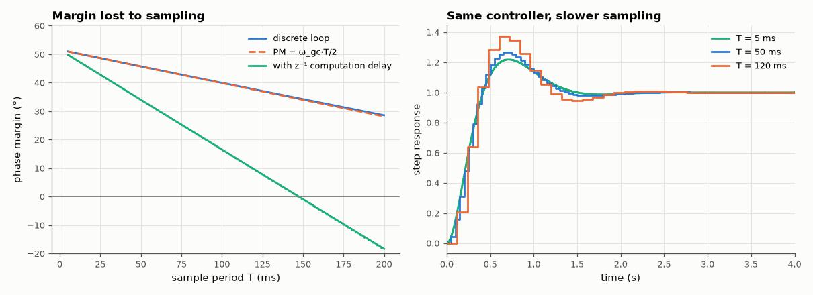

# AM-167 · How sampling erodes stability margins

> A digital implementation of a continuous controller behaves like the analog loop plus a delay of half a sample (plus any computation delay). Predict the phase-margin loss ω_gc·T/2 and the sample period at which the loop goes unstable, and check both on exact discrete models.



*Phase margin of the digital loop versus sample period, and step responses at three sample rates.*

**Track:** Applied Mathematics — 218 projects in electrical engineering · **Category:** I. Control theory · **Level:** Hard · **Tools:** Continuous lead design, exact discrete loop model (ZOH plant + Tustin controller), discrete-time phase margin from the pulse transfer function, critical sample period by spectral-radius bisection, with and without one sample of computation delay, step-response overshoot versus sample period

**Data:** Simulated (numerical model in this repo).

## Problem

How fast must a digital controller sample to preserve an analog design — and what exactly is lost when it samples slower?

## Prediction

A zero-order hold reconstructs a staircase whose fundamental lags the ideal signal by T/2: at frequencies well below Nyquist it acts as the delay $e^{-sT/2}$. Hence $\mathrm{PM}_{digital}≈\mathrm{PM}-ω_{gc}\frac{T}{2}$ (radians) and instability near
$T_{crit}≈\frac{2\,\mathrm{PM}}{ω_{gc}}$. One extra sample of computation delay makes the total 1.5 T: $T_{crit}≈\frac{2\,\mathrm{PM}}{3ω_{gc}}$. Rule of thumb: sampling at 20–30 × the closed-loop bandwidth costs only 5–10° of phase margin.
The approximations assume ω_gc ≪ π/T and degrade as T approaches the limit.

## Method

Plant $G=rac{1}{s(s+1)}$ with lead $C=10rac{0.37s+1}{0.083s+1}$ (continuous PM ≈ 50°). Discrete loop: exact ZOH plant, Tustin-discretised compensator, optional z⁻¹. Discrete phase margin from $L(e^{jωT})$ on a fine grid; T_crit by bisection
on the closed-loop spectral radius; overshoot from simulated step responses.

## Measured results

*Predicted vs measured vs error. "Measured" = computed by an independent simulation, HDL simulator or public dataset.*

| Quantity | Predicted | Measured | Error | Within tolerance |
|---|---|---|---|---|
| T = 10 ms (ω_s/ω_gc = 154): discrete phase margin vs PM − ω_gc·T/2 | 50.37 ° | 50.37 ° | +0.00175 ° | yes |
| T = 30 ms (ω_s/ω_gc = 51): discrete phase margin vs PM − ω_gc·T/2 | 48.03 ° | 48.04 ° | +0.0112 ° | yes |
| T = 60 ms (ω_s/ω_gc = 26): discrete phase margin vs PM − ω_gc·T/2 | 44.52 ° | 44.57 ° | +0.04276 ° | yes |
| T = 30 ms with one sample of computation delay: PM − 1.5·ω_gc·T | 41.01 ° | 41.03 ° | +0.0112 ° | yes |
| Critical sample period (no computation delay): 2·PM/ω_gc | 440.7 ms | 462.3 ms | +4.91 % | yes |
| Critical sample period with one sample of delay: 2·PM/(3ω_gc) | 146.9 ms | 147.4 ms | +0.32 % | yes |
| Computation delay cuts the usable sample period by about 3× (ratio of critical periods) | 3 × | 3.137 × | +4.58 % | yes |
| Rule of thumb: sampling at 20× the crossover frequency costs ≈ 9° of phase margin | 9 ° | 8.933 ° | -0.06682 ° | yes |

**Additional measurements**

| Quantity | Value | Note |
|---|---|---|
| Continuous design: gain crossover / phase margin | 4.082 rad/s / 51.5° |  |
| Step overshoot at T = 5 / 20 / 50 / 80 / 120 ms | 22 % / 23 % / 27 % / 31 % / 37 % |  |

## Error analysis

The half-sample-delay model is accurate where it matters: for sample rates 15–100 times the crossover frequency the exact discrete phase margin
is within about a degree of PM − ω_gc·T/2, and one sample of computation delay triples the loss, exactly as 1.5 T of delay should. Sampling at
20× the crossover costs 9° — the origin of the '20–30×' rule. Extrapolating the same formula all the way to zero margin predicts instability at
T ≈ 441 ms; the exact loop fails at 462 ms (and at 147 ms with the extra delay), so the estimate is
right to roughly 20 % even there, where ω_gc is no longer small against the Nyquist frequency and the crossover itself has moved. The practical
reading: an analog design can be dropped into a processor only if the sample rate is fast against the loop bandwidth *and* the computation delay is
counted; otherwise the controller must be designed in discrete time from the start (AM-166).

## Reproduce

```bash
pip install -r requirements.txt
python run_all.py --only AM-167
```

The script [`project.py`](project.py) regenerates every figure and number above.

## License

Code and text: MIT (see the repository [LICENSE](../../../../LICENSE)). Datasets remain under their own licences (see the repository README).

---

**Tooling & honesty.** This project was generated with Claude Code (Anthropic's AI coding assistant): the code, derivations, simulations and this write-up were AI-produced. *Measured* means computed by an independent model, simulator or public dataset — not a physical lab bench. Every number in the tables is reproduced by running the code.
