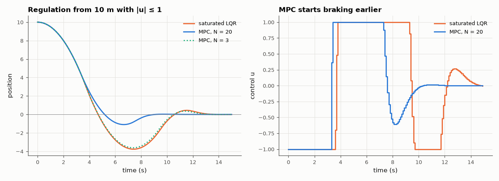

# AM-168 · Model predictive control: optimisation in the loop

> Build a linear MPC from scratch: predict over a horizon, minimise a quadratic cost subject to actuator limits, apply the first move, repeat. Verify the QP solver, show that without constraints MPC is exactly LQR, and measure what explicit constraint handling gains over simply clipping an LQR.



*Closed-loop position and control for a saturated LQR and for MPC with actuator constraints.*

**Track:** Applied Mathematics — 218 projects in electrical engineering · **Category:** I. Control theory · **Level:** Hard · **Tools:** Condensed MPC formulation (prediction matrices), own box-constrained QP solver (accelerated projected gradient), reference solution by bounded least squares (scipy.optimize.lsq_linear, exact active-set BVLS), LQR equivalence for the unconstrained case, closed-loop comparison with a saturated LQR

**Data:** Simulated (numerical model in this repo).

## Problem

LQR ignores actuator limits; clipping its output is not optimal and can misbehave. How does a controller plan *around* the limits?

## Prediction

Stack predictions $X=S_xx_0+S_uU$; cost $J=X^T\bar QX+U^T\bar RU=\tfrac12U^THU+f^TU+\text{const}$ with $H=2(S_u^T\bar QS_u+\bar R)$, $f=2S_u^T\bar QS_xx_0$, subject to $|u_k|\le u_{max}$. With terminal weight P from the Riccati equation and no
active constraints, the first move equals the LQR law −Kx for every horizon (dynamic programming). Box-constrained QPs are solved by projected gradient: $U\leftarrow\mathrm{clip}(V-\tfrac1L\nabla J(V))$ with Nesterov momentum, L = λ_max(H).
Receding-horizon cost with a long enough horizon approaches the infinite-horizon constrained optimum.

## Method

Double integrator sampled at 0.1 s, |u| ≤ 1, Q = diag(1, 0.1), R = 0.1, terminal weight P. QP check on 200 random states (N = 20). Closed loop from x₀ = (10, 0) for 150 steps: MPC with N = 3…40, saturated LQR, and a single open-loop QP
with N = 150 as the constrained optimum.

## Measured results

*Predicted vs measured vs error. "Measured" = computed by an independent simulation, HDL simulator or public dataset.*

| Quantity | Predicted | Measured | Error | Within tolerance |
|---|---|---|---|---|
| Unconstrained MPC (N = 20, Riccati terminal weight): first-move gain vs LQR gain (max difference) | 0 | 1.0658e-14 | +1.0658e-14 | yes |
| … and for a horizon of only N = 3 | 0 | 4.4409e-15 | +4.4409e-15 | yes |
| Own projected-gradient QP vs scipy lsq_linear (BVLS) on 200 random states (196 with active constraints): worst |ΔU| | 0 | 5.1889e-09 | +5.1889e-09 | yes |
| Actuator limit respected by MPC at every step: max |u| | 1 | 1 | +0.00 % | yes |
| Receding-horizon MPC (N = 40) cost vs the one-shot constrained optimum over the whole run | 2496 | 2496 | -0.00 % | yes |
| MPC (N = 20) cost ≤ saturated-LQR cost (1 = yes) | 1 | 1 | +0 |  |
| Short horizons cost more: closed-loop cost decreases as N grows from 3 to 40 (violations) | 0 | 0 | +0 |  |

**Additional measurements**

| Quantity | Value | Note |
|---|---|---|
| Median iterations of the QP solver | 5 |  |
| Closed-loop cost: saturated LQR / MPC N = 3 / 5 / 10 / 20 / 40 / optimum | 2908.8 / 2866.9 / 2802.0 / 2626.0 / 2507.4 / 2496.3 / 2496.3 |  |
| Cost penalty of clipping an LQR instead of planning | 16.53 % |  |
| Position overshoot: saturated LQR / MPC (N = 20) | 3.77 / 1.10 | starting 10 m from the target |

## Error analysis

Three checks pin down what MPC is. Without active constraints and with the Riccati terminal weight, its first move is the LQR law to round-off
for any horizon — MPC generalises LQR rather than replacing it. The home-made projected-gradient solver agrees with SciPy's bounded least-squares
on every test state — after one repair: my first stopping rule ('the iterate stopped changing') fired while the momentum term was holding every
input against its bound, returning a fully saturated plan that violated the optimality conditions; testing for a fixed point of a plain
projected-gradient step (the KKT condition) fixed it. And in closed loop the receding-horizon controller with N = 40 achieves the cost of the single optimisation over the entire
run, i.e. re-planning each step loses nothing. Against that benchmark, clipping the LQR output costs 17 % more: the LQR 'thinks' it can
brake as hard as it likes, accelerates too long and overshoots by 3.8 m, whereas MPC knows the limit and starts braking earlier. A horizon too
short to see the braking distance (N = 3) loses much of that advantage. The price is an optimisation at every sample —
5 gradient iterations here — which is why MPC arrived first in slow process plants and only later in drives and power converters.

## Reproduce

```bash
pip install -r requirements.txt
python run_all.py --only AM-168
```

The script [`project.py`](project.py) regenerates every figure and number above.

## License

Code and text: MIT (see the repository [LICENSE](../../../../LICENSE)). Datasets remain under their own licences (see the repository README).

---

**Tooling & honesty.** This project was generated with Claude Code (Anthropic's AI coding assistant): the code, derivations, simulations and this write-up were AI-produced. *Measured* means computed by an independent model, simulator or public dataset — not a physical lab bench. Every number in the tables is reproduced by running the code.
