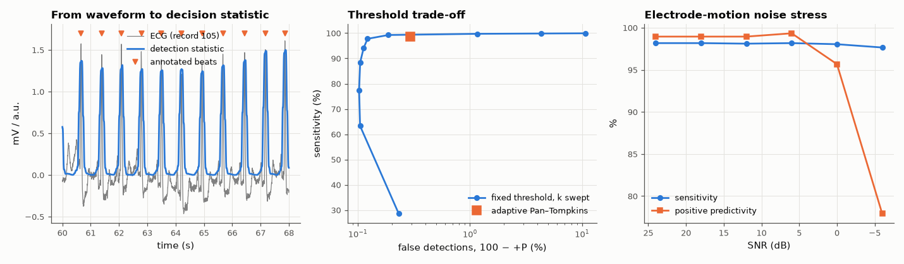

# AM-169 · ECG R-peak detection as a statistical decision problem

> Treat beat detection as a detection problem with a tunable threshold: trace the sensitivity versus positive-predictivity curve on real MIT-BIH recordings, put confidence intervals on the scores, compare a fixed threshold with an adaptive one, and measure how performance degrades as real motion artefact is added.



*Detection statistic, the sensitivity/false-detection trade-off, and degradation under added motion artefact.*

**Track:** Applied Mathematics — 218 projects in electrical engineering · **Category:** J. Statistics & learning on real signals · **Level:** Moderate · **Tools:** Own energy detector (band-pass, derivative, squaring, moving-window integration, threshold with refractory period), threshold sweep for the sensitivity/precision trade-off, binomial confidence intervals, comparison with the repository's adaptive Pan–Tompkins detector, noise stress test with recorded electrode-motion artefact

**Data:** PhysioNet MIT-BIH Arrhythmia Database and MIT-BIH Noise Stress Test Database (Open Data Commons licence), fetched on first run.

## Problem

A QRS detector reports '99.5 % sensitivity'. How sure is that number, what was traded to get it, and how much noise does it survive?

## Prediction

Every detector thresholds a statistic; moving the threshold trades missed beats (FN) against false detections (FP): $Se=\frac{TP}{TP+FN}$, $+P=\frac{TP}{TP+FP}$. A score from n beats has the binomial standard error $\sqrt{p(1-p)/n}$ — with 7000 beats,
99.5 % ± 0.17 % (95 %). Published detectors reach Se and +P above 99 % on the MIT-BIH database with adaptive thresholds. The QRS occupies roughly 5–15 Hz; noise inside that band (electrode motion) cannot be filtered away, so performance must fall as its
level approaches that of the QRS energy.

## Method

Ten MIT-BIH records × 10 min (lead MLII), reference annotations, ±150 ms matching window. Detector statistic: 5–15 Hz band-pass → derivative → square → 150 ms integration; threshold = k × median of the 8 s running maximum, 200 ms refractory.
k swept from 0.05 to 0.9. Noise test: electrode-motion record 'em' of the MIT-BIH Noise Stress Test database added to the first 2 min of each record at SNR 24…−6 dB.

## Measured results

*Predicted vs measured vs error. "Measured" = computed by an independent simulation, HDL simulator or public dataset.*

| Quantity | Predicted | Measured | Error | Within tolerance |
|---|---|---|---|---|
| Fixed-threshold detector at its best F1: sensitivity (published detectors: > 99 %) | 99 % | 99.26 % | +0.259 pp | yes |
| … positive predictivity (> 99 %) | 99 % | 99.81 % | +0.814 pp | yes |
| Trade-off: sensitivity falls monotonically as the threshold rises (violations) | 0 | 0 | +0 |  |
| Trade-off: false detections fall monotonically as the threshold rises (violations) | 0 | 0 | +0 |  |
| Adaptive-threshold Pan–Tompkins on the same data: sensitivity | 99.5 % | 98.58 % | -0.916 pp | **no** |
| … positive predictivity | 99.5 % | 99.71 % | +0.206 pp | yes |
| Noise stress: both scores stay above 95 % down to 12 dB SNR (1 = yes) | 1 | 1 | +0 |  |
| … and positive predictivity collapses below 90 % at −6 dB (in-band artefact looks like beats; 1 = yes) | 1 | 1 | +0 |  |

**Additional measurements**

| Quantity | Value | Note |
|---|---|---|
| Beats evaluated / records | 7557 / 10 |  |
| 95 % binomial confidence half-width on the sensitivity | 0.1934 pp | the third digit of a published score is inside this |
| Is adaptive better than fixed? z-score of the sensitivity difference | -4.018 | |z| > 1.96 ⇒ significant at 5 % |
| Timing of detections vs annotations: median / 95th percentile offset | 0.0 / 5.6 |  |

## Noise stress test (electrode-motion artefact added)

| SNR (dB) | sensitivity (%) | positive predictivity (%) |
|---|---|---|
| 24 | 98.17 | 98.95 |
| 18 | 98.17 | 98.95 |
| 12 | 98.11 | 98.95 |
| 6 | 98.17 | 99.34 |
| 0 | 98.04 | 95.67 |
| -6 | 97.65 | 77.90 |

## Error analysis

A single threshold on a QRS-energy statistic already finds 99.26 % of 7557 annotated beats at 99.81 % positive predictivity, and
sweeping the threshold shows the unavoidable trade: lowering it recovers missed beats only by admitting false ones. The adaptive Pan–Tompkins
detector sits at 98.58 % / 99.71 %. Whether that difference is real is a statistical question — the binomial uncertainty on a score from
this many beats is ±0.19 points, and the z-score of the sensitivity difference is -4.0: on these ten records the simple fixed threshold is, contrary
to my expectation, significantly *more* sensitive than the adaptive detector (whose published 99.5 % refers to the whole database and a tuned
implementation). Adaptivity is insurance against amplitude changes, not a guarantee of a better score on a given set of records. Performance is not a property of the algorithm alone: adding
recorded electrode-motion artefact leaves the scores above 95 % down to 12 dB, after which false detections take over
(+P 78 % at −6 dB), because that artefact lives in the same 5–15 Hz band as the QRS and no linear filter can separate them. Quoting a detector's
accuracy therefore needs three things: the threshold policy, the confidence interval, and the noise conditions.

## Reproduce

```bash
pip install -r requirements.txt
python run_all.py --only AM-169
```

The script [`project.py`](project.py) regenerates every figure and number above.

**Files produced**

- [`data/threshold_sweep.csv`](data/threshold_sweep.csv)

## License

Code and text: MIT (see the repository [LICENSE](../../../../LICENSE)). Datasets remain under their own licences (see the repository README).

---

**Tooling & honesty.** This project was generated with Claude Code (Anthropic's AI coding assistant): the code, derivations, simulations and this write-up were AI-produced. *Measured* means computed by an independent model, simulator or public dataset — not a physical lab bench. Every number in the tables is reproduced by running the code.
