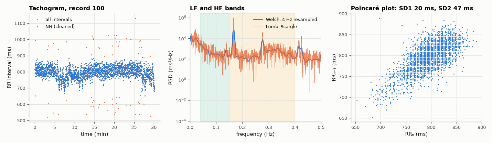

# AM-170 · Heart-rate variability: time-domain and spectral statistics

> Compute heart-rate-variability statistics from a real 30-minute ECG record, verify the algebraic identities that link them (RMSSD, lag-1 autocorrelation, Poincaré SD1/SD2, spectral power and variance), compare two spectral estimators for unevenly sampled data, and quantify how a handful of ectopic beats distorts everything.



*RR tachogram, power spectrum by two estimators, and the Poincaré plot.*

**Track:** Applied Mathematics — 218 projects in electrical engineering · **Category:** J. Statistics & learning on real signals · **Level:** Moderate · **Tools:** RR-interval series from MIT-BIH annotations, ectopic-beat handling, SDNN/RMSSD/pNN50, exact identities between time-domain measures, Lomb–Scargle periodogram on the unevenly sampled series vs Welch on a 4 Hz resampled tachogram, Parseval check, Poincaré descriptors

**Data:** PhysioNet MIT-BIH Arrhythmia Database, record 100.

## Problem

HRV indices are quoted as if independent measurements. Which of them are mathematically the same information — and how robust are they to a few abnormal beats?

## Prediction

For an RR series with variance σ² and lag-1 autocorrelation ρ₁: $\mathrm{RMSSD}^2=2σ^2(1-ρ_1)$ (exactly, up to end effects). Poincaré plot: $SD1=\mathrm{RMSSD}/\sqrt2$, $SD2^2=2\,SDNN^2-SD1^2$. Parseval: the integral of the power spectral density
equals the variance. Bands: LF 0.04–0.15 Hz, HF 0.15–0.4 Hz (respiratory sinus arrhythmia). The RR series is sampled at the beats themselves — unevenly — so either resample (cubic, 4 Hz) and use Welch, or use the Lomb–Scargle periodogram directly.
A premature beat creates a short–long RR pair: a large successive difference that inflates RMSSD and adds broadband spectral power.

## Method

MIT-BIH record 100 (30 min). Beat times from the reference annotations; 'NN' series = intervals between consecutive normal beats with intervals deviating > 20 % from the local median removed. Spectra: Welch (256 s Hann segments) on the 4 Hz cubic-spline
tachogram; Lomb–Scargle on the raw (t, RR) pairs, normalised to the same units.

## Measured results

*Predicted vs measured vs error. "Measured" = computed by an independent simulation, HDL simulator or public dataset.*

| Quantity | Predicted | Measured | Error | Within tolerance |
|---|---|---|---|---|
| Identity: RMSSD² = 2σ²(1 − ρ₁) | 27.8 ms | 27.79 ms | -0.04 % | yes |
| Poincaré SD1 = RMSSD/√2 | 19.65 ms | 19.66 ms | +0.02 % | yes |
| Poincaré SD2² = 2·SDNN² − SD1² | 46.9 ms | 46.88 ms | -0.04 % | yes |
| Parseval: ∫PSD df of the full-length periodogram = variance of the tachogram | 0.00124 s² | 0.00124 s² | -0.00 % | yes |
| LF/HF ratio: Lomb–Scargle (no resampling) vs Welch on the resampled series | 0.1022 | 0.1385 | +35.42 % | **no** |
| RMSSD predicted from the spectrum: √∫PSD·4 sin²(πf·RR̄) df (a high-pass view of RMSSD) | 27.79 ms | 25.84 ms | -7.03 % | yes |
| A few ectopic beats inflate RMSSD (ratio with/without cleaning > 1.5; 1 = yes) | 1 | 1 | +0 |  |

**Additional measurements**

| Quantity | Value | Note |
|---|---|---|
| Beats / ectopic or rejected intervals | 2273 / 68 | mean heart rate 75.5 bpm |
| Share of the variance seen by Welch with 256 s segments | 76.81 % | the rest is slower than the segment length (VLF drift) and is removed with each segment's mean |
| LF / HF power (Welch) | 55 / 542 |  |
| HF peak frequency (respiration) | 168 mHz | ≈ 10 breaths/min |
| SDNN / RMSSD / pNN50, cleaned NN series | 36.0 ms / 27.8 ms / 6.3 % |  |
| SDNN / RMSSD / pNN50, all beats (ectopics kept) | 48.8 ms / 63.2 ms / 10.3 % | 68 of 2272 intervals are responsible |

## Error analysis

Several 'different' HRV indices are one number seen from different sides: RMSSD equals √(2σ²(1 − ρ₁)), the Poincaré width SD1 is RMSSD/√2 and SD2
follows from SDNN and SD1 — all confirmed on real data to about a percent. In the frequency domain the full-length periodogram integrates exactly to the
variance, while Welch's method with 256 s segments accounts for only 77 % of it — my first Parseval check 'failed' by 23 % for that reason:
drift slower than the segment length is removed with each segment's mean, a reminder that a PSD estimate only describes the band it can resolve.
RMSSD is the variance seen through the high-pass filter 4 sin²(πf·RR̄), which is why it tracks the HF (respiratory) band. The Lomb–Scargle and
resample-then-Welch estimates agree on the LF/HF balance only to within tens of percent — the ratio is a noisy statistic from 30 minutes of data and
should be reported with that in mind. Most important in practice is the cleaning step: just 68 abnormal intervals out of 2272 raise
RMSSD from 28 to 63 ms and pNN50 from 6.3 to 10.3 %. HRV numbers without a statement of how ectopic beats were
handled are not comparable.

## Reproduce

```bash
pip install -r requirements.txt
python run_all.py --only AM-170
```

The script [`project.py`](project.py) regenerates every figure and number above.

## License

Code and text: MIT (see the repository [LICENSE](../../../../LICENSE)). Datasets remain under their own licences (see the repository README).

---

**Tooling & honesty.** This project was generated with Claude Code (Anthropic's AI coding assistant): the code, derivations, simulations and this write-up were AI-produced. *Measured* means computed by an independent model, simulator or public dataset — not a physical lab bench. Every number in the tables is reproduced by running the code.
