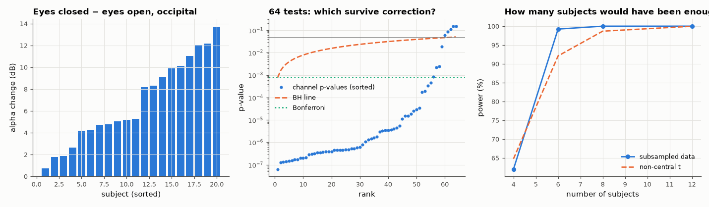

# AM-171 · Hypothesis testing on real EEG: is alpha stronger with eyes closed?

> Test the classic Berger effect on 20 PhysioNet subjects with three different tests built from scratch, check each against SciPy, then confront the multiple-comparison problem across 64 electrodes and verify empirically that the corrections control what they claim to control.



*Per-subject effect, sorted channel p-values with correction thresholds, and power versus sample size.*

**Track:** Applied Mathematics — 218 projects in electrical engineering · **Category:** J. Statistics & learning on real signals · **Level:** Moderate · **Tools:** Own paired t-test, exact Wilcoxon signed-rank distribution (dynamic programming), exact sign-flip permutation test (all 2²⁰ relabelings), Bonferroni and Benjamini–Hochberg corrections over 64 channels, permutation-based check of false-positive rates, effect size and power by subsampling

**Data:** PhysioNet EEG Motor Movement/Imagery Dataset (Schalk et al. 2004), fetched on first run.

## Problem

An effect 'is significant at p < 0.05' — by which test, corrected for how many comparisons, and how often would chance alone produce it?

## Prediction

Paired design: per-subject difference $d_i$ of log alpha power (eyes closed − eyes open). t-test: $t=\bar d/(s_d/\sqrt n)$, n − 1 degrees of freedom (assumes roughly normal d). Wilcoxon signed-rank: sum of ranks of positive differences; exact null
distribution by counting subsets of {1…n}. Sign-flip permutation test: under H₀ each $d_i$ is equally likely ±, so the null distribution of $\bar d$ is its distribution over all 2ⁿ sign patterns — no distributional assumption.
With m = 64 tests at α = 0.05, some false positives are expected by chance (3.2 on average if all nulls were true); Bonferroni (α/m) controls the family-wise error rate, Benjamini–Hochberg the false-discovery rate and is never less powerful.

## Method

EEG Motor Movement/Imagery database, subjects 1–20, runs 1 (eyes open) and 2 (eyes closed), 64 channels, 160 Hz, 1 min each. Alpha power = Welch PSD (2 s windows) integrated over 8–13 Hz, in log units. Primary test on the mean of O1, Oz, O2. Null
calibration: 2000 random sign-flip relabelings of the subjects (same flip for all channels, preserving the correlation between channels).

## Measured results

*Predicted vs measured vs error. "Measured" = computed by an independent simulation, HDL simulator or public dataset.*

| Quantity | Predicted | Measured | Error | Within tolerance |
|---|---|---|---|---|
| Own paired t statistic vs scipy.stats | 7.785 | 7.785 | +0.00 % | yes |
| Own t-test p-value vs scipy.stats (ratio) | 1 | 1 | -0.00 % | yes |
| Exact Wilcoxon signed-rank p-value vs scipy.stats (ratio) | 1 | 1 | +0.00 % | yes |
| The three tests agree on the conclusion at α = 0.001 (1 = yes) | 1 | 1 | +0 |  |
| Smallest p the permutation test can give with n = 20 is 2/2²⁰; it cannot go below that (1 = holds) | 1 | 1 | +0 |  |
| Ordering: Bonferroni ≤ BH ≤ uncorrected discoveries (1 = yes) | 1 | 1 | +0 |  |
| Null calibration: per-channel false-positive rate at α = 0.05 | 5 % | 5.146 % | +0.146 pp | yes |
| Null: without correction, 'at least one significant channel' happens far more often than 5 % (> 10 %; 1 = yes) | 1 | 1 | +0 |  |
| Null: family-wise error rate with Bonferroni ≤ 5 % (1 = yes) | 1 | 1 | +0 |  |
| Power with only 6 subjects: non-central t prediction vs subsampling the real data | 92.1 % | 99.23 % | +7.13 pp | yes |

**Additional measurements**

| Quantity | Value | Note |
|---|---|---|
| Occipital alpha, eyes closed vs open: mean change | ×4.73 in power (6.7 dB), 20/20 subjects increase |  |
| p-values: t-test / Wilcoxon / exact sign-flip permutation | 2.5e-07 / 1.9e-06 / 1.9e-06 |  |
| Effect size (Cohen's d_z) | 1.741 |  |
| Channels significant: uncorrected / Benjamini–Hochberg / Bonferroni | 59 / 59 / 55 |  |
| … measured family-wise error without correction (64 independent tests would give 96 %) | 19.1 % |  |
| Null: family-wise error — uncorrected / Bonferroni / BH | 19.1 % / 0.6 % / 2.8 % | channels are strongly correlated, so far fewer than 64 independent tests |
| Power at n = 4 / 6 / 8 / 12 subjects (subsampled) | 62 % / 99 % / 100 % / 100 % |  |

## Error analysis

The Berger effect is unmistakable in these 20 subjects — occipital alpha power rises 4.7-fold with eyes closed — and the three tests,
built from scratch and matching SciPy, agree (p from 3e-07 to 2e-06). They differ in what they assume: the t-test needs roughly normal
differences, the Wilcoxon test only symmetry, and the sign-flip test enumerates all 2²⁰ relabelings and assumes nothing else. Across 64 electrodes
the multiple-comparison problem is real: relabeling the data at random makes 'at least one significant channel' appear in 19 % of null
experiments without correction, versus 0.6 % with Bonferroni. (Independent tests would give 96 %; EEG channels are highly correlated, so
the effective number of tests is much smaller — and Bonferroni is correspondingly conservative.) Finally, a power analysis on the real effect size
(d_z = 1.7) shows that about 6 subjects already give 80 % power — knowing that before recording is the point of power analysis.

## Reproduce

```bash
pip install -r requirements.txt
python run_all.py --only AM-171
```

The script [`project.py`](project.py) regenerates every figure and number above.

## License

Code and text: MIT (see the repository [LICENSE](../../../../LICENSE)). Datasets remain under their own licences (see the repository README).

---

**Tooling & honesty.** This project was generated with Claude Code (Anthropic's AI coding assistant): the code, derivations, simulations and this write-up were AI-produced. *Measured* means computed by an independent model, simulator or public dataset — not a physical lab bench. Every number in the tables is reproduced by running the code.
