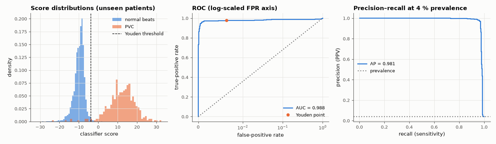

# AM-172 · ROC analysis of an arrhythmia detector

> Evaluate a beat classifier the way a diagnostic test is evaluated: build the ROC curve, show that its area is exactly the probability that a random abnormal beat outranks a random normal one, attach honest uncertainty to it, and show why a test with AUC near 1 can still have a poor positive predictive value.



*Score distributions, ROC curve and precision–recall curve of the PVC detector on unseen patients.*

**Track:** Applied Mathematics — 218 projects in electrical engineering · **Category:** J. Statistics & learning on real signals · **Level:** Moderate · **Tools:** Logistic-regression score for premature ventricular beats (train on 10 patients, test on 10 others), ROC curve by threshold sweep, AUC as a Mann–Whitney statistic, Hanley–McNeil vs bootstrap vs patient-level bootstrap standard errors, Youden operating point, precision under changing prevalence

**Data:** PhysioNet MIT-BIH Arrhythmia Database (15 min of 20 records).

## Problem

One number — accuracy — hides the threshold, the class balance and the uncertainty. What does a complete evaluation of a detector look like?

## Prediction

ROC: TPR vs FPR over all thresholds; it does not depend on prevalence. $\mathrm{AUC}=P(s^+>s^-)+\tfrac12P(s^+=s^-)=U/(n_+n_-)$ with U the Mann–Whitney statistic. Standard error (Hanley–McNeil):
$\sqrt{\frac{A(1-A)+(n_+-1)(Q_1-A^2)+(n_--1)(Q_2-A^2)}{n_+n_-}}$, $Q_1=\frac{A}{2-A}$, $Q_2=\frac{2A^2}{1+A}$ — valid for independent samples. Youden's J = TPR − FPR picks the threshold farthest from chance. Predictive value depends on prevalence π:
$PPV=\frac{Se\,π}{Se\,π+(1-Sp)(1-π)}$.

## Method

MIT-BIH beats (7 timing and morphology features per beat): logistic regression trained on the 10 'DS1' records, scored on the 10 'DS2' records (different patients). Bootstrap: 2000 resamples of beats, and 2000 resamples of whole records.
Prevalence experiment: negatives subsampled or replicated to set π = 50 %, natural and 0.5 %.

## Measured results

*Predicted vs measured vs error. "Measured" = computed by an independent simulation, HDL simulator or public dataset.*

| Quantity | Predicted | Measured | Error | Within tolerance |
|---|---|---|---|---|
| AUC by the trapezoid rule vs Mann–Whitney U/(n₊n₋) from ranks | 0.9881 | 0.9881 | -0.00 % | yes |
| … and vs scipy.stats.mannwhitneyu | 0.9881 | 0.9881 | -0.00 % | yes |
| AUC = probability that a random PVC scores higher than a random normal beat (200 000 random pairs) | 0.9881 | 0.9876 | -0.05 % | yes |
| Standard error of the AUC: Hanley–McNeil formula vs beat-level bootstrap | 0.003866 | 0.005002 | +29.40 % | yes |
| Patient-level bootstrap gives a larger standard error than the beat-level one (beats of one patient are not independent; 1 = yes) | 1 | 1 | +0 |  |
| PPV at the natural prevalence (4.0 %) from Se, Sp and Bayes' rule | 0.8643 | 0.8643 | +0.00 % | yes |
| PPV when prevalence is 50 % (same detector, same threshold) | 0.9936 | 0.9922 | -0.14 % | yes |
| PPV when prevalence is 0.5 % (same detector, same threshold) | 0.4372 | 0.4326 | -1.04 % | yes |

**Additional measurements**

| Quantity | Value | Note |
|---|---|---|
| AUC and its standard error: Hanley–McNeil / beat bootstrap / patient bootstrap | 0.9881 ± 0.0039 / 0.0050 / 0.0126 | 391 PVCs, 9493 normal beats, 10 patients |
| Youden operating point: sensitivity / specificity | 97.7 % / 99.4 % |  |
| Area under the precision–recall curve (average precision) | 0.9808 | chance level = prevalence = 0.040; chance AUC-ROC = 0.5 |

## Error analysis

The area under the ROC curve is not just a geometric summary: computed by the trapezoid rule it equals the Mann–Whitney statistic to machine
precision, and sampling random (PVC, normal) pairs confirms its meaning — the detector ranks the abnormal beat higher 98.8 % of the time.
Its uncertainty depends on what is treated as independent. The Hanley–McNeil formula and a beat-level bootstrap give ±0.0050, but beats from one
patient resemble each other; resampling whole patients gives ±0.0126, 3× larger, and that is the honest figure for 'how would this do on new
patients'. Finally, the ROC is blind to prevalence and the user is not: at the Youden point the detector has Se 98 % and Sp 99 %, yet with
PVCs at 4 % of beats its positive predictive value is only 86 %, and at 0.5 % prevalence most alarms would be false — Bayes' rule,
confirmed by resampling. For rare events the precision–recall curve tells the story the ROC hides.

## Reproduce

```bash
pip install -r requirements.txt
python run_all.py --only AM-172
```

The script [`project.py`](project.py) regenerates every figure and number above.

**Files produced**

- [`data/roc.csv`](data/roc.csv)

## License

Code and text: MIT (see the repository [LICENSE](../../../../LICENSE)). Datasets remain under their own licences (see the repository README).

---

**Tooling & honesty.** This project was generated with Claude Code (Anthropic's AI coding assistant): the code, derivations, simulations and this write-up were AI-produced. *Measured* means computed by an independent model, simulator or public dataset — not a physical lab bench. Every number in the tables is reproduced by running the code.
