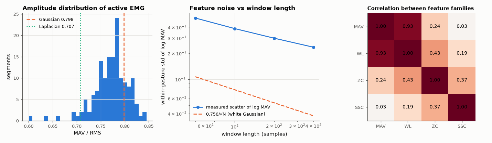

# AM-173 · EMG features: what they measure and how much they overlap

> Examine the classic time-domain EMG features on real 8-channel armband recordings: test the Gaussian model of the EMG amplitude, measure how feature noise falls with window length, show which features carry the same information, and rank them by how well they separate six gestures.



*MAV/RMS ratio of real EMG, feature scatter versus window length, and correlation between feature families.*

**Track:** Applied Mathematics — 218 projects in electrical engineering · **Category:** J. Statistics & learning on real signals · **Level:** Moderate · **Tools:** Amplitude statistics of surface EMG (MAV/RMS ratio, kurtosis) against Gaussian and Laplacian models, estimator variance versus window length, correlation structure of the Hudgins feature set, Fisher separability, per-feature-family classification with LDA

**Data:** UCI Machine Learning Repository, 'EMG data for gestures' (Lobov et al. 2018), fetched on first run.

## Problem

Dozens of EMG features exist. Which are genuinely different measurements, how noisy are they, and how long a window do they need?

## Prediction

Model: EMG = zero-mean noise whose standard deviation follows muscle activation. For a Gaussian amplitude distribution MAV/RMS = $\sqrt{2/π}$ ≈ 0.798 and kurtosis 3; for a Laplacian 1/√2 ≈ 0.707 and kurtosis 6 (surface EMG at low force is
closer to Laplacian). With N independent Gaussian samples the MAV estimate has coefficient of variation $\sqrt{π/2-1}/\sqrt N$ = 0.756/√N — correlated samples reduce the effective N. Waveform length (Σ|Δx|) is MAV of the differenced signal, so log WL
and log MAV should be highly correlated; zero crossings and slope-sign changes measure frequency content instead.

## Method

UCI 'EMG data for gestures' (Myo armband, 8 channels, 36 subjects). Amplitude statistics on gesture segments of subjects 1–10. Estimator noise: features recomputed for 50, 100, 200 and 400-sample windows; within-gesture scatter of log MAV
(per subject, channel and gesture). Separability: Fisher ratio per feature and within-subject LDA accuracy (train on recording 1, test on recording 2) for each feature family and for all 32.

## Measured results

*Predicted vs measured vs error. "Measured" = computed by an independent simulation, HDL simulator or public dataset.*

| Quantity | Predicted | Measured | Error | Within tolerance |
|---|---|---|---|---|
| MAV/RMS of active surface EMG: Gaussian model √(2/π) | 0.7979 | 0.7746 | -2.92 % | yes |
| Scatter of log MAV within a gesture vs window length: slope −½ if only estimation noise mattered | -0.5 | -0.373 | +0.127 | yes |
| Longer windows help: accuracy at 400 ms > accuracy at 50 ms (1 = yes) | 1 | 1 | +0 |  |
| Correlation between log MAV and log WL on the same channel (predicted: > 0.9) | 0.95 | 0.927 | -0.023 | yes |
| ZC and SSC are much less correlated with amplitude than WL is (|r| < 0.6; 1 = yes) | 1 | 1 | +0 |  |
| My expectation: adding ZC to MAV helps more than adding the redundant WL (1 = yes) | 1 | 0 | -1 |  |

**Additional measurements**

| Quantity | Value | Note |
|---|---|---|
| … Laplacian model would give | 0.7071 | measured median 0.775; median kurtosis 3.59 (Gaussian 3, Laplacian 6) |
| Lag-1 autocorrelation of the raw EMG samples (median) | 0.8886 | samples are not independent ⇒ fewer effective samples per window |
| Scatter of log MAV with 200-sample windows: measured vs white-Gaussian prediction 0.756/√N | 0.298 vs 0.053 | ratio 5.6 — real contractions are not stationary |
| Within-subject accuracy (all 32 features) at window 50 / 100 / 200 / 400 ms | 90.4 % / 93.5 % / 94.7 % / 94.6 % |  |
| Within-subject accuracy, MAV | 94.29 % | 36 subjects, chance 16.7 % |
| Within-subject accuracy, WL | 94.03 % | 36 subjects, chance 16.7 % |
| Within-subject accuracy, ZC | 41.15 % | 36 subjects, chance 16.7 % |
| Within-subject accuracy, SSC | 25.36 % | 36 subjects, chance 16.7 % |
| Within-subject accuracy, MAV+ZC | 94.09 % | 36 subjects, chance 16.7 % |
| Within-subject accuracy, all 32 | 94.75 % | 36 subjects, chance 16.7 % |
| Within-subject accuracy, MAV+WL | 94.92 % |  |
| Mean Fisher ratio (between/within variance) per family: MAV / WL / ZC / SSC | 8.1 / 7.9 / 0.6 / 0.2 |  |

## Error analysis

The Gaussian model is a fair first description of active surface EMG: the median MAV/RMS ratio is 0.775 against 0.798 (a Laplacian would give
0.707), with a kurtosis of 3.6. It is not a description of a *contraction*, though: the scatter of log MAV between windows of the same gesture is
6× what estimation noise of a stationary Gaussian signal would give and falls with window length with slope -0.37 rather than −½ —
most of the feature noise is the muscle's force actually wandering, which longer windows cannot average away. The correlation matrix shows why
feature lists overstate their diversity: log WL and log MAV correlate at 0.93 (waveform length is essentially amplitude), whereas zero crossings
and slope-sign changes measure frequency content. I expected that complementary information to pay off; on this dataset it does not. Amplitude
alone classifies six gestures at 94.3 %, ZC or SSC alone at only 41 % and 25 %, and adding ZC to MAV gives 94.1 % —
no better than adding the 'redundant' WL (94.9 %). The whole 32-feature set reaches 94.7 %, half a point above eight amplitude
values. With this armband (200 Hz sampling, heavily filtered) the gesture information is in *which channels are active*, i.e. the spatial
amplitude pattern; the frequency features matter in recordings with wider bandwidth and for fatigue, not here.

## Reproduce

```bash
pip install -r requirements.txt
python run_all.py --only AM-173
```

The script [`project.py`](project.py) regenerates every figure and number above.

## License

Code and text: MIT (see the repository [LICENSE](../../../../LICENSE)). Datasets remain under their own licences (see the repository README).

---

**Tooling & honesty.** This project was generated with Claude Code (Anthropic's AI coding assistant): the code, derivations, simulations and this write-up were AI-produced. *Measured* means computed by an independent model, simulator or public dataset — not a physical lab bench. Every number in the tables is reproduced by running the code.
