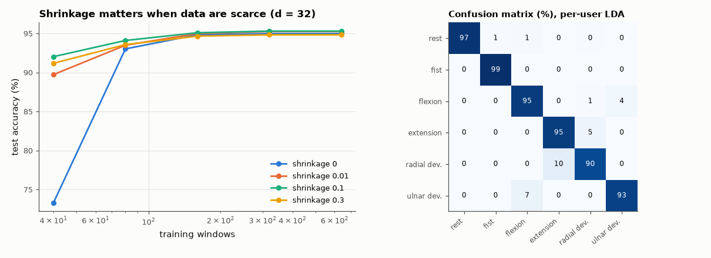

# AM-174 · Linear discriminant analysis from scratch

> Derive LDA as the Bayes classifier for Gaussian classes with a common covariance, verify its error rate against the closed form, confirm it maximises the Fisher criterion and coincides with least squares for two classes, and study how shrinkage rescues it when training data are scarce — on synthetic data and on real EMG.



*Accuracy of LDA versus training-set size for several shrinkage levels, and the confusion matrix on real EMG.*

**Track:** Applied Mathematics — 218 projects in electrical engineering · **Category:** J. Statistics & learning on real signals · **Level:** Moderate · **Tools:** Own multi-class LDA (pooled covariance, shrinkage, priors), Bayes error for Gaussian classes in closed form, equivalence with least-squares regression for two classes, Fisher-criterion check against random directions, small-sample shrinkage study, real EMG gesture data

**Data:** UCI 'EMG data for gestures' (Lobov et al. 2018).

## Problem

LDA is the default classifier for EMG and EEG interfaces. What does it assume, when is it optimal, and what breaks when there are few training windows?

## Prediction

For classes $\mathcal N(μ_k,Σ)$ the Bayes rule is linear: choose k maximising $x^TΣ^{-1}μ_k-\tfrac12μ_k^TΣ^{-1}μ_k+\ln π_k$. Two classes with equal priors: error $=Φ(-Δ/2)$, $Δ^2=(μ_1-μ_0)^TΣ^{-1}(μ_1-μ_0)$ (Mahalanobis distance).
The direction $w=Σ^{-1}(μ_1-μ_0)$ maximises the Fisher ratio $\frac{(w^T(μ_1-μ_0))^2}{w^TΣw}$ and is proportional to the least-squares regression of the class label on x. With n training samples in d dimensions the estimated covariance
is poorly conditioned when n ≈ d; shrinking it toward a scaled identity trades bias for variance.

## Method

Synthetic: d = 10, Δ = 1, 2, 3; 2000 training and 200 000 test samples. Fisher check: 2000 random directions. Small-sample study: d = 32 (the EMG feature dimension), 40 to 640 training windows per subject drawn from real data, shrinkage 0,
0.01, 0.1, 0.3. Real data: six gestures, 36 subjects, train on one recording, test on the other.

## Measured results

*Predicted vs measured vs error. "Measured" = computed by an independent simulation, HDL simulator or public dataset.*

| Quantity | Predicted | Measured | Error | Within tolerance |
|---|---|---|---|---|
| Synthetic Gaussians, Δ = 1: test error vs Bayes error Φ(−Δ/2) | 30.85 % | 30.99 % | +0.46 % | yes |
| Synthetic Gaussians, Δ = 2: test error vs Bayes error Φ(−Δ/2) | 15.87 % | 15.83 % | -0.25 % | yes |
| Two classes: cosine between the LDA direction and the least-squares regression direction | 1 | 1 | +0.00 % | yes |
| Fisher criterion: random directions (2000) that beat the LDA direction | 0 | 0 | +0 |  |
| Fisher ratio at the LDA direction = estimated Δ² | 3.98 | 3.98 | +0.00 % | yes |
| Synthetic Gaussians, Δ = 3: test error vs Bayes error Φ(−Δ/2) | 6.681 % | 6.686 % | +0.08 % | yes |
| Real EMG, six gestures, per-user LDA: mean accuracy (literature for this feature set: 90–95 %) | 92 % | 94.75 % | +2.75 pp | yes |
| Few training windows (40, about the feature dimension): shrinkage 0.1 beats no shrinkage (1 = yes) | 1 | 1 | +0 |  |
| Plenty of training windows: the unshrunk estimate is as good or better than heavy shrinkage 0.3 (1 = yes) | 1 | 1 | +0 |  |

**Additional measurements**

| Quantity | Value | Note |
|---|---|---|
| Subjects / accuracy range | 36 / 82–100 % | chance 16.7 % |
| Most frequent confusion | radial dev. → extension | 116 windows |
| Accuracy with 40 training windows: shrinkage 0 / 0.01 / 0.1 / 0.3 | 73.3 % / 89.7 % / 92.0 % / 91.2 % |  |
| Accuracy with the largest training set: shrinkage 0 / 0.01 / 0.1 / 0.3 | 95.0 % / 95.2 % / 95.3 % / 94.8 % |  |

## Error analysis

On data that satisfy its assumptions LDA is simply the best possible classifier: the test error lands on the Bayes error Φ(−Δ/2) for every
separation tried, its direction is the one that maximises the Fisher ratio (no random direction did better), and for two classes it coincides with
ordinary least squares on the labels. On real EMG the assumptions hold only roughly, yet per-user accuracy is 94.7 % over 36 subjects,
which is why LDA remains the baseline in myoelectric control. Its weak point is the covariance estimate: with 40 training windows for 32 features
the unshrunk classifier scores 73 %, and blending the covariance with 10 % of a scaled identity lifts it to 92 %; with hundreds of
windows the shrinkage no longer matters (95.0 vs 95.3 %). Shrinkage is the cheap insurance that makes LDA usable after a short calibration.

## Reproduce

```bash
pip install -r requirements.txt
python run_all.py --only AM-174
```

The script [`project.py`](project.py) regenerates every figure and number above.

## License

Code and text: MIT (see the repository [LICENSE](../../../../LICENSE)). Datasets remain under their own licences (see the repository README).

---

**Tooling & honesty.** This project was generated with Claude Code (Anthropic's AI coding assistant): the code, derivations, simulations and this write-up were AI-produced. *Measured* means computed by an independent model, simulator or public dataset — not a physical lab bench. Every number in the tables is reproduced by running the code.
