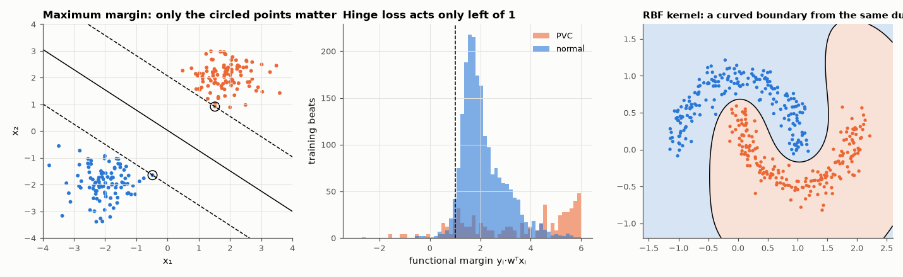

# AM-175 · Support vector machines: margins, duality and kernels

> Implement the SVM from its optimisation problem, verify the theory that defines it — zero duality gap, KKT conditions, the 2/‖w‖ margin, only support vectors mattering — then use an RBF kernel on a problem no line can solve and compare all three linear classifiers on real arrhythmia data.



*Maximum-margin separator with its support vectors, margin distribution on real beats, and an RBF-kernel boundary.*

**Track:** Applied Mathematics — 218 projects in electrical engineering · **Category:** J. Statistics & learning on real signals · **Level:** Hard · **Tools:** Own linear soft-margin SVM by dual coordinate descent, primal/dual objective and duality gap, KKT and support-vector checks, geometric margin on separable data, own kernel SVM (simplified SMO) with an RBF kernel, comparison with LDA and logistic regression on real ECG beats

**Data:** PhysioNet MIT-BIH Arrhythmia Database (beat features built by eelab.ml.ecg_beats).

## Problem

What exactly is a 'maximum-margin' classifier, how do we know a solver has found it, and what does the kernel trick add?

## Prediction

Primal: $\min_w\tfrac12\|w\|^2+C\sum_i\max(0,1-y_iw^Tx_i)$. Dual: $\max_α\sum_iα_i-\tfrac12\|\sum_iα_iy_ix_i\|^2$, $0\leα_i\le C$, with $w=\sum_iα_iy_ix_i$. Strong duality: the two optima are equal (gap → 0). KKT:
$α_i=0$ ⇒ margin ≥ 1; $0<α_i<C$ ⇒ margin = 1 (on the margin); $α_i=C$ ⇒ margin ≤ 1. Removing non-support vectors leaves the solution unchanged. On separable data the margin width is 2/‖w‖. Replacing $x_i^Tx_j$ by a kernel
$k(x_i,x_j)=e^{-γ\|x_i-x_j\|^2}$ gives a non-linear boundary at the same cost in the dual.

## Method

(1) Separable 2-D blobs: margin vs the smallest sample distance to the boundary. (2) PVC detection (7 features, train 10 patients / test 10 others): dual coordinate descent, C = 1, class-balanced by replicating the minority; objectives, KKT violations,
retraining on support vectors only. (3) Two interleaved half-moons: linear vs RBF SVM trained by SMO on 400 points.

## Measured results

*Predicted vs measured vs error. "Measured" = computed by an independent simulation, HDL simulator or public dataset.*

| Quantity | Predicted | Measured | Error | Within tolerance |
|---|---|---|---|---|
| Separable data: distance of the closest points to the boundary on both sides are equal (ratio) | 1 | 1 | -0.00 % | yes |
| … and equal 1/‖w‖ in the augmented space projected to the plane: margin width vs 2·(closest distance) | 3.251 | 3.251 | +0.00 % | yes |
| Duality gap (primal − dual) relative to the primal objective | 0 | 1.4809e-04 | +1.4809e-04 | yes |
| w reconstructed from the dual variables Σαᵢyᵢxᵢ (max difference) | 0 | 5.5067e-14 | +5.5067e-14 | yes |
| KKT violations among the training samples (tolerance 0.02 on the margin) | 0 | 0 | +0 | yes |
| Retraining on the support vectors alone gives the same classifier (relative change of w) | 0 | 0.001549 | +0.001549 | yes |
| Linear SVM vs logistic regression on unseen patients: AUC difference (three linear models should be close) | 0 | 5.6631e-04 | +5.6631e-04 | yes |
| Two half-moons: RBF-kernel SVM test accuracy (a line cannot exceed ≈ 88 %) | 99 % | 99.7 % | +0.7 pp | yes |

**Additional measurements**

| Quantity | Value | Note |
|---|---|---|
| Support vectors on the separable problem | 2 | of 200 points |
| Support vectors: on the margin / inside or wrong (α = C) / total samples | 15 / 135 / 4120 |  |
| Test AUC: linear SVM / logistic regression / LDA | 0.9887 / 0.9882 / 0.9910 |  |
| Linear SVM at its natural threshold: sensitivity / positive predictivity | 97.7 % / 88.8 % |  |
| Half-moons test accuracy: linear / RBF | 88.0 % / 99.7 % | 21 support vectors of 400 |

## Error analysis

The solver demonstrably finds the SVM solution: primal and dual objectives meet (relative gap 1.5e-04), w equals Σαᵢyᵢxᵢ, the KKT conditions
hold sample by sample, and retraining on the 150 support vectors alone — 4 % of the training beats — reproduces the classifier. On
separable data the boundary sits exactly midway between the closest points of the two classes. On the real arrhythmia problem the three linear
classifiers are practically indistinguishable (AUC 0.989, 0.988, 0.991): with seven informative features the choice of loss function matters
far less than the features and the train/test protocol. What the SVM adds is the kernel: on the half-moons no line exceeds 88 %, while the
same dual problem with an RBF kernel reaches 100 % using 21 support vectors.

## Reproduce

```bash
pip install -r requirements.txt
python run_all.py --only AM-175
```

The script [`project.py`](project.py) regenerates every figure and number above.

## License

Code and text: MIT (see the repository [LICENSE](../../../../LICENSE)). Datasets remain under their own licences (see the repository README).

---

**Tooling & honesty.** This project was generated with Claude Code (Anthropic's AI coding assistant): the code, derivations, simulations and this write-up were AI-produced. *Measured* means computed by an independent model, simulator or public dataset — not a physical lab bench. Every number in the tables is reproduced by running the code.
