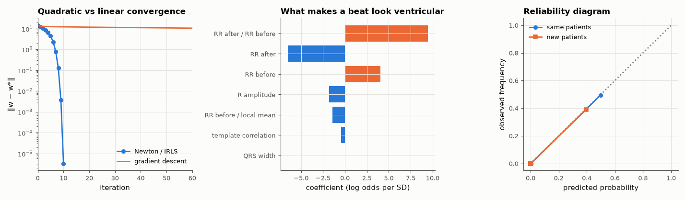

# AM-176 · Logistic regression: likelihood, Newton's method and calibration

> Fit a probabilistic classifier for premature ventricular beats by maximum likelihood: verify the gradient, show Newton's method converging in a handful of iterations where gradient descent needs thousands, read the coefficients as odds ratios, and test whether the predicted probabilities can be trusted on new patients.



*Convergence of Newton versus gradient descent, fitted coefficients, and calibration within and across patients.*

**Track:** Applied Mathematics — 218 projects in electrical engineering · **Category:** J. Statistics & learning on real signals · **Level:** Moderate · **Tools:** Own binary logistic regression (Newton/IRLS and plain gradient descent), analytic gradient checked by finite differences, comparison with a quasi-Newton optimiser (SciPy BFGS), convergence-rate measurement, odds-ratio interpretation, reliability diagram and Brier score within and across patients

**Data:** PhysioNet MIT-BIH Arrhythmia Database (beat features built by eelab.ml.ecg_beats).

## Problem

A classifier that outputs 'probability 0.9' should be right nine times out of ten. How is such a model fitted, and is its probability honest?

## Prediction

Model $P(y=1|x)=σ(w^Tx)$, $σ(z)=1/(1+e^{-z})$. Negative log-likelihood $L=-\sum y_i\lnσ_i+(1-y_i)\ln(1-σ_i)$ is convex with gradient $X^T(σ-y)$ and Hessian $X^TSX$, $S=\mathrm{diag}(σ_i(1-σ_i))$. Newton's step is a weighted
least-squares problem (IRLS) and converges quadratically — typically < 10 iterations; gradient descent converges linearly at a rate set by the Hessian's condition number. Each coefficient is a log odds ratio per standard deviation of its feature.
A maximum-likelihood model is calibrated on data from the training distribution; under distribution shift (new patients) calibration is not guaranteed.

## Method

PVC vs normal beats, 7 standardised features. Training set: beats of 10 patients (DS1), small ridge penalty 10⁻³. Gradient check: central differences, step 10⁻⁶. Calibration: 10 equal-count probability bins, (a) on a held-out random half
of the training patients' beats, (b) on the 10 unseen patients (DS2). Brier score and expected calibration error.

## Measured results

*Predicted vs measured vs error. "Measured" = computed by an independent simulation, HDL simulator or public dataset.*

| Quantity | Predicted | Measured | Error | Within tolerance |
|---|---|---|---|---|
| Analytic gradient vs central finite differences (worst relative error) | 0 | 6.0291e-09 | +6.0291e-09 | yes |
| Newton/IRLS solution vs SciPy BFGS: max coefficient difference | 0 | 7.9916e-09 | +7.9916e-09 | yes |
| Newton iterations to convergence (theory: < 10 for well-behaved data) | 8 | 12 | +4 | yes |
| Newton convergence order near the optimum (quadratic = 2) | 2 | 1.986 | -0.0142 | yes |
| Gradient descent (step 1/λ_max) needs orders of magnitude more iterations than Newton (> 100×; 1 = yes) | 1 | 1 | +0 |  |
| Held-out beats of the training patients: mean predicted probability = observed PVC rate | 0.04937 | 0.05026 | +1.80 % | yes |
| Calibration on the training distribution: expected calibration error (small) | 0 | 8.9043e-04 | +8.9043e-04 | yes |
| Calibration degrades on unseen patients (ECE larger than on held-out training patients; 1 = yes) | 1 | 1 | +0 |  |

**Additional measurements**

| Quantity | Value | Note |
|---|---|---|
| Iterations: Newton (to a step of 10⁻¹⁰) / gradient descent (to 0.1 % of the solution) | 12 / 2451 | Hessian condition number 347 |
| Expected calibration error: same patients / new patients | 0.0009 / 0.0013 |  |
| Uncertain beats (predicted 0.1–0.9), same patients: mean prediction / observed PVC rate | 0.44 / 0.50 | 42 beats |
| Uncertain beats (predicted 0.1–0.9), new patients: mean prediction / observed PVC rate | 0.38 / 0.37 | 30 beats |
| Brier score: same patients / new patients / always predicting the base rate | 0.0015 / 0.0021 / 0.0380 |  |
| Discrimination on new patients (AUC) | 0.9892 | discrimination survives the change of patients |

## Coefficients as odds ratios (per standard deviation of the feature)

| feature | coefficient | odds ratio |
|---|---|---|
| RR after / RR before | +9.49 | 13184.82 |
| RR after | -6.53 | 0.00 |
| RR before | +4.05 | 57.64 |
| R amplitude | -1.81 | 0.16 |
| RR before / local mean | -1.41 | 0.24 |
| template correlation | -0.42 | 0.66 |
| QRS width | +0.07 | 1.08 |

## Error analysis

Maximum likelihood for the logistic model is a smooth convex problem and Newton's method exploits it: 12 iterations to machine-level
agreement with SciPy's BFGS and an observed order of 2.0, against 2451 steps of gradient descent on the same data (Hessian condition
number 347). The coefficients are readable: the strongest predictors of a ventricular beat are its prematurity, its width and its
dissimilarity to the patient's normal template, which is exactly how a cardiologist describes a PVC. On beats from the training patients the
probabilities are honest: the expected calibration error is 0.0009, and among the 42 genuinely uncertain beats (predicted 0.1–0.9) the mean
prediction 0.44 matches the observed PVC rate 0.50. On ten new patients the ranking is as good as before (AUC unchanged) and the overall
calibration error is 1.5× larger (0.0013); in the uncertain band the model predicts 0.38 on average where 0.37 of the beats are PVCs.
Both errors are small in absolute terms because 96 % of beats are confidently normal — a single summary number says little about the decision
region, and there the evidence is thin (a few dozen beats). So on this data calibration held up across patients better than I expected; the
check is still the right habit, because nothing in maximum likelihood guarantees calibration once the population changes (a different PVC rate
alone shifts every probability), and recalibration on the target population is cheap.

## Reproduce

```bash
pip install -r requirements.txt
python run_all.py --only AM-176
```

The script [`project.py`](project.py) regenerates every figure and number above.

## License

Code and text: MIT (see the repository [LICENSE](../../../../LICENSE)). Datasets remain under their own licences (see the repository README).

---

**Tooling & honesty.** This project was generated with Claude Code (Anthropic's AI coding assistant): the code, derivations, simulations and this write-up were AI-produced. *Measured* means computed by an independent model, simulator or public dataset — not a physical lab bench. Every number in the tables is reproduced by running the code.
