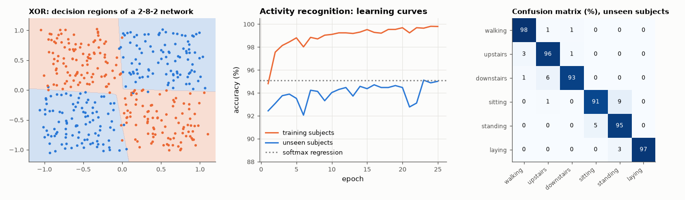

# AM-177 · A neural network from scratch: backpropagation verified

> Write forward and backward passes by hand, prove the gradients right to seven digits, show the network solving a problem no linear model can, then train it on a real 6-class activity-recognition benchmark, compare it fairly with a linear baseline and watch it over-fit when data are scarce.



*A network solving XOR, learning curves on the activity-recognition task, and the test confusion matrix.*

**Track:** Applied Mathematics — 218 projects in electrical engineering · **Category:** J. Statistics & learning on real signals · **Level:** Hard · **Tools:** Own multilayer perceptron in NumPy (ReLU, softmax, cross-entropy, Adam), analytic gradients checked against finite differences, XOR as the minimal non-linear problem, human-activity recognition from smartphone IMU features, comparison with softmax regression, over-fitting study

**Data:** UCI Human Activity Recognition Using Smartphones (Anguita et al. 2013), fetched on first run.

## Problem

What does a neural network actually compute during training, and how do we know the hand-derived gradients are correct?

## Prediction

Layer: $a_l=\mathrm{ReLU}(a_{l-1}W_l+b_l)$, output softmax, loss = cross-entropy. Backpropagation is the chain rule applied layer by layer: $δ_L=(p-y)/n$, $\nabla W_l=a_{l-1}^Tδ_l$, $δ_{l-1}=(δ_lW_l^T)\odot[a_{l-1}>0]$.
A correct implementation matches central finite differences to ~10⁻⁷ relative error. One hidden layer suffices to represent XOR, which no linear classifier separates (best possible 75 %). On a well-engineered feature set a linear model is already
strong, so the network's gain is expected to be small; with few training samples a large network memorises (training accuracy 100 %) and generalises worse.

## Method

Gradient check on a 5-7-6-3 network (all parameters, step 10⁻⁵, float64). XOR: 2-8-2 network, 400 noisy points. HAR: 561 features, 21 training subjects (7352 windows) and 9 test subjects (2947); network 561-64-6, 25 epochs of Adam; softmax
regression baseline. Over-fitting: 200 training windows, 561-256-6 network without weight decay, versus the same with weight decay 0.03.

## Measured results

*Predicted vs measured vs error. "Measured" = computed by an independent simulation, HDL simulator or public dataset.*

| Quantity | Predicted | Measured | Error | Within tolerance |
|---|---|---|---|---|
| Backpropagation vs central finite differences: worst relative error over all 119 parameters | 0 | 1.0244e-08 | +1.0244e-08 | yes |
| XOR: best linear classifier cannot beat 75 % (measured accuracy of the linear model ≤ 75 %; 1 = yes) | 1 | 1 | +0 |  |
| XOR: one hidden layer of 8 units | 100 % | 97.75 % | -2.25 pp | yes |
| HAR, 9 unseen subjects: MLP test accuracy (published results on these features: ≈ 95–96 %) | 95.5 % | 95.01 % | -0.488 pp | yes |
| HAR: linear softmax regression on the same features (expected within ~2 points of the network) | 95.01 % | 95.08 % | +0.0679 pp | yes |
| 200 training windows, 145 000 parameters, no regularisation: training accuracy (memorisation) | 100 % | 100 % | +0 pp | yes |
| … generalisation gap (train − test) is large (> 5 points; 1 = yes) | 1 | 1 | +0 |  |

**Additional measurements**

| Quantity | Value | Note |
|---|---|---|
| Binomial standard error of a test accuracy on 2947 windows | 0.401 pp | differences smaller than ~1 point are not meaningful (and windows of one subject are correlated) |
| Share of the network's errors that are sitting ↔ standing | 48.98 % | the two static postures differ only in the gravity direction at the waist |
| Test accuracy with 200 training windows: no weight decay / weight decay 0.03 / full training set | 86.9 % / 87.1 % / 95.0 % |  |

## Error analysis

The hand-written backward pass agrees with finite differences to 1e-08 on every parameter — the check that should precede any training run.
With it the network does what linear models cannot (XOR: 98 % against 48 %) and reaches 95.0 % on nine unseen subjects of the
activity benchmark. The instructive comparison is the baseline: plain softmax regression on the same 561 engineered features scores
95.1 %, a difference of 0.1 points against a standard error of 0.4. When the features already linearise the problem, a
hidden layer buys little; the largest single group of remaining errors (49 %) is sitting-versus-standing, a limit of the sensor
placement rather than of the classifier. And capacity cuts both ways: given only 200 windows, a 145 000-parameter network fits them perfectly and
scores 86.9 % on new subjects; weight decay barely changes that (87.1 %) — what the small training set lacks is other people's movement,
which no regulariser can supply.

## Reproduce

```bash
pip install -r requirements.txt
python run_all.py --only AM-177
```

The script [`project.py`](project.py) regenerates every figure and number above.

## License

Code and text: MIT (see the repository [LICENSE](../../../../LICENSE)). Datasets remain under their own licences (see the repository README).

---

**Tooling & honesty.** This project was generated with Claude Code (Anthropic's AI coding assistant): the code, derivations, simulations and this write-up were AI-produced. *Measured* means computed by an independent model, simulator or public dataset — not a physical lab bench. Every number in the tables is reproduced by running the code.
