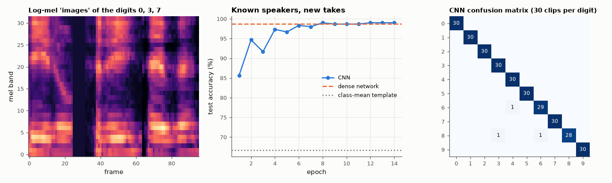

# AM-178 · A convolutional network on spectrograms, written in NumPy

> Turn one-second audio clips into 32 × 32 log-mel images and classify spoken digits with a small convolutional network implemented from scratch — gradients verified numerically — then ask the question that matters: does it recognise digits, or the six speakers it was trained on?



*Example spectrograms, test accuracy during training, and the CNN's confusion matrix.*

**Track:** Applied Mathematics — 218 projects in electrical engineering · **Category:** J. Statistics & learning on real signals · **Level:** Hard · **Tools:** Own CNN (3×3 convolutions via sliding windows and einsum, ReLU, 2×2 max-pooling, dense layers, Adam) with hand-derived backward pass, finite-difference gradient check, log-mel spectrograms of spoken digits, comparisons with a dense network and a nearest-centroid baseline, random-recording versus unseen-speaker evaluation

**Data:** Free Spoken Digit Dataset (Jakobovski et al., CC BY-SA 4.0), fetched on first run.

## Problem

Why do convolutions suit spectrograms, how is a CNN trained without a deep-learning library, and what does its test accuracy really measure?

## Prediction

A convolution layer applies the same small filter at every time–frequency position (weight sharing): far fewer parameters than a dense layer and built-in tolerance to shifts, which pooling reinforces. Backward pass: the gradient w.r.t. the
filters is the correlation of the layer input with the output gradient; the gradient w.r.t. the input is the 'full' correlation with the flipped filters; max-pooling routes the gradient to the winning position.
Expected: CNN > dense network > template matching on unseen recordings of known speakers (published small-CNN results on FSDD: 95–99 %), with a clear drop on a speaker never heard in training.

## Method

Free Spoken Digit Dataset: 3000 recordings, 6 speakers, 8 kHz. Features: 32-band log-mel spectrogram, 32 frames centred on the energy centroid. Network: conv 8@3×3 → pool → conv 16@3×3 → pool → dense 64 → 10 (≈ 67 000 parameters), 14 epochs.
Split A (standard): takes 0–4 of every speaker and digit for testing (300), the rest for training. Split B: one speaker held out completely.

## Measured results

*Predicted vs measured vs error. "Measured" = computed by an independent simulation, HDL simulator or public dataset.*

| Quantity | Predicted | Measured | Error | Within tolerance |
|---|---|---|---|---|
| CNN backward pass vs finite differences (sampled parameters of every layer): worst relative error | 0 | 1.4134e-09 | +1.4134e-09 | yes |
| Standard split (new takes of known speakers): CNN test accuracy (published small CNNs: 95–99 %) | 97 % | 99 % | +2 pp | yes |
| CNN at least as accurate as the dense network on the same input (1 = yes) | 1 | 1 | +0 |  |
| Shift tolerance: accuracy lost when test clips are delayed by 3 frames (37 ms) is smaller for the CNN than for the dense net (1 = yes) | 1 | 1 | +0 |  |
| Unseen speaker: accuracy is lower than on new takes of known speakers (1 = yes) | 1 | 1 | +0 |  |

**Additional measurements**

| Quantity | Value | Note |
|---|---|---|
| Test accuracy: nearest class-mean template / dense 1024-64-10 / CNN | 66.7 % / 98.7 % / 99.0 % | 300 test clips; CNN has 67498 parameters, the dense net 66250 |
| Accuracy after a 3-frame shift: dense / CNN | 90.0 % / 93.7 % |  |
| CNN accuracy on a completely held-out speaker (two different speakers tried) | 72.8 % / 82.0 % | speakers: george, yweweler |

## Error analysis

A CNN needs no library — sliding windows, two einsum calls per layer and a carefully derived backward pass, which matches finite differences
to 1e-09. On the standard split it recognises 99.0 % of 300 unseen recordings, against 98.7 % for a dense network with a similar number of
parameters (67498 vs 66250) and 66.7 % for class-mean templates. The CNN's lead over the dense network is 1 clip(s) out of 300 — not a
significant difference (standard error ≈ 0.6 points); on centred, equal-length clips a dense layer has little to lose. The benefit of weight
sharing shows when the input moves: delaying the test clips by three frames costs the dense network 8.7 points and the CNN 5.3. The standard split, however, tests new takes by speakers the network has
already heard. Holding a speaker out entirely gives 73 % and 82 % — the honest estimate of performance on a new voice, and a
reminder that with six speakers a model can lean on who is speaking as much as on what is said.

## Reproduce

```bash
pip install -r requirements.txt
python run_all.py --only AM-178
```

The script [`project.py`](project.py) regenerates every figure and number above.

## License

Code and text: MIT (see the repository [LICENSE](../../../../LICENSE)). Datasets remain under their own licences (see the repository README).

---

**Tooling & honesty.** This project was generated with Claude Code (Anthropic's AI coding assistant): the code, derivations, simulations and this write-up were AI-produced. *Measured* means computed by an independent model, simulator or public dataset — not a physical lab bench. Every number in the tables is reproduced by running the code.
