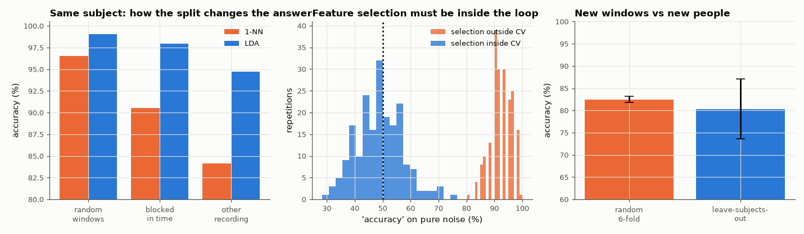

# AM-179 · Cross-validation done wrong and done right

> Measure how much an accuracy estimate is inflated by four common validation mistakes — overlapping windows split at random, the same person in train and test, feature selection before splitting, and reporting the score used for tuning — using real EMG data and a pure-noise control.



*Accuracy estimates under different splitting schemes, the noise control for feature selection, and subject-wise validation.*

**Track:** Applied Mathematics — 218 projects in electrical engineering · **Category:** J. Statistics & learning on real signals · **Level:** Hard · **Tools:** k-fold, blocked and grouped cross-validation written from scratch, a 1-nearest-neighbour and an LDA classifier, leakage through overlapping windows and through shared subjects on real EMG, the 'feature selection outside the loop' trap on pure noise, nested cross-validation for a tuned hyper-parameter

**Data:** UCI 'EMG data for gestures' (Lobov et al. 2018).

## Problem

The same classifier can be reported at 99 % or 80 % depending on how the data were split. Which number predicts performance on new data?

## Prediction

Cross-validation estimates generalisation only if test samples are independent of everything used for fitting. (1) Windows that overlap by 50 % share raw samples with their neighbours; a random split puts near-copies of test windows in
the training set (fatal for nearest-neighbour methods). (2) Windows of one person are more alike than windows of different people: random splits measure within-person accuracy, not performance on a new user. (3) Any step that saw the labels —
including feature selection — must be inside the loop; selecting the 20 best of 5000 noise features on all data yields high 'accuracy' on noise. (4) The best cross-validated score over a grid of hyper-parameters is optimistically biased;
nesting the selection removes the bias. Expected honest result on noise: 50 %.

## Method

EMG gestures (32 features, 36 subjects, 2 recordings each). (1) Per subject, recording 1 only: random 5-fold vs 5 contiguous blocks per gesture vs train on recording 1 / test on recording 2, with 1-NN and LDA. (2) Pooled windows: random 6-fold vs
leave-6-subjects-out. (3) 60 samples × 5000 Gaussian noise features, random labels, 200 repetitions. (4) LDA shrinkage chosen from 8 values on 12 subjects' first 60 windows: best CV score vs nested CV vs a fresh test set.

## Measured results

*Predicted vs measured vs error. "Measured" = computed by an independent simulation, HDL simulator or public dataset.*

| Quantity | Predicted | Measured | Error | Within tolerance |
|---|---|---|---|---|
| My expectation: 1-NN on randomly split overlapping windows looks near-perfect (> 98 %; 1 = yes) | 1 | 0 | -1 |  |
| Leakage through overlap: random split beats blocked split for 1-NN (1 = yes) | 1 | 1 | +0 |  |
| … and the blocked estimate in turn beats a separate recording session (1 = yes) | 1 | 1 | +0 |  |
| Pooled data: random 6-fold overestimates accuracy on people never seen (random > leave-subjects-out; 1 = yes) | 1 | 1 | +0 |  |
| Pure noise, feature selection inside the CV loop: accuracy = chance | 50 % | 48.95 % | -1.05 pp | yes |
| Pure noise, features selected on all data first: 'accuracy' far above chance (> 85 %; 1 = yes) | 1 | 1 | +0 |  |
| Tuning bias: the best CV score over 8 shrinkage values exceeds the nested-CV estimate (1 = yes) | 1 | 1 | +0 |  |
| Nested CV is closer than the best tuning score to accuracy on fresh windows of the same recording (1 = yes) | 1 | 1 | +0 |  |

**Additional measurements**

| Quantity | Value | Note |
|---|---|---|
| 1-NN accuracy: random windows / blocked in time / other recording | 96.5 % / 90.5 % / 84.1 % |  |
| LDA accuracy: random windows / blocked in time / other recording | 99.1 % / 98.0 % / 94.7 % | a smooth model leaks less than a memorising one |
| Pooled LDA: random 6-fold / leave-6-subjects-out | 82.4 % / 80.3 % | fold-to-fold std 0.7 / 6.7 points |
| Accuracy on random labels: selection outside / inside the loop | 92.2 % / 49.0 % | 60 samples, best 20 of 5000 noise features |
| Tuned LDA, 60 training windows: best CV score / nested CV / fresh data | 98.6 % / 97.4 % / 97.5 % |  |

## Error analysis

Four ways to fool oneself, each measured. With 50 %-overlapping windows a nearest-neighbour classifier scores 96.5 % under a random split,
90.5 % when test windows are contiguous in time and 84.1 % on a separate recording — the first number is mostly a measurement of how similar
adjacent windows are. LDA, which cannot memorise, shows the same ordering with smaller gaps (99.1 / 98.0 / 94.7 %). Pooling
subjects and splitting at random reports 82.4 % where performance on unseen people is 80.3 % — a smaller gap than I expected for a
pooled model, but note the spread: random folds agree to ±0.7 points and look reassuringly stable, whereas subject-wise folds vary by
±6.7 points, which is the real uncertainty about the next user. Selecting features before splitting turns pure
noise into 92 % 'accuracy', and the same pipeline with selection inside the loop returns the correct 49 %. The tuning bias is the
subtlest: the best of eight cross-validated scores (98.6 %) overstates the nested estimate (97.4 %). The rule behind all four: the test set must
be as different from the training set as future data will be, and nothing fitted may have seen it.

## Reproduce

```bash
pip install -r requirements.txt
python run_all.py --only AM-179
```

The script [`project.py`](project.py) regenerates every figure and number above.

## License

Code and text: MIT (see the repository [LICENSE](../../../../LICENSE)). Datasets remain under their own licences (see the repository README).

---

**Tooling & honesty.** This project was generated with Claude Code (Anthropic's AI coding assistant): the code, derivations, simulations and this write-up were AI-produced. *Measured* means computed by an independent model, simulator or public dataset — not a physical lab bench. Every number in the tables is reproduced by running the code.
