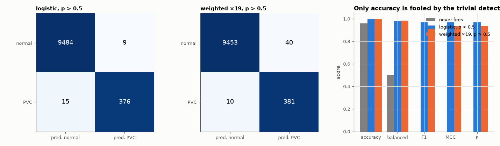

# AM-180 · Confusion matrices and class imbalance

> Show on real, imbalanced ECG data why accuracy is the wrong headline number, verify the identities that tie the alternative metrics together, and test whether the usual remedies for imbalance — weighting, over-sampling, moving the threshold — are actually different things.



*Confusion matrices of the unweighted and weighted detectors, and five metrics for three detectors.*

**Track:** Applied Mathematics — 218 projects in electrical engineering · **Category:** J. Statistics & learning on real signals · **Level:** Moderate · **Tools:** Confusion-matrix metrics (accuracy, balanced accuracy, F1, Matthews correlation, Cohen's κ) coded from their definitions and cross-checked through identities, the accuracy paradox on 4 %-prevalence arrhythmia data, class weighting vs over-sampling vs threshold moving for logistic regression, micro/macro averaging on a 6-class problem

**Data:** PhysioNet MIT-BIH Arrhythmia Database; UCI HAR.

## Problem

A detector for a condition present in 4 % of beats is '96 % accurate' if it never fires. Which numbers should be reported instead, and how should the classifier be trained?

## Prediction

From the confusion matrix (TP, FP, FN, TN): accuracy of the trivial 'always negative' rule = 1 − π. Balanced accuracy = (Se + Sp)/2; F1 = 2TP/(2TP + FP + FN); Matthews correlation
$\mathrm{MCC}=\frac{TP\cdot TN-FP\cdot FN}{\sqrt{(TP+FP)(TP+FN)(TN+FP)(TN+FN)}}$ with $\mathrm{MCC}^2=χ^2/n$; Cohen's κ compares accuracy with chance agreement. Weighting the positive class by r in the likelihood is *identical* to replicating each
positive r times (over-sampling), and for a well-specified logistic model it is approximately a shift of the intercept by ln r — i.e. the same ranking with a moved threshold, $p>\frac{1}{1+r}$. For single-label multi-class problems micro-averaged F1 equals accuracy;
macro-averaging weights every class equally.

## Method

PVC detection, 7 features, logistic regression trained on 10 patients and tested on 10 others. Models: unweighted; positives weighted by r = (1 − π)/π; positives replicated r times (r rounded). Decision at p > 0.5, and the unweighted model
at p > 1/(1 + r). Multi-class part: softmax regression on the HAR benchmark.

## Measured results

*Predicted vs measured vs error. "Measured" = computed by an independent simulation, HDL simulator or public dataset.*

| Quantity | Predicted | Measured | Error | Within tolerance |
|---|---|---|---|---|
| Accuracy of a detector that never fires = 1 − prevalence | 96.04 % | 96.04 % | +0.00 % | yes |
| … while its balanced accuracy is 50 % and its MCC, κ and F1 are 0 (sum of the three) | 0 | 0 | +0 | yes |
| Identity: MCC² = χ²/n for the 2 × 2 table | 0.9367 | 0.9367 | +0.00 % | yes |
| Identity: F1 is the harmonic mean of sensitivity and positive predictive value | 0.9691 | 0.9691 | +0.00 % | yes |
| Weighting positives by r = 19 vs replicating them r times: max coefficient difference | 0 | 8.7041e-14 | +8.7041e-14 | yes |
| Weighted model at p > 0.5 vs unweighted model at p > 1/(1 + r): sensitivity | 97.44 % | 97.19 % | -0.256 pp | yes |
| … specificity | 99.58 % | 99.62 % | +0.0421 pp | yes |
| Intercept shift caused by weighting ≈ ln r | 2.944 | 2.995 | +1.72 % | yes |
| Weighting barely changes the ranking: AUC weighted − AUC unweighted | 0 | 6.6949e-04 | +6.6949e-04 | yes |
| Re-balancing trades precision for sensitivity: weighted model has higher Se and lower PPV than the unweighted one (1 = yes) | 1 | 1 | +0 |  |
| Multi-class: micro-averaged F1 = accuracy | 0.9427 | 0.9427 | +0.00 % | yes |

**Additional measurements**

| Quantity | Value | Note |
|---|---|---|
| HAR: accuracy / macro-F1 / worst class F1 | 94.3 % / 0.942 / 0.917 (sitting) |  |

## Four detectors, six metrics (unseen patients)

| detector | accuracy | sensitivity | specificity | PPV | balanced acc. | F1 | MCC | κ |
|---|---|---|---|---|---|---|---|---|
| never fires | 96.04 % | 0.0 % | 100.0 % | 0.0 % | 50.0 % | 0.000 | 0.000 | 0.000 |
| logistic, p > 0.5 | 99.76 % | 96.2 % | 99.9 % | 97.7 % | 98.0 % | 0.969 | 0.968 | 0.968 |
| weighted ×19, p > 0.5 | 99.49 % | 97.4 % | 99.6 % | 90.5 % | 98.5 % | 0.938 | 0.936 | 0.936 |
| unweighted, p > 1/20 | 99.52 % | 97.2 % | 99.6 % | 91.3 % | 98.4 % | 0.942 | 0.940 | 0.939 |

## Error analysis

With PVCs at 4.0 % of beats, a detector that never fires is 96.0 % accurate — and scores zero on F1, MCC and κ and 50 % balanced
accuracy, which is why those are the numbers to report. The metrics are not independent inventions: MCC² is the χ² statistic of the table divided
by n, and F1 is the harmonic mean of sensitivity and precision, both verified to round-off. The remedies for imbalance are less different than
their names suggest. Weighting the positive class by 19 and replicating every positive 19 times give the *same* coefficients; and the weighted
model behaves almost exactly like the unweighted one with its threshold moved from 0.5 to 1/20 (sensitivity 97.4 vs 97.2 %, specificity
99.6 vs 99.6 %), with an unchanged AUC. Re-balancing does not make the classifier better; it moves the operating point —
more PVCs caught (96 → 97 %), more false alarms (PPV 98 → 90 %). Whether that trade is right depends on the costs,
not on the class ratio.

## Reproduce

```bash
pip install -r requirements.txt
python run_all.py --only AM-180
```

The script [`project.py`](project.py) regenerates every figure and number above.

## License

Code and text: MIT (see the repository [LICENSE](../../../../LICENSE)). Datasets remain under their own licences (see the repository README).

---

**Tooling & honesty.** This project was generated with Claude Code (Anthropic's AI coding assistant): the code, derivations, simulations and this write-up were AI-produced. *Measured* means computed by an independent model, simulator or public dataset — not a physical lab bench. Every number in the tables is reproduced by running the code.
