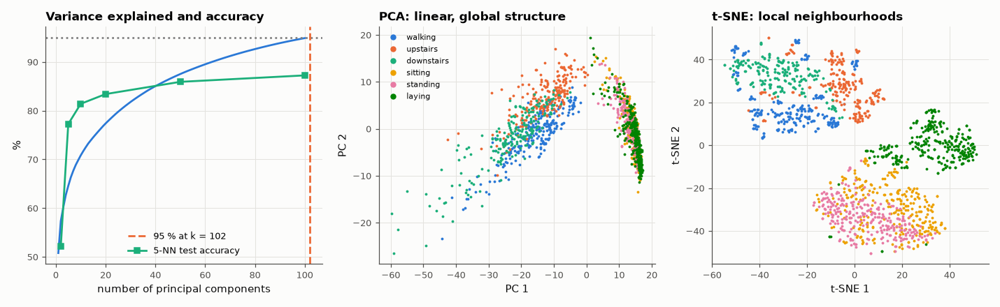

# AM-181 · Dimensionality reduction: PCA and t-SNE from scratch

> Reduce 561-dimensional activity-recognition features to a handful of dimensions: verify the algebra of PCA on real data, find how few components a classifier needs, implement t-SNE and quantify — not just look at — how much better it preserves local neighbourhoods than a linear projection.



*Explained variance and accuracy versus dimension; the same 1500 windows under PCA and under t-SNE.*

**Track:** Applied Mathematics — 218 projects in electrical engineering · **Category:** J. Statistics & learning on real signals · **Level:** Hard · **Tools:** PCA by SVD and by eigen-decomposition of the covariance, reconstruction-error identity, k-NN accuracy versus retained dimensions, own exact t-SNE (perplexity calibration by bisection, early exaggeration, momentum gradient descent), neighbourhood-preservation and class-purity measures

**Data:** UCI Human Activity Recognition Using Smartphones.

## Problem

A 561-dimensional feature vector cannot be plotted and is mostly redundant. How many dimensions carry the information, and how far can a 2-D picture be trusted?

## Prediction

PCA: the right singular vectors of the centred data are the eigenvectors of its covariance; variances are $s_i^2/(n-1)$. Keeping k components gives the best rank-k reconstruction, with mean squared error equal to the sum of the discarded
eigenvalues (Eckart–Young). t-SNE instead matches neighbour probabilities: Gaussian affinities $p_{ij}$ in the original space (bandwidth per point set by a target perplexity) and Student-t affinities $q_{ij}$ in the map, minimising KL(P‖Q) with gradient
$4\sum_j(p_{ij}-q_{ij})(y_i-y_j)(1+\|y_i-y_j\|^2)^{-1}$. It preserves local structure, not global distances: expect tighter class clusters in 2-D than PCA, at the cost of meaningless inter-cluster distances.

## Method

UCI HAR training features (7352 × 561, standardised). PCA checks on the full set. k-NN (k = 5) accuracy on the 9 test subjects versus number of components. t-SNE on 1500 random training windows, perplexity 30, 500 iterations, initialised from the
first two PCs. Quality: fraction of each point's 10 nearest neighbours (in 561-D) that remain among its 10 nearest in 2-D, and class purity of the 10 nearest map neighbours.

## Measured results

*Predicted vs measured vs error. "Measured" = computed by an independent simulation, HDL simulator or public dataset.*

| Quantity | Predicted | Measured | Error | Within tolerance |
|---|---|---|---|---|
| PCA variances from the SVD vs eigenvalues of the covariance matrix (largest 50, worst relative difference) | 0 | 4.0474e-15 | +4.0474e-15 | yes |
| Principal axes are orthonormal: ‖VVᵀ − I‖ for the first 50 | 0 | 1.9984e-15 | +1.9984e-15 | yes |
| Reconstruction error with 30 components = sum of the discarded eigenvalues | 102.2 | 102.2 | +0.00 % | yes |
| Eckart–Young: a random 30-dimensional projection reconstructs worse than the PCA one (1 = yes) | 1 | 1 | +0 |  |
| Accuracy lost by keeping 50 of 561 dimensions (my expectation: under 2 points) | 0 pp | 2.104 pp | +2.104 pp | **no** |
| t-SNE bandwidth calibration: achieved perplexity (mean over points) | 30 | 30 | +0.00 % | yes |
| t-SNE objective KL(P‖Q) decreases after the exaggeration phase (violations between checkpoints) | 0 | 0 | +0 |  |
| t-SNE preserves 10-nearest-neighbour sets better than 2-D PCA (1 = yes) | 1 | 1 | +0 |  |

**Additional measurements**

| Quantity | Value | Note |
|---|---|---|
| Components for 80 / 95 / 99 % of the variance | 26 / 102 / 179 | of 561 features |
| 5-NN test accuracy with 2 / 5 / 10 / 20 / 50 / 100 / 561 dimensions | 52.2 / 77.3 / 81.4 / 83.4 / 85.9 / 87.2 / 88.0 |  |
| Fraction of the 10 nearest neighbours preserved in 2-D: PCA / t-SNE | 11.3 % / 43.5 % |  |
| Class purity of the 10 nearest map neighbours: 561-D / PCA-2D / t-SNE-2D | 82.0 % / 49.1 % / 83.7 % |  |
| Moving vs static activities: separation (centroid distance / spread) in PCA / t-SNE | 3.4 / 2.8 | the first principal component alone separates movement from rest |

## Error analysis

The algebra of PCA holds to round-off on real data: SVD and covariance eigen-decomposition give the same spectrum, the axes are orthonormal and the
reconstruction error equals the discarded variance exactly. The practical finding is the redundancy of the feature set — 102 of 561 directions hold
95 % of the variance, and a nearest-neighbour classifier on 50 components (85.9 %) comes within 2.1 points of the full set (88.0 %) —
slightly more than the 2 points I expected; the low-variance directions are not pure noise. Two components, however, are not
enough for classification (52 %): the 2-D PCA picture separates moving from static activities and little else. t-SNE, implemented here with exact
gradients, keeps 43 % of each point's ten nearest neighbours against 11 % for PCA, and its map neighbours share the class label 84 % of the
time — close to the 82 % of the original space. That is its purpose and its limit: clusters and their membership are trustworthy, the distances and
sizes of clusters in the map are not, and it gives no projection for new data.

## Reproduce

```bash
pip install -r requirements.txt
python run_all.py --only AM-181
```

The script [`project.py`](project.py) regenerates every figure and number above.

## License

Code and text: MIT (see the repository [LICENSE](../../../../LICENSE)). Datasets remain under their own licences (see the repository README).

---

**Tooling & honesty.** This project was generated with Claude Code (Anthropic's AI coding assistant): the code, derivations, simulations and this write-up were AI-produced. *Measured* means computed by an independent model, simulator or public dataset — not a physical lab bench. Every number in the tables is reproduced by running the code.
