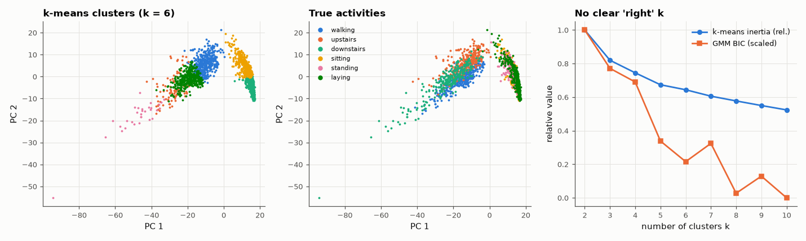

# AM-182 · Clustering without labels: k-means and Gaussian mixtures

> Cluster smartphone-sensor windows without using the activity labels, verify the defining properties of the algorithms (inertia and likelihood can only improve), and then use the labels to judge what unsupervised structure actually corresponds to: movement versus rest is found perfectly, the six activities are not.



*k-means clusters and true activities in the plane of the first two principal components; model-selection curves.*

**Track:** Applied Mathematics — 218 projects in electrical engineering · **Category:** J. Statistics & learning on real signals · **Level:** Moderate · **Tools:** Own k-means (k-means++ seeding) and Gaussian-mixture EM (diagonal covariances, log-domain), monotonicity checks of both objectives, adjusted Rand index and purity against held-back labels, elbow and BIC model selection, restarts and initialisation sensitivity

**Data:** UCI Human Activity Recognition Using Smartphones.

## Problem

Without labels, what structure does a clustering algorithm find in real sensor data — and how do we know whether to believe it?

## Prediction

k-means alternates assignment and mean update; each step cannot increase the inertia $\sum_i\|x_i-μ_{c(i)}\|^2$, so it converges (to a local optimum that depends on the start; k-means++ seeding gives an O(log k) guarantee in expectation).
EM for a Gaussian mixture alternates responsibilities (E) and weighted moments (M); the log-likelihood never decreases. BIC = −2 ln L + (parameters)·ln n penalises complexity. Agreement with reference labels: adjusted Rand index (0 = chance,
1 = identical). Clusters reflect the geometry of the features — dominant variance first — which need not match the labels a human would choose.

## Method

UCI HAR training set, 561 features standardised and reduced to 20 principal components (k-means and the GMM are distance-based; PCA removes redundant directions). k-means for k = 2…10, 10 restarts each; GMM for the same k. Reference labels: 6
activities, and the coarse split moving (3 activities) vs static (3).

## Measured results

*Predicted vs measured vs error. "Measured" = computed by an independent simulation, HDL simulator or public dataset.*

| Quantity | Predicted | Measured | Error | Within tolerance |
|---|---|---|---|---|
| k-means inertia never increases from one iteration to the next (violations, k = 2…10, all restarts) | 0 | 0 | +0 |  |
| k = 2 recovers 'moving vs static' without labels: purity | 100 % | 99.71 % | -0.286 pp | yes |
| … adjusted Rand index against that split | 1 | 0.9886 | -0.0114 | yes |
| k = 6 vs the six activity labels: adjusted Rand index (literature for k-means on these features: ≈ 0.45) | 0.45 | 0.2764 | -0.1736 | **no** |
| EM log-likelihood never decreases (violations, k = 2…10) | 0 | 0 | +0 |  |
| BIC keeps falling up to k = 10 — the data are not six Gaussian blobs (BIC-optimal k > 6; 1 = yes) | 1 | 1 | +0 |  |

**Additional measurements**

| Quantity | Value | Note |
|---|---|---|
| k = 6: purity | 43.44 % | chance for 6 balanced classes ≈ 19 % |
| k = 6, 30 random restarts: spread of the final inertia (max/min − 1) | 8.875 % | different local optima — always restart |
| Gaussian mixture, k = 6: adjusted Rand index vs activities | 0.3251 | k-means: 0.28 |
| Relative inertia drop when adding a cluster, k = 2→3, 3→4, … | 18 %, 9 %, 10 %, 4 %, 6 %, 5 % | no sharp elbow after k = 2 |

## Activities (rows) vs k-means clusters (columns), k = 6

| | c0 | c1 | c2 | c3 | c4 | c5 |
|---|---|---|---|---|---|---|
| walking | 563 | 155 | 0 | 0 | 13 | 495 |
| upstairs | 817 | 85 | 0 | 0 | 0 | 171 |
| downstairs | 169 | 160 | 0 | 0 | 86 | 571 |
| sitting | 1 | 0 | 830 | 455 | 0 | 0 |
| standing | 0 | 0 | 749 | 625 | 0 | 0 |
| laying | 11 | 0 | 935 | 461 | 0 | 0 |

## Error analysis

Both algorithms behave as their derivations promise — inertia and log-likelihood never moved the wrong way — and both depend on where they start
(the final inertia of 30 k-means runs differs by 9 %). What they find is instructive. Asked for two clusters, k-means separates moving
from static activities with 99.7 % purity, without ever seeing a label: that split is the dominant structure of the data. Asked for six, it
does not return the six activities (adjusted Rand 0.28; the Gaussian mixture gives 0.33): the table shows sitting and standing sharing clusters
while walking styles are split. Neither the elbow nor BIC points to k = 6. The labels humans care about are one of many possible partitions, and
an unsupervised method has no way to know which; cluster-validity numbers measure compactness, not meaning.

## Reproduce

```bash
pip install -r requirements.txt
python run_all.py --only AM-182
```

The script [`project.py`](project.py) regenerates every figure and number above.

## License

Code and text: MIT (see the repository [LICENSE](../../../../LICENSE)). Datasets remain under their own licences (see the repository README).

---

**Tooling & honesty.** This project was generated with Claude Code (Anthropic's AI coding assistant): the code, derivations, simulations and this write-up were AI-produced. *Measured* means computed by an independent model, simulator or public dataset — not a physical lab bench. Every number in the tables is reproduced by running the code.
