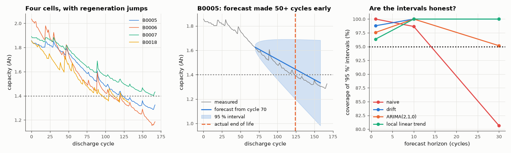

# AM-183 · Forecasting battery ageing: ARIMA and state-space models with honest intervals

> Forecast the capacity fade of NASA lithium-ion cells many cycles ahead, and evaluate the forecasts the way forecasts should be evaluated: out of sample from rolling origins, against a naive baseline, and by checking whether the '95 %' intervals actually contain the future 95 % of the time.



*Capacity fade of four cells, a long-range forecast with its interval, and the empirical coverage of each model's intervals.*

**Track:** Applied Mathematics — 218 projects in electrical engineering · **Category:** J. Statistics & learning on real signals · **Level:** Hard · **Tools:** Own AR fitting (Yule–Walker and least squares), random walk with drift, ARIMA(p,1,0), local-linear-trend Kalman filter with maximum-likelihood noise variances, rolling-origin evaluation, prediction-interval coverage, Ljung–Box residual test, remaining-useful-life forecasts on four real cells

**Data:** NASA Ames Prognostics Center of Excellence Li-ion Battery Aging Datasets (Saha & Goebel), fetched on first run.

## Problem

A fitted curve through past capacity looks convincing. How good are forecasts made *before* the data existed, and can their uncertainty be trusted?

## Prediction

Random walk with drift: $c_t=c_{t-1}+δ+ε_t$; the h-step forecast is $c_t+hδ$ with variance $hσ^2$ (plus drift uncertainty $h^2σ^2/n$): intervals widen as √h. ARIMA(p,1,0) models the differences as AR(p): $Δc_t=δ+\sum φ_iΔc_{t-i}+ε_t$.
Local linear trend (state space): level and slope follow random walks, observed with noise; the Kalman filter gives forecasts and variances, and the likelihood for estimating the three noise variances. Scaled error: MASE = MAE / MAE of the
naive (last-value) forecast; < 1 beats naive. A well-specified model has white one-step residuals (Ljung–Box) and nominal interval coverage. Capacity data are not so polite: rest periods cause 'regeneration' jumps.

## Method

Capacity per discharge cycle of cells B0005, B0006, B0007, B0018 (NASA Ames). Rolling origins from cycle 40 onwards, horizons 1, 10, 30 cycles; parameters re-estimated at each origin on past data only. Coverage of nominal 95 % intervals pooled over
origins and cells. Remaining useful life: first cycle below 1.4 Ah (B0005). AR estimators validated on a synthetic AR(2) series.

## Measured results

*Predicted vs measured vs error. "Measured" = computed by an independent simulation, HDL simulator or public dataset.*

| Quantity | Predicted | Measured | Error | Within tolerance |
|---|---|---|---|---|
| Synthetic AR(2), φ₁ = 1.2: least-squares estimate | 1.2 | 1.2 | -0.02 % | yes |
| Synthetic AR(2), φ₂ = −0.5: Yule–Walker estimate | -0.5 | -0.4951 | +0.97 % | yes |
| Synthetic random walk with drift: coverage of the 95 % interval at h = 30 (validates the formula) | 95 % | 94.83 % | -0.175 pp | yes |
| Drift model beats the naive forecast 30 cycles ahead (MASE < 1; 1 = yes) | 1 | 1 | +0 |  |
| At one step ahead no model beats 'tomorrow = today' by much: best MASE at h = 1 (my expectation ≈ 1) | 1 | 0.7585 | -24.15 % | **no** |
| Coverage of nominal 95 % intervals on real capacity data, drift model, h = 30 | 95 % | 100 % | +5 pp | **no** |
| Coverage of nominal 50 % intervals, drift model, h = 10 (a sharper test of calibration) | 50 % | 81.08 % | +31.1 pp | **no** |
| Coverage of nominal 50 % intervals, local linear trend, h = 10 | 50 % | 71.62 % | +21.6 pp | **no** |
| End-of-life of B0005 lies inside the 95 % interval of every forecast (count) | 4 | 4 | +0 |  |
| Forecast error shrinks as the origin approaches end of life: |error| at the last origin < at the first (1 = yes) | 1 | 1 | +0 |  |

**Additional measurements**

| Quantity | Value | Note |
|---|---|---|
| Ljung–Box p-value of one-step residuals: drift model / ARIMA(2,1,0) | 0.77 / 0.96 | p > 0.05: no linear autocorrelation left — the residuals are 'white' but, as the kurtosis shows, far from Gaussian |
| Kurtosis of the capacity increments (Gaussian = 3) | 22.12 | regeneration jumps after rest periods — heavy tails |

## Rolling-origin evaluation (4 cells pooled)

| model | MASE h=1 | MASE h=10 | MASE h=30 | 95 % interval coverage h=1 | h=10 | h=30 | 50 % interval coverage h=10 |
|---|---|---|---|---|---|---|---|
| naive | 1.00 | 1.00 | 1.00 | 100 % | 99 % | 81 % | 59 % |
| drift | 0.76 | 0.73 | 0.45 | 99 % | 100 % | 100 % | 81 % |
| ARIMA(2,1,0) | 0.93 | 0.73 | 0.45 | 98 % | 100 % | 95 % | 65 % |
| local linear trend | 0.89 | 0.73 | 0.44 | 96 % | 100 % | 100 % | 72 % |

## Remaining-useful-life forecasts for B0005 (actual end of life: cycle 124)

| forecast made at cycle | predicted EOL | 95 % interval | error (cycles) |
|---|---|---|---|
| 50 | 251 | 98 – ∞ | +127 |
| 70 | 138 | 95 – ∞ | +14 |
| 90 | 163 | 110 – ∞ | +39 |
| 110 | 123 | 112 – 285 | -1 |

## Error analysis

The estimators are right on synthetic data (AR coefficients recovered, random-walk intervals covering 95 %), so what follows is about the data.
At 30 cycles the fade trend dominates and the drift model's error is 0.45 of the naive one; even one cycle ahead the best model (drift) reaches
a MASE of 0.76 — better than the ≈ 1 I expected, because the fade per cycle is not negligible against the cycle-to-cycle noise. The
remaining-useful-life forecasts for B0005 bracket the true end of life from every origin and tighten as it approaches. The uncertainty is where the
models fail, and not in the direction I anticipated: the nominal 95 % intervals contained the future 100 % of the time at 30 cycles, and the
nominal 50 % intervals 81 % (drift) and 72 % (local linear trend) at 10 cycles — the intervals are too *wide*. The one-step
residuals pass the Ljung–Box test (p = 0.77), so nothing linear is left to model; but their kurtosis is 22. Capacity 'regenerates'
after rest periods in rare large jumps, which inflate the estimated variance: a Gaussian model then spreads that variance evenly over all cycles,
over-covering on ordinary cycles and still being surprised by a jump. A forecast is a distribution; only out-of-sample coverage at several
levels shows whether its shape, and not just its mean, deserves trust.

## Reproduce

```bash
pip install -r requirements.txt
python run_all.py --only AM-183
```

The script [`project.py`](project.py) regenerates every figure and number above.

## License

Code and text: MIT (see the repository [LICENSE](../../../../LICENSE)). Datasets remain under their own licences (see the repository README).

---

**Tooling & honesty.** This project was generated with Claude Code (Anthropic's AI coding assistant): the code, derivations, simulations and this write-up were AI-produced. *Measured* means computed by an independent model, simulator or public dataset — not a physical lab bench. Every number in the tables is reproduced by running the code.
