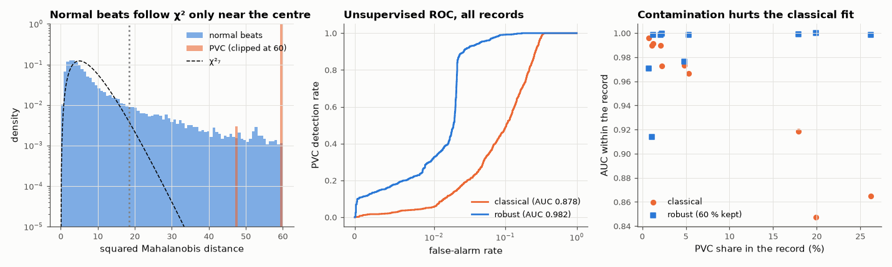

# AM-184 · Anomaly detection without labels: abnormal heartbeats as outliers

> Detect premature ventricular beats with no training labels at all, by modelling each patient's usual beat and flagging what is far from it. Test the Gaussian theory behind the threshold, show how outliers corrupt the very model that should detect them, and compare with the supervised detector of AM-172.



*Distance distribution against χ², ROC of classical and robust detectors, and per-record AUC versus contamination.*

**Track:** Applied Mathematics — 218 projects in electrical engineering · **Category:** J. Statistics & learning on real signals · **Level:** Hard · **Tools:** Mahalanobis distance from a per-patient model of 'usual' beats, robust (iteratively trimmed) mean and covariance against contamination, χ² calibration of the threshold, comparison of false-alarm rates with theory, PCA reconstruction error on beat waveforms, ROC evaluation against reference annotations

**Data:** PhysioNet MIT-BIH Arrhythmia Database.

## Problem

Labelled abnormal examples are rare and patient-specific. Can 'unusual for this patient' be detected directly — and how is the alarm threshold set?

## Prediction

If normal beats' features were Gaussian $\mathcal N(μ,Σ)$, the squared Mahalanobis distance $D^2=(x-μ)^TΣ^{-1}(x-μ)$ would follow $χ^2_d$, so a threshold at the 99th percentile of $χ^2_d$ gives a 1 % false-alarm rate.
Two practical problems: (1) real features are heavy-tailed, so the true false-alarm rate is higher; (2) μ and Σ must be estimated from unlabeled data that *contain* the anomalies, which inflate Σ and hide themselves ('masking'). Robust estimation —
fit, discard the most distant beats, refit — restores the contrast, provided more is trimmed than the share of anomalies. For waveforms, the analogous score is the reconstruction error after projecting on the principal components of the patient's beats.

## Method

MIT-BIH beats of 20 records, 7 timing/morphology features each (labels used only for scoring). Per record: classical and trimmed (5 iterations, 60 % of beats kept) estimates on all beats of that record; ROC within each record and pooled. χ² check on annotated-normal beats.
Waveform variant: PCA (5 components) of each record's beats, reconstruction error as the score.

## Measured results

*Predicted vs measured vs error. "Measured" = computed by an independent simulation, HDL simulator or public dataset.*

| Quantity | Predicted | Measured | Error | Within tolerance |
|---|---|---|---|---|
| Unsupervised detection (robust distance, no labels): mean within-patient AUC (supervised detector on unseen patients: 0.988) | 0.988 | 0.9855 | -0.002539 | yes |
| Robust fit improves on the classical fit (mean within-patient AUC higher; 1 = yes) | 1 | 1 | +0 |  |
| Masking: in the three records with the most PVCs (18–26 % of beats) the classical AUC is below the robust AUC (count) | 3 | 3 | +0 |  |
| False-alarm rate on normal beats at the χ²₇ 99 % threshold (Gaussian theory: 1 %) | 1 % | 26.8 % | +25.8 pp | **no** |
| Centre of the distribution is Gaussian-like: median D² of normal beats / median of χ²₇ | 1 | 1.041 | +4.11 % | yes |

**Additional measurements**

| Quantity | Value | Note |
|---|---|---|
| Mean within-patient AUC: classical / robust | 0.9511 / 0.9855 | 906 PVCs among 20296 beats, 10 records with ≥ 5 PVCs |
| Pooled AUC (one threshold for all patients): classical / robust | 0.8781 / 0.9820 |  |
| Those three records: PVC share → classical / robust AUC | 26 % → 0.865 / 0.999; 20 % → 0.847 / 1.000; 18 % → 0.918 / 0.999 |  |
| … same threshold with the classical (contaminated) estimates | 4.977 % | fewer false alarms only because the inflated covariance shrinks every distance |
| … sensitivity to PVCs at that threshold | 100 % |  |
| Threshold giving a true 1 % false-alarm rate (empirical 99th percentile) vs χ² value | 20037 vs 18.5 | sensitivity there: 33 % |
| Sensitivity at a 1 % false-alarm rate with a separate threshold per patient | 96.35 % | scores are not comparable between patients; one global threshold wastes most of the detector's ability |
| Kurtosis of the normal beats' features (mean over features; Gaussian = 3) | 49.98 |  |
| Waveform-only score (PCA reconstruction error): pooled AUC | 0.994 | no RR-interval information |
| Rank-sum of both scores: pooled AUC | 0.9943 |  |

## Effect of the trimming fraction (chosen after seeing this table — it is a tuning parameter)

| fraction of beats kept | mean within-patient AUC | worst record |
|---|---|---|
| 100% | 0.9511 | 0.847 |
| 90% | 0.9568 | 0.800 |
| 80% | 0.9687 | 0.849 |
| 70% | 0.9872 | 0.926 |
| 60% | 0.9855 | 0.914 |
| 50% | 0.9862 | 0.936 |

## Error analysis

Without a single label, 'far from this patient's usual beat' detects PVCs with a mean within-patient AUC of 0.985 — the level of the
supervised detector (0.988 on unseen patients) — because a premature, wide, oddly shaped beat is an outlier by construction. Robust estimation is
what makes it work. With the ordinary mean and covariance the AUC is 0.951, and in the three records where 18–26 % of beats are PVCs it falls to
0.85–0.92: the anomalies inflate the covariance that was supposed to expose them. My first robust version kept 80 % of the beats and
still failed on the record with 26 % PVCs — the trimming has to exceed the contamination — so the table above shows the whole sweep rather than
only the best setting. The Gaussian threshold theory does *not* survive contact with the data: the centre of the distance distribution is
χ²-like (median ratio 1.04), but the feature distributions are heavy-tailed (kurtosis ≈ 50) and the nominal 1 % threshold fires on 27 % of
normal beats. A threshold has to come from empirical quantiles, and per patient: one global
threshold set for a true 1 % false-alarm rate (D² ≈ 20037 instead of 18) catches only 33 % of PVCs, whereas a 1 % threshold set within
each record catches 96 %. And an unsupervised detector flags *unusual*, not
*dangerous* — a lead change or a run of paced beats would score just as high — so it complements rather than replaces a trained classifier.

## Reproduce

```bash
pip install -r requirements.txt
python run_all.py --only AM-184
```

The script [`project.py`](project.py) regenerates every figure and number above.

## License

Code and text: MIT (see the repository [LICENSE](../../../../LICENSE)). Datasets remain under their own licences (see the repository README).

---

**Tooling & honesty.** This project was generated with Claude Code (Anthropic's AI coding assistant): the code, derivations, simulations and this write-up were AI-produced. *Measured* means computed by an independent model, simulator or public dataset — not a physical lab bench. Every number in the tables is reproduced by running the code.
