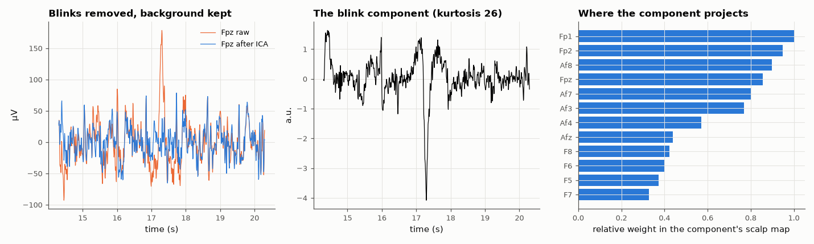

# AM-185 · Independent component analysis for removing eye blinks from EEG

> Separate a 64-channel EEG recording into statistically independent sources, find the one that is the eye blink, remove it and rebuild the signals — after first proving on synthetic mixtures that the algorithm recovers known sources — and measure both what was removed and what was preserved.



*A frontal channel before and after removing the blink component, the component's time course, and its strongest electrodes.*

**Track:** Applied Mathematics — 218 projects in electrical engineering · **Category:** J. Statistics & learning on real signals · **Level:** Hard · **Tools:** Own FastICA (PCA whitening, symmetric fixed-point iteration with tanh non-linearity), validation on synthetic mixtures with the Amari index, blink-component identification by frontal topography and kurtosis, reconstruction without the artefact, comparison with channel regression, preservation checks in the alpha band

**Data:** PhysioNet EEG Motor Movement/Imagery Dataset (Schalk et al. 2004).

## Problem

An eye blink is 10 times larger than brain activity at the forehead and leaks into every electrode. How can it be subtracted without subtracting the brain?

## Prediction

Model $x=As$: sensors are linear mixtures of independent sources. After whitening, the unmixing is a rotation; FastICA finds it by maximising non-Gaussianity: $w\leftarrow E[z\,g(w^Tz)]-E[g'(w^Tz)]\,w$ with g = tanh, followed by symmetric
decorrelation. ICA recovers sources up to order, sign and scale; quality on known mixtures is the Amari index of $WA$ (0 = perfect). A blink is a strongly non-Gaussian (high-kurtosis), frontally dominant source, nearly independent of cortical
rhythms — an ideal ICA target. Removing it means zeroing its column before remixing. Regressing a frontal channel out of all others also removes blinks, but takes with it whatever brain activity that channel contains.

## Method

Synthetic: 4 sources (sine, sawtooth, Laplacian noise, amplitude-modulated tone), random 4 × 4 mixing, 20 trials. Real: EEG Motor Movement/Imagery database, subject 1, run 1 (eyes open, 64 channels, 160 Hz, 61 s), band-pass 1–40 Hz, reduced to
20 principal components, FastICA. Blinks located on Fpz (> 5 robust standard deviations of the low-passed signal). Blink component: largest |correlation| with the frontal-polar average.

## Measured results

*Predicted vs measured vs error. "Measured" = computed by an independent simulation, HDL simulator or public dataset.*

| Quantity | Predicted | Measured | Error | Within tolerance |
|---|---|---|---|---|
| Synthetic mixtures: Amari index of W·A (0 = perfect separation; mean of 20 trials) | 0 | 0.007507 | +0.007507 | yes |
| Synthetic mixtures: worst |correlation| between a true source and its estimate | 1 | 0.9985 | -0.15 % | yes |
| The blink component is the most kurtotic one (rank of its kurtosis among 20; 1 = highest) | 1 | 1 | +0 | yes |
| Its scalp map is frontal: weight at Fp1/Fpz/Fp2 relative to the average electrode (> 3; 1 = yes) | 1 | 1 | +0 |  |
| Blink amplitude at Fpz after removal, relative to the blink-free background (≈ 1 if the blink is gone) | 1 | 1.261 | +26.11 % | yes |
| Occipital alpha power outside blinks: change caused by the removal | 0 % | 0.009748 % | +0.00975 pp | yes |
| Blink-free frontal EEG retained (variance ratio): ICA keeps more than regression on the frontal-polar channel (1 = yes) | 1 | 1 | +0 |  |

**Additional measurements**

| Quantity | Value | Note |
|---|---|---|
| Blinks found on the frontal-polar channels | 12 | in 61 s; 10 % of samples within ±0.25 s of a blink |
| Blink component: correlation with frontal average / kurtosis / frontal weight ratio | 0.87 / 26 / 4.6 | FastICA converged in 123 iterations |
| Median blink peak-to-peak at Fpz: before / after / blink-free background | 405 / 145 / 115 | reduction 90 % of the excess |
| Variance of blink-free frontal EEG (AF/F electrodes) retained: ICA / regression | 88 % / 31 % | regression subtracts the brain activity seen by the reference channel too |

## Error analysis

On mixtures with known sources FastICA recovers them essentially exactly (Amari index 0.008, source correlations above 1.00), which is the
licence to use it on data where the truth is unknown. On the real recording one component stands out on every criterion at once: it correlates
0.87 with the frontal-polar channels, has a kurtosis of 26 against ≈ 3 for ongoing EEG, and projects 5 times more strongly to Fp1/Fpz/Fp2 than
to the average electrode. Removing it brings the blink at Fpz from 405 µV to 145 µV peak-to-peak, against a blink-free background of 115 µV, while
occipital alpha power changes by +0.0 %. The comparison with regression shows why a source model is preferable: subtracting a scaled copy of the
frontal-polar signal keeps only 31 % of the blink-free activity at neighbouring frontal electrodes, ICA 88 %. The usual caveats apply — the blink is
identified here by a rule, the number of components is a choice, and ICA assumes the mixing does not change over the recording.

## Reproduce

```bash
pip install -r requirements.txt
python run_all.py --only AM-185
```

The script [`project.py`](project.py) regenerates every figure and number above.

## License

Code and text: MIT (see the repository [LICENSE](../../../../LICENSE)). Datasets remain under their own licences (see the repository README).

---

**Tooling & honesty.** This project was generated with Claude Code (Anthropic's AI coding assistant): the code, derivations, simulations and this write-up were AI-produced. *Measured* means computed by an independent model, simulator or public dataset — not a physical lab bench. Every number in the tables is reproduced by running the code.
