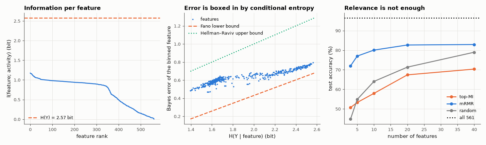

# AM-186 · Feature selection with mutual information

> Estimate how many bits each of 561 sensor features carries about the activity being performed, validate the estimator where the answer is known, confirm the information-theoretic bounds on classification error, and show why the 20 individually best features are a worse set than 20 chosen to avoid redundancy.



*Mutual information per feature, the Fano and Hellman–Raviv bounds, and accuracy for three selection strategies.*

**Track:** Applied Mathematics — 218 projects in electrical engineering · **Category:** J. Statistics & learning on real signals · **Level:** Hard · **Tools:** Plug-in mutual-information estimator on quantile-binned features with Miller–Madow bias correction, validation on distributions with known MI and on shuffled labels, Fano and Hellman–Raviv bounds checked feature by feature, max-relevance vs minimum-redundancy (mRMR) selection, LDA accuracy versus number of features

**Data:** UCI Human Activity Recognition Using Smartphones.

## Problem

Out of hundreds of candidate features, which few should a wearable device compute — and what does 'informative' mean quantitatively?

## Prediction

$I(X;Y)=\sum p(x,y)\log_2\frac{p(x,y)}{p(x)p(y)}$ bits; 0 iff independent, at most H(Y). The plug-in estimate from a table with $B_x\times B_y$ cells is biased upward by ≈ $\frac{(B_x-1)(B_y-1)}{2N\ln2}$ (Miller–Madow). Known cases: binary
symmetric channel $1-H_2(ε)$; jointly Gaussian $-\tfrac12\log_2(1-ρ^2)$. Any classifier using X obeys Fano's bound $P_e\ge\frac{H(Y|X)-1}{\log_2(K-1)}$; the Bayes classifier obeys $P_e\le\tfrac12H(Y|X)$ (Hellman–Raviv).
Selecting the top-k features by MI ignores that they may all carry the *same* bits; mRMR adds features greedily by relevance minus mean MI with those already chosen.

## Method

UCI HAR training set (7352 windows, 561 features, 6 classes), features binned into 10 equal-count bins. Bias check: labels shuffled. Bounds: in-sample Bayes error of each binned feature, 1 − Σₓ max_y p(x, y). Selection from the 150 most relevant
features: top-k by MI, mRMR, and random; LDA trained on the training subjects and tested on the 9 test subjects for k = 3…40.

## Measured results

*Predicted vs measured vs error. "Measured" = computed by an independent simulation, HDL simulator or public dataset.*

| Quantity | Predicted | Measured | Error | Within tolerance |
|---|---|---|---|---|
| Estimator check, binary symmetric channel ε = 0.1: I = 1 − H₂(ε) | 0.531 bit | 0.5331 bit | +0.39 % | yes |
| Estimator check, Gaussian pair ρ = 0.8, 30 × 30 bins: I = −½ log₂(1 − ρ²) (binning loses a little) | 0.737 bit | 0.7158 bit | -2.87 % | yes |
| Shuffled labels: raw plug-in MI equals the Miller–Madow bias (B_x−1)(B_y−1)/(2N ln 2) | 0.004415 bit | 0.004158 bit | -5.83 % | yes |
| Shuffled labels: bias-corrected MI | 0 bit | -2.1816e-04 bit | -2.1816e-04 bit | yes |
| Fano lower bound violated by a feature's Bayes error (of 561) | 0 | 0 | +0 |  |
| Hellman–Raviv upper bound Pₑ ≤ ½H(Y|X) violated (of 561) | 0 | 0 | +0 |  |
| Redundancy (mean pairwise MI) among the first 20 mRMR features is lower than among the top-20 by relevance (1 = yes) | 1 | 1 | +0 |  |
| With 10 features, mRMR beats top-MI selection on unseen subjects (1 = yes) | 1 | 1 | +0 |  |
| My expectation: the 10 most informative features beat 10 random ones (1 = yes) | 1 | 0 | -1 |  |

**Additional measurements**

| Quantity | Value | Note |
|---|---|---|
| Class entropy H(Y) / most informative single feature | 2.57 bit / 1.17 bit | its single-feature Bayes error: 48 % |
| Mean pairwise MI among 20 selected features: top-MI / mRMR | 1.84 / 0.95 | the top-ranked features are near-copies of one another |
| LDA on all 561 features | 96.44 % | mRMR with 40 features: 82.9 % |

## LDA test accuracy (%) vs number of features

| k | top-k by MI | mRMR | random (mean of 10) |
|---|---|---|---|
| 3 | 50.7 | 72.0 | 44.8 |
| 5 | 53.3 | 77.0 | 54.8 |
| 10 | 57.9 | 80.0 | 64.0 |
| 20 | 67.4 | 82.7 | 71.3 |
| 40 | 70.3 | 82.9 | 79.0 |

## Error analysis

The estimator reproduces the known mutual information of a binary symmetric channel and of a Gaussian pair, and on shuffled labels its raw value
equals the Miller–Madow bias — so the numbers on real features can be read as bits. The best single feature carries 1.17 of the 2.57 bits needed to
name the activity, and every one of the 561 features respects both bounds that tie conditional entropy to error. The selection experiment shows
the classic trap. The 20 most informative features share 1.84 bit with each other on average — they are variations of the same measurement —
so ten of them give 58 % accuracy, no better than 64 % for ten *random* features. mRMR, which penalises redundancy, reaches
80 % with ten and 83 % with forty (all 561: 96 %). A feature's value depends on what is already in the set; ranking features one at a
time cannot see that.

## Reproduce

```bash
pip install -r requirements.txt
python run_all.py --only AM-186
```

The script [`project.py`](project.py) regenerates every figure and number above.

## License

Code and text: MIT (see the repository [LICENSE](../../../../LICENSE)). Datasets remain under their own licences (see the repository README).

---

**Tooling & honesty.** This project was generated with Claude Code (Anthropic's AI coding assistant): the code, derivations, simulations and this write-up were AI-produced. *Measured* means computed by an independent model, simulator or public dataset — not a physical lab bench. Every number in the tables is reproduced by running the code.
