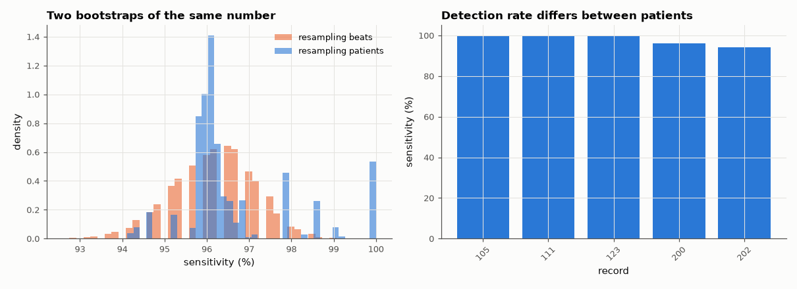

# AM-187 · Bootstrap confidence intervals — and when they fail

> Put error bars on statistics by resampling: check that bootstrap intervals cover the truth at the advertised rate where the truth is known, show that they agree with the textbook binomial interval for independent data, that they are far too narrow when resampling ignores clustering, and one statistic for which the bootstrap is simply wrong.



*Bootstrap distributions of the detector's sensitivity under beat-level and patient-level resampling, and per-patient sensitivity.*

**Track:** Applied Mathematics — 218 projects in electrical engineering · **Category:** J. Statistics & learning on real signals · **Level:** Moderate · **Tools:** Own percentile and BCa bootstrap, coverage experiments by simulation, Wilson binomial interval, cluster (patient-level) bootstrap versus beat-level bootstrap on real ECG detections, design-effect prediction from the intraclass correlation, the known failure for the sample maximum

**Data:** PhysioNet MIT-BIH Arrhythmia Database.

## Problem

A detector found 96 % of 391 abnormal beats. How uncertain is that number — and does it matter that all those beats came from only a handful of people?

## Prediction

The bootstrap replaces the unknown population by the sample: the spread of a statistic over resamples estimates its sampling spread. For the mean, the bootstrap SE equals $s\sqrt{(n-1)/n}/\sqrt n$. Percentile intervals are
first-order accurate; BCa corrects bias and skewness. Resampling must copy the dependence structure: with m correlated observations per cluster, the variance of a proportion is inflated by the design effect $1+(m-1)ρ_{ICC}$, so an
observation-level bootstrap is too narrow by about $\sqrt{\mathrm{deff}}$. The bootstrap fails for statistics that depend on the extreme order statistics (e.g. the maximum of a uniform), where the resampling distribution has an atom at the sample maximum.

## Method

Coverage: 2000 simulated samples each (n = 40 lognormal medians, n = 30 uniform maxima), 2000 resamples per interval. Real data: sensitivity of the PVC detector of AM-172 (logistic regression, train on 10 patients, test on 10 others)
— Wilson interval, beat-level bootstrap and patient-level (cluster) bootstrap; ICC of detection within patient from a one-way ANOVA estimator.

## Measured results

*Predicted vs measured vs error. "Measured" = computed by an independent simulation, HDL simulator or public dataset.*

| Quantity | Predicted | Measured | Error | Within tolerance |
|---|---|---|---|---|
| Bootstrap SE of the mean vs s·√((n−1)/n)/√n | 0.4037 | 0.4039 | +0.06 % | yes |
| Coverage of the 95 % percentile interval for the median of a lognormal sample (n = 40) | 95 % | 94.83 % | -0.167 pp | yes |
| … BCa interval | 95 % | 94.33 % | -0.667 pp | yes |
| Known failure: percentile interval for the maximum of Uniform(0, 1) — coverage is far below 95 % (< 20 %; 1 = yes) | 1 | 1 | +0 |  |
| Sensitivity: beat-level bootstrap interval width vs Wilson interval width (independent-beats assumption) | 0.03894 | 0.03836 | -1.48 % | yes |
| Resampling patients instead of beats widens the interval (1 = yes) | 1 | 1 | +0 |  |

**Additional measurements**

| Quantity | Value | Note |
|---|---|---|
| Coverage for the uniform maximum | 0 % | the bootstrap never produces a value above the sample maximum, the truth is always above it |
| Width ratio patient-level / beat-level interval vs √(design effect) from the ANOVA ICC | 1.41 vs 1.00 | the ICC estimate from so few clusters is unreliable (it truncates at 0 here) |
| Sensitivity with 95 % intervals: Wilson / beat bootstrap / patient bootstrap | 96.2 % [93.8, 97.7] / [94.1, 98.0] / [94.6, 100.0] | 391 PVCs from 5 patients |
| Intraclass correlation of detections within a patient / design effect | 0.000 / 1.0 | effective number of independent PVCs ≈ 391 |

## Error analysis

Where the answer is known the bootstrap earns its reputation: its standard error of a mean matches the formula, and its 95 % intervals for a
skewed sample median cover the truth 95 % (percentile) and 94 % (BCa) of the time. Two cautions follow from the same experiments. For the maximum
of a uniform sample the coverage is 0 % — the bootstrap cannot produce values beyond the sample, so statistics set by the extremes are out
of its reach. And the resampling unit matters. For the detector's 96.2 % sensitivity, resampling individual beats reproduces the Wilson interval
([93.8, 97.7] %), both implicitly assuming 391 independent PVCs. Resampling patients gives [94.6, 100.0] %, 1.4× wider. The formula route
failed here: with only 5 test patients contributing PVCs, the ANOVA estimate of the intraclass correlation comes out at its floor of zero
(design effect 1.0), yet the per-patient sensitivities in the right-hand plot clearly differ — five clusters are too few to estimate an ICC, but
enough for the cluster bootstrap to show that most of the uncertainty is *which patients* were tested. The honest interval for 'a new patient' is
the wide one, and a study with more patients, not more beats, is what would narrow it.

## Reproduce

```bash
pip install -r requirements.txt
python run_all.py --only AM-187
```

The script [`project.py`](project.py) regenerates every figure and number above.

## License

Code and text: MIT (see the repository [LICENSE](../../../../LICENSE)). Datasets remain under their own licences (see the repository README).

---

**Tooling & honesty.** This project was generated with Claude Code (Anthropic's AI coding assistant): the code, derivations, simulations and this write-up were AI-produced. *Measured* means computed by an independent model, simulator or public dataset — not a physical lab bench. Every number in the tables is reproduced by running the code.
