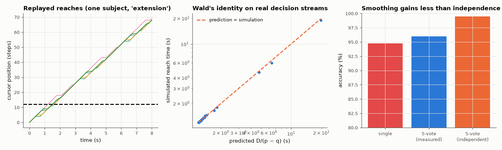

# AM-188 · EMG cursor control: from classifier accuracy to task performance

> Turn recorded forearm EMG into a four-direction cursor, and predict how long reaching a target takes from nothing but the classifier's confusion statistics. Test the independence assumption behind error-smoothing and information-rate formulas against the real decision stream, where errors come in bursts.



*Simulated cursor reaches driven by recorded EMG, predicted vs simulated reach times, and the effect of majority voting.*

**Track:** Applied Mathematics — 218 projects in electrical engineering · **Category:** J. Statistics & learning on real signals · **Level:** Hard · **Tools:** Per-user LDA on real EMG streamed window by window, Wolpaw information-transfer rate vs mutual information of the confusion matrix, random-walk (Wald) prediction of time-to-target, majority-vote smoothing vs the binomial independence prediction, lag-correlation of classifier errors, closed-loop cursor simulation

**Data:** UCI 'EMG data for gestures' (Lobov et al. 2018).

## Problem

A gesture classifier is '95 % accurate'. How fast can someone actually move a cursor with it, and do smoothing tricks deliver the gains that textbook formulas promise?

## Prediction

Decisions every 100 ms; gestures flexion/extension → left/right, radial/ulnar deviation → up/down. If a step goes toward the target with probability p and away with probability q, the expected time to cover D steps is $D/(p-q)$ decisions
(Wald's identity). Information: Wolpaw's ITR $\log_2N+P\log_2P+(1-P)\log_2\frac{1-P}{N-1}$ bits per decision assumes errors spread evenly; the mutual information of the actual confusion matrix is the exact figure for a memoryless channel. A majority vote over m
decisions with independent errors would succeed with probability $\sum_{k>m/2}\binom mk p^k(1-p)^{m-k}$ (lower bound for more classes). Classifier errors on consecutive, overlapping EMG windows are correlated, so the real gain should be smaller.

## Method

36 subjects; LDA trained on recording 1, the decision stream of recording 2 replayed in time order. Cursor: targets 12 steps away along one axis; each decision moves the cursor one step (rest and fist do nothing); 400 simulated reaches per subject by
sampling contiguous stretches of the real decision stream. Majority vote over 5 consecutive decisions.

## Measured results

*Predicted vs measured vs error. "Measured" = computed by an independent simulation, HDL simulator or public dataset.*

| Quantity | Predicted | Measured | Error | Within tolerance |
|---|---|---|---|---|
| Four direction gestures: Wolpaw ITR vs mutual information of the pooled confusion matrix (bits per decision) | 1.633 bit | 1.539 bit | -5.78 % | yes |
| Time to reach a target 12 steps away, error-prone pairs (p − q < 0.95): Wald prediction D/(p − q) vs replayed streams (median ratio) | 1 | 0.9963 | -0.37 % | yes |
| Majority vote of 5: accuracy gain predicted assuming independent errors vs measured on the real stream (ratio) | 1 | 0.268 | -73.20 % | **no** |
| Classifier errors on consecutive windows are positively correlated (median lag-1 correlation > 0.2; 1 = yes) | 1 | 1 | +0 |  |

**Additional measurements**

| Quantity | Value | Note |
|---|---|---|
| Direction accuracy / bits per decision / bits per minute at 10 decisions/s | 93.3 % / 1.63 / 980 |  |
| Reach time on those pairs: predicted / simulated (median) | 1.33 s / 1.36 s | 17 of 80 (subject, direction) pairs; the others are almost error-free (minimum possible 1.2 s) |
| Worst (subject, direction) pair: predicted / simulated reach time | 19.8 s / 19.0 s |  |
| Accuracy: single decision / 5-vote measured / 5-vote if errors were independent | 94.7 % / 96.0 % / 99.5 % |  |
| Median lag-1 autocorrelation of the error indicator | 0.3991 | errors arrive in bursts, during gesture onsets and weak contractions |

## Error analysis

Classifier statistics predict task performance remarkably well when the prediction uses the right quantity. The time to reach a target is set by
the drift p − q (toward minus away from the target), and Wald's identity D/(p − q) matches the replayed real decision streams (median ratio
1.00 on the pairs where errors matter) — errors that stop the cursor cost time, errors that reverse it cost twice. Wolpaw's information-rate formula and the exact mutual
information of the confusion matrix agree within 6 % at 1.63 bits per decision. The independence assumption is where the formulas
overpromise: consecutive errors are correlated (lag-1 correlation 0.40), so a 5-decision majority vote lifts accuracy from 94.7 % to
96.0 %, not to the 99.5 % the binomial formula predicts, and it adds 200 ms of latency. For a real interface the useful targets are the
drift and the burstiness of errors, not the headline accuracy.

## Reproduce

```bash
pip install -r requirements.txt
python run_all.py --only AM-188
```

The script [`project.py`](project.py) regenerates every figure and number above.

## License

Code and text: MIT (see the repository [LICENSE](../../../../LICENSE)). Datasets remain under their own licences (see the repository README).

---

**Tooling & honesty.** This project was generated with Claude Code (Anthropic's AI coding assistant): the code, derivations, simulations and this write-up were AI-produced. *Measured* means computed by an independent model, simulator or public dataset — not a physical lab bench. Every number in the tables is reproduced by running the code.
