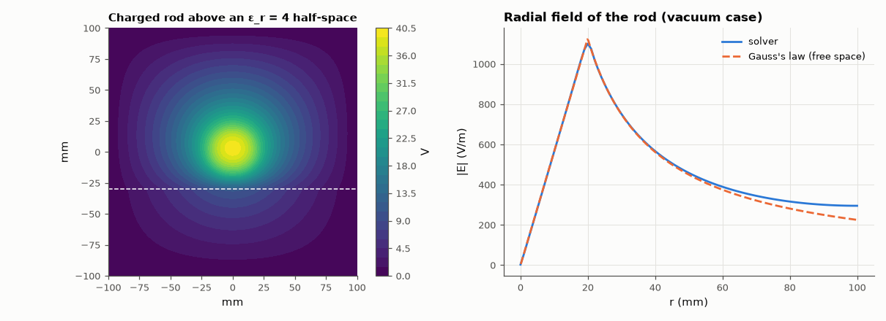

# AM-189 · A numerical field solver that obeys Gauss's law

> Solve −∇·(ε∇V) = ρ on a grid and check the solution against the physics it must satisfy: the flux of D out of any closed box equals the charge inside (exactly, by construction of a finite-volume scheme), the field of a charged rod matches Gauss's-law results, and normal D is continuous across a dielectric boundary.



*Potential of a charged rod above a dielectric, and its radial field against Gauss's law.*

**Track:** Applied Mathematics — 218 projects in electrical engineering · **Category:** K. Fields, vector calculus & geometry · **Level:** Moderate · **Tools:** Own finite-volume Poisson solver (sparse matrix, harmonic-mean permittivity at faces), discrete flux integrals over closed boxes, analytic field of a uniformly charged cylinder, dielectric interface conditions, grid-convergence study

**Data:** Simulated (numerical model in this repo).

## Problem

A field solver produces pretty colour maps. How do we know the numbers obey Maxwell's equations?

## Prediction

Gauss's law $\oint D\cdot n\,dl=Q_{enc}$ (per unit length in 2-D). A long cylinder of radius a with uniform density ρ: $E=\frac{ρr}{2ε}$ inside, $\frac{ρa^2}{2εr}$ outside. At an interface normal D is continuous and tangential E is continuous, so
$E_{n2}/E_{n1}=ε_1/ε_2$. A finite-volume discretisation integrates the PDE over each cell, so the discrete flux balance holds to round-off for *any* box aligned with the cells; pointwise errors of the second-order stencil fall as h².

## Method

Square box 0.2 m, grounded walls. Case 1: charged rod (a = 20 mm, ρ = 1 µC/m³) at the centre in vacuum; fluxes through 5 boxes; radial field vs analytic at the grid sizes 101…401. Case 2: the same rod with the lower half of the box
filled with ε_r = 4: flux balance and the D/E jump conditions at the interface.

## Measured results

*Predicted vs measured vs error. "Measured" = computed by an independent simulation, HDL simulator or public dataset.*

| Quantity | Predicted | Measured | Error | Within tolerance |
|---|---|---|---|---|
| Flux of D out of 5 closed boxes vs enclosed charge (worst relative error) | 0 | 1.1241e-14 | +1.1241e-14 | yes |
| Radial field at r = 10 mm (Gauss's law with the discretised charge) | 564.7 V/m | 564.1 V/m | -0.10 % | yes |
| Radial field at r = 50 mm (Gauss's law with the discretised charge) | 449.7 V/m | 458.4 V/m | +1.93 % | yes |
| With a dielectric half-space: flux of D still equals the enclosed charge | 1.2510e-09 C/m | 1.2510e-09 C/m | +0.00 % | yes |
| Normal D continuous across the interface (ratio just below / just above) | 1 | 0.9667 | -3.33 % | yes |
| Normal E jumps by ε₁/ε₂ = 1/4 across the interface | 0.25 | 0.2417 | -3.33 % | yes |
| Tangential E across the interface (adjacent node rows): the mismatch halves each time h halves (first-order → continuous) | 2 × | 1.933 × | -3.33 % | yes |

**Additional measurements**

| Quantity | Value | Note |
|---|---|---|
| Field error at r = 40 mm for grid spacing 2 / 1 / 0.5 mm | 1.109 % / 0.827 % / 0.764 % | the grounded box makes the field differ slightly from the free-space formula, so the error levels off rather than following h² |
| Tangential-E mismatch between the rows either side of the interface, h = 1 / 0.5 / 0.25 mm | 13.5 % / 7.2 % / 3.7 % |  |

## Error analysis

Because the solver is built by integrating the PDE over cells, Gauss's law is not an approximation for it but an identity: the flux of D out of five
different closed boxes equals the enclosed charge to round-off, with or without a dielectric in the box. Pointwise the field matches the
Gauss's-law result for a charged rod inside the rod and outside it, and across the dielectric boundary the solver reproduces the interface
conditions — normal D continuous, normal E reduced four-fold, tangential E continuous in the limit (the mismatch between the node rows either
side falls in proportion to h) — which it was never told explicitly; they follow from the harmonic-mean face
permittivities. The grid study shows the other side of verification: the pointwise error stops shrinking at the level where the grounded box
itself makes the free-space formula inexact, so a convergence test must compare against the solution of the *same* problem.

## Reproduce

```bash
pip install -r requirements.txt
python run_all.py --only AM-189
```

The script [`project.py`](project.py) regenerates every figure and number above.

## License

Code and text: MIT (see the repository [LICENSE](../../../../LICENSE)). Datasets remain under their own licences (see the repository README).

---

**Tooling & honesty.** This project was generated with Claude Code (Anthropic's AI coding assistant): the code, derivations, simulations and this write-up were AI-produced. *Measured* means computed by an independent model, simulator or public dataset — not a physical lab bench. Every number in the tables is reproduced by running the code.
