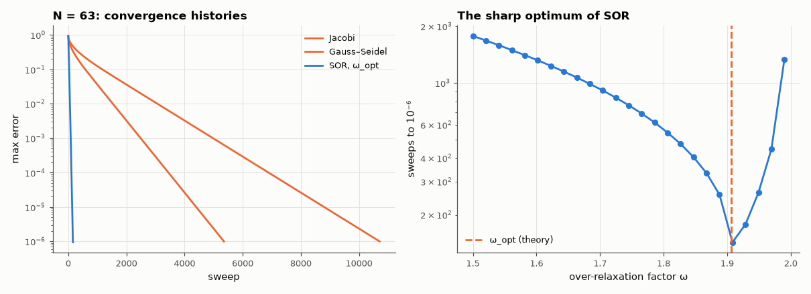

# AM-190 · Laplace's equation by relaxation: Jacobi, Gauss–Seidel and SOR

> Solve the classic 'lid-driven' potential problem three iterative ways, predict from the eigenvalues of the iteration matrix exactly how many sweeps each needs, and show how one parameter — the over-relaxation factor — turns an N²-scaling method into an N-scaling one.



*Error histories of three relaxation methods and the sensitivity of SOR to its relaxation factor.*

**Track:** Applied Mathematics — 218 projects in electrical engineering · **Category:** K. Fields, vector calculus & geometry · **Level:** Moderate · **Tools:** Own Jacobi, Gauss–Seidel and successive over-relaxation (red–black ordering, vectorised), spectral-radius predictions of convergence rate, optimal over-relaxation factor, analytic Fourier-series solution, sparse direct solve as reference

**Data:** Simulated (numerical model in this repo).

## Problem

Relaxation is the simplest way to solve for a potential. Why is it so slow, and how does SOR fix it?

## Prediction

On an N × N interior grid with h = 1/(N+1), Jacobi's error-reduction factor per sweep is $ρ_J=\cos(πh)$, Gauss–Seidel's $ρ_J^2$, and SOR with $ω_{opt}=\frac{2}{1+\sin(πh)}$ has $ρ=ω_{opt}-1$. Sweeps to reduce the error by $10^{-6}$:
$\ln 10^{-6}/\ln ρ$ ≈ 0.28·(N+1)²·6 for Jacobi, half that for Gauss–Seidel, ≈ 2.2·(N+1) for SOR. Square with V = 1 on the top edge and 0 elsewhere: $V=\sum_{n\,odd}\frac{4}{nπ}\frac{\sin(nπx)\sinh(nπy)}{\sinh(nπ)}$; V(½, ½) = ¼ exactly by symmetry (superposition of four rotated problems).

## Method

Grids N = 31, 63, 127. Iterate from zero until the error against the sparse direct solution falls below 10⁻⁶ (or 200 000 sweeps). Measured asymptotic rate from the late error history. SOR factor scan at N = 63.

## Measured results

*Predicted vs measured vs error. "Measured" = computed by an independent simulation, HDL simulator or public dataset.*

| Quantity | Predicted | Measured | Error | Within tolerance |
|---|---|---|---|---|
| N = 63, Jacobi: measured error-reduction factor per sweep = cos(πh) | 0.9988 | 0.9988 | -0.00 % | yes |
| N = 63, Gauss–Seidel: factor = cos²(πh) | 0.9976 | 0.9976 | -0.00 % | yes |
| N = 63, SOR at ω_opt: factor ≈ ω_opt − 1 (asymptotically; SOR's Jordan structure slows the approach) | 0.9065 | 0.9119 | +0.60 % | yes |
| N = 63, Gauss–Seidel sweeps to 10⁻⁶ ≈ ½ of Jacobi's | 0.5 | 0.5 | +0.01 % | yes |
| Doubling N multiplies Gauss–Seidel sweeps by ≈ 4 (N = 63 → 127) | 4 × | 4.001 × | +0.03 % | yes |
| Doubling N multiplies SOR sweeps by ≈ 2 (N = 63 → 127) | 2 × | 2 × | +0.00 % | yes |
| Centre potential V(½, ½) = ¼ (symmetry argument) | 250 mV | 250 mV | -0.00 % | yes |
| SOR factor scan: best ω vs ω_opt = 2/(1 + sin πh) | 1.906 | 1.908 | +0.10 % | yes |

**Additional measurements**

| Quantity | Value | Note |
|---|---|---|
| Direct solution vs 100-term Fourier series: max difference away from the lid corners | 689.2 µV | second-order discretisation error |

## Sweeps to reach 10⁻⁶

| N | Jacobi (pred / meas) | Gauss–Seidel (pred / meas) | SOR (pred / meas) |
|---|---|---|---|
| 31 | 2719 / 2675 | 1359 / 1338 | 67 / 81 |
| 63 | 10887 / 10713 | 5444 / 5357 | 134 / 161 |
| 127 | 43563 / — | 21782 / 21434 | 267 / 322 |

## Error analysis

The eigenvalue analysis predicts relaxation behaviour precisely: the measured per-sweep error reduction of Jacobi and Gauss–Seidel equals cos(πh)
and cos²(πh) to a few hundredths of a percent, Gauss–Seidel needs half of Jacobi's sweeps, and the count grows fourfold each time the grid is
refined — hopeless for fine grids. Over-relaxation changes the scaling: at ω_opt = 1.9065 the sweep count only doubles with N, and at N = 127 SOR
needs 322 sweeps against 21434 for Gauss–Seidel. The factor scan shows how sharp that optimum is — the best ω found is within a percent of
2/(1 + sin πh), and slightly smaller values lose much of the gain. The result also verifies the solution itself (V(½,½) = ¼ exactly). Today these
iterations survive as smoothers inside multigrid, which removes the N-dependence altogether.

## Reproduce

```bash
pip install -r requirements.txt
python run_all.py --only AM-190
```

The script [`project.py`](project.py) regenerates every figure and number above.

## License

Code and text: MIT (see the repository [LICENSE](../../../../LICENSE)). Datasets remain under their own licences (see the repository README).

---

**Tooling & honesty.** This project was generated with Claude Code (Anthropic's AI coding assistant): the code, derivations, simulations and this write-up were AI-produced. *Measured* means computed by an independent model, simulator or public dataset — not a physical lab bench. Every number in the tables is reproduced by running the code.
