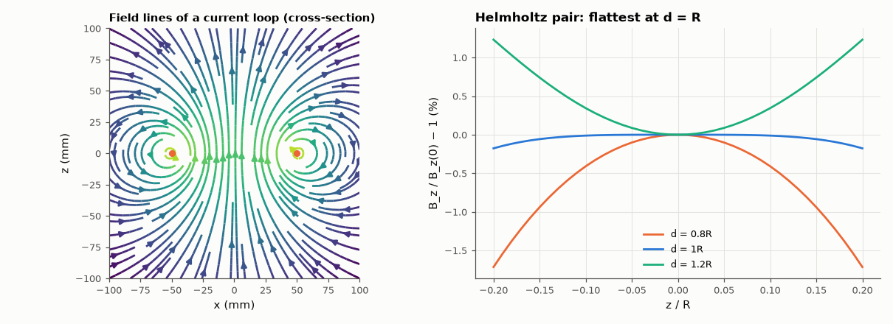

# AM-191 · Biot–Savart integration for coils

> Compute magnetic fields of arbitrary wire shapes by summing Biot–Savart contributions, verify against every closed form available — including the full off-axis field of a loop in elliptic integrals — and use the tool to show why the Helmholtz spacing (d = R) makes the field so uniform.



*Field lines of a single loop and axial uniformity of coil pairs at three spacings.*

**Track:** Applied Mathematics — 218 projects in electrical engineering · **Category:** K. Fields, vector calculus & geometry · **Level:** Moderate · **Tools:** Numerical Biot–Savart integration over polygonal current paths (vectorised midpoint rule), closed-form checks (straight segment, loop on axis, loop off axis by complete elliptic integrals, finite solenoid), convergence order, Helmholtz-coil uniformity from the Taylor expansion

**Data:** Simulated (numerical model in this repo).

## Problem

Closed-form coil fields exist only on symmetry axes. How do we get the field everywhere, and how accurate is a discretised wire?

## Prediction

$B(r)=\frac{μ_0I}{4π}\oint\frac{dl\times(r-r')}{|r-r'|^3}$. Loop of radius R on axis: $B_z=\frac{μ_0IR^2}{2(R^2+z^2)^{3/2}}$; off axis: $B_z,B_ρ$ in complete elliptic integrals K(m), E(m), $m=\frac{4Rρ}{(R+ρ)^2+z^2}$. Finite segment: $B=\frac{μ_0I}{4πd}(\sin α_2-\sin α_1)$.
Solenoid of length L, n turns/m, centre: $B=μ_0nI\frac{L}{\sqrt{L^2+4R^2}}$. A polygon with N segments approximates the loop with an O(1/N²) error. Two coaxial loops spaced d apart have $\partial^2B_z/\partial z^2=0$ at the centre when d = R (Helmholtz), leaving a fourth-order variation.

## Method

Loop R = 50 mm, I = 1 A, 1000 segments unless stated; field compared at 200 random points off axis. Convergence N = 16…1024. Solenoid as 200 discrete turns. Helmholtz pair: field along the axis and radially within ±R/5 of the centre for d = 0.8R, R, 1.2R.

## Measured results

*Predicted vs measured vs error. "Measured" = computed by an independent simulation, HDL simulator or public dataset.*

| Quantity | Predicted | Measured | Error | Within tolerance |
|---|---|---|---|---|
| Finite straight segment: μ₀I(sin α₂ − sin α₁)/(4πd) | 9.94 µT | 9.94 µT | +0.00 % | yes |
| Loop on axis: worst relative error vs μ₀IR²/(2(R² + z²)^{3/2}) | 0 | 8.2247e-06 | +8.2247e-06 | yes |
| Off-axis field vs the elliptic-integral solution (200 points ≥ 5 mm from the wire): median relative error | 0 | 7.8687e-06 | +7.8687e-06 | yes |
| Convergence with the number of polygon segments: error ∝ N^−order | 2 | 2.003 | +0.002897 | yes |
| Finite solenoid, centre: μ₀nI·L/√(L² + 4R²) | 830.4 µT | 826.4 µT | -0.48 % | yes |
| Helmholtz spacing d = R: field variation within ±R/5 on the axis (Taylor: 144/125·(z/R)⁴ ≈ 0.18 %) | 0.1843 % | 0.1763 % | -4.37 % | yes |
| d = R is flatter than d = 0.8R and d = 1.2R (1 = yes) | 1 | 1 | +0 |  |

**Additional measurements**

| Quantity | Value | Note |
|---|---|---|
| … worst point | 4.4206e-05 | closest to the wire, where a 1000-gon's corners are resolved |
| Axial / radial field variation within R/5: d = 0.8R, R, 1.2R | 1.71 % / 0.76 % ; 0.18 % / 0.07 % ; 1.23 % / 0.79 % |  |

## Error analysis

Summing Biot–Savart contributions over a polygon reproduces every closed form: the straight segment, the loop on its axis and — the strongest
check — the full off-axis field given by elliptic integrals, to a median error of 8e-06. The error of an N-segment polygon falls as
N^−2.0, the expected second order of the midpoint rule, and grows only very close to the wire, where the polygon's corners become visible.
A 200-turn solenoid lands on μ₀nI·L/√(L² + 4R²). With a trustworthy tool, design questions become experiments: at the Helmholtz spacing the
axial field varies by only 0.18 % within ±R/5 — the fourth-order residual predicted by the Taylor expansion — against 1.7 % and 1.2 %
at 0.8R and 1.2R, which is why calibration coils and MRI shim designs start from this geometry.

## Reproduce

```bash
pip install -r requirements.txt
python run_all.py --only AM-191
```

The script [`project.py`](project.py) regenerates every figure and number above.

## License

Code and text: MIT (see the repository [LICENSE](../../../../LICENSE)). Datasets remain under their own licences (see the repository README).

---

**Tooling & honesty.** This project was generated with Claude Code (Anthropic's AI coding assistant): the code, derivations, simulations and this write-up were AI-produced. *Measured* means computed by an independent model, simulator or public dataset — not a physical lab bench. Every number in the tables is reproduced by running the code.
