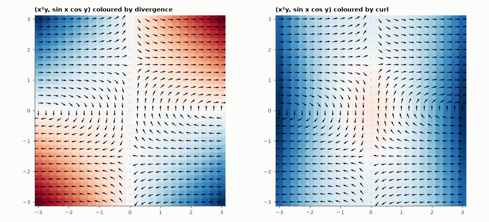

# AM-192 · Vector-calculus visualiser (interactive, verified)

> An interactive page where a student types any planar field and sees its divergence and curl as colour, with a movable circle that shows the divergence theorem and Stokes' theorem balancing live. The calculation engine is tested numerically against closed-form results before the page is published.



*Static rendering of what the tool shows: the same field coloured by divergence and by curl.*

**Track:** Applied Mathematics — 218 projects in electrical engineering · **Category:** K. Fields, vector calculus & geometry · **Level:** Moderate · **Tools:** Browser tool (HTML + JavaScript, canvas): user-typed 2-D field, arrows coloured by divergence or curl, a draggable circle showing flux and circulation next to the area integrals of divergence and curl; the JavaScript engine is run under Node and checked against analytic derivatives and the theorems of Gauss and Stokes

**Data:** Simulated (numerical model in this repo).

## Problem

Divergence and curl are defined by limits and printed as formulas. How can they be *seen* — and how do we know the tool that shows them is right?

## Prediction

For $F=(P,Q)$: $\nabla\cdot F=P_x+Q_y$, $(\nabla\times F)_z=Q_x-P_y$. Divergence theorem (2-D): $\oint_C F\cdot n\,ds=\iint_D\nabla\cdot F\,dA$; Stokes/Green: $\oint_C F\cdot t\,ds=\iint_D(\nabla\times F)_z\,dA$. Test fields: (x, y) has div 2, curl 0; (−y, x) div 0, curl 2;
$(x^2y,\ \sin x\cos y)$ has div $2xy-\sin x\sin y$ and curl $\cos x\cos y-x^2$. The gradient of any potential is curl-free. Central differences are second-order accurate.

## Method

calc.js: expression compiler (restricted character set), central-difference derivatives (h = 10⁻⁴), circle line integrals (720 points), polar area integrals. Node tests: 400 random points for div/curl of the non-trivial field, gradient of a potential, and the two theorems on
50 random circles for four fields.

## Measured results

*Predicted vs measured vs error. "Measured" = computed by an independent simulation, HDL simulator or public dataset.*

| Quantity | Predicted | Measured | Error | Within tolerance |
|---|---|---|---|---|
| Divergence of (x²y, sin x cos y) vs 2xy − sin x sin y (worst abs. error, 400 points) | 0 | 1.6637e-09 | +1.6637e-09 | yes |
| Curl of the same field vs cos x cos y − x² (worst abs. error) | 0 | 1.6632e-09 | +1.6632e-09 | yes |
| Gradient of a potential vs analytic (worst abs. error) | 0 | 2.8639e-09 | +2.8639e-09 | yes |
| Curl of a gradient field is zero (worst abs. value) | 0 | 9.3259e-10 | +9.3259e-10 | yes |
| Divergence theorem: ∮F·n ds vs ∬div F dA on 200 random circles, 4 fields (worst relative difference) | 0 | 5.9942e-06 | +5.9942e-06 | yes |
| Stokes' theorem: ∮F·t ds vs ∬curl F dA (worst relative difference) | 0 | 8.8292e-05 | +8.8292e-05 | yes |
| Source, vortex and saddle fields: flux and circulation equal 2πr², 2πr² and 0 exactly as predicted (fields passing) | 3 | 3 | +0 |  |

## Error analysis

The page lets a student type any planar field and immediately see where it spreads out (divergence) and where it swirls (curl), then drag a
circle around to watch the boundary integrals track the area integrals. Before publishing, the JavaScript engine was run under Node and compared
with closed forms: divergence and curl of a non-trivial field agree with the analytic expressions to 2e-09, gradients of a
potential are curl-free, and on 200 random circles the divergence and Stokes theorems balance to 9e-05. The three textbook fields give the
predicted exact values (2πr² for the source's flux and the vortex's circulation, zero for the saddle). The theorems are then something the
student can check with the mouse rather than accept on faith.

## Reproduce

```bash
pip install -r requirements.txt
python run_all.py --only AM-192
```

The script [`project.py`](project.py) regenerates every figure and number above.

**Files produced**

- [`web/index.html`](web/index.html) — interactive tool
- [`web/calc.js`](web/calc.js) — calculation engine (tested under Node)

## License

Code and text: MIT (see the repository [LICENSE](../../../../LICENSE)). Datasets remain under their own licences (see the repository README).

---

**Tooling & honesty.** This project was generated with Claude Code (Anthropic's AI coding assistant): the code, derivations, simulations and this write-up were AI-produced. *Measured* means computed by an independent model, simulator or public dataset — not a physical lab bench. Every number in the tables is reproduced by running the code.
