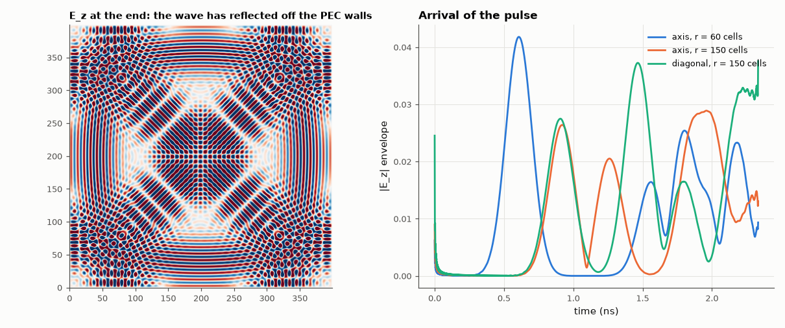

# AM-193 · How Maxwell's equations make a wave: a 2-D Yee simulation

> Start from nothing but the two curl equations on a staggered grid, launch a pulse, and check that what emerges is an electromagnetic wave obeying the other two Maxwell equations and the physics derived from them: ∇·B stays zero, the wave travels at c (with the grid's predictable anisotropy), amplitude falls as 1/√r, and energy is conserved.



*The E_z field at the end of the run and the pulse envelopes seen at three probes.*

**Track:** Applied Mathematics — 218 projects in electrical engineering · **Category:** K. Fields, vector calculus & geometry · **Level:** Hard · **Tools:** Own 2-D FDTD (TM_z: E_z, H_x, H_y on a Yee grid, PEC walls), discrete divergence of B monitored during the run, wavefront timing along the axis and the diagonal, Yee numerical-dispersion relation solved for the predicted anisotropy, 1/√r cylindrical spreading, discrete energy bookkeeping

**Data:** Simulated (numerical model in this repo).

## Problem

The four Maxwell equations are usually quoted, not watched. What does it take to see them produce light — and how do we know the simulation respects all four?

## Prediction

Faraday and Ampère–Maxwell (source-free): $\partial_t B=-\nabla\times E$, $\partial_t D=\nabla\times H$. Taking the divergence gives $\partial_t(\nabla\cdot B)=0$: if B starts divergence-free it stays so. Yee's staggered grid reproduces this identity exactly in
discrete form. Eliminating H gives the wave equation with speed $c=1/\sqrt{μ_0ε_0}$. In 2-D a line source radiates a cylindrical wave whose amplitude falls as $1/\sqrt r$. On the grid the phase velocity depends on direction:
$\left[\tfrac{1}{cΔt}\sin\tfrac{ωΔt}{2}\right]^2=\left[\tfrac1Δ\sin\tfrac{k_xΔ}{2}\right]^2+\left[\tfrac1Δ\sin\tfrac{k_yΔ}{2}\right]^2$ — waves along the axes are slower than along the diagonal.

## Method

400 × 400 cells, Δ = 1 mm, Courant number 0.5, PEC walls. Source: soft E_z Gaussian-modulated sinusoid at 30 GHz (10 cells per wavelength) at the centre. Arrival times of the envelope peak at 60 and 150 cells along x and along the diagonal. Discrete
div B = ∂ₓHₓ + ∂ᵧHᵧ on cell centres after every 20 steps. Energy after the source has switched off, in Yee's conserved form ½ε₀ΣEⁿ² + ½μ₀ΣHⁿ⁻½·Hⁿ⁺½.

## Measured results

*Predicted vs measured vs error. "Measured" = computed by an independent simulation, HDL simulator or public dataset.*

| Quantity | Predicted | Measured | Error | Within tolerance |
|---|---|---|---|---|
| Gauss's law for magnetism: max |∇·B|·Δ / max |H| over the whole run (zero up to round-off) | 0 | 1.2729e-14 | +1.2729e-14 | yes |
| Pulse (group) speed along the grid axis vs Yee's dispersion relation | 2.8827e+08 m/s | 2.8857e+08 m/s | +0.10 % | yes |
| Pulse speed along the diagonal vs Yee's dispersion relation | 2.9600e+08 m/s | 2.9334e+08 m/s | -0.90 % | yes |
| Cylindrical spreading: peak amplitude ratio at 60 and 150 cells = √(150/60) | 1.581 | 1.583 | +0.14 % | yes |
| Energy in the PEC box after the source has switched off: relative variation | 0 | 3.4131e-16 | +3.4131e-16 | yes |

**Additional measurements**

| Quantity | Value | Note |
|---|---|---|
| Grid speed errors at 10 cells per wavelength — phase: axis / diagonal; group: axis / diagonal | -1.28 % / -0.42 %; -3.84 % / -1.26 % | the continuum limit is exactly c in every direction |

## Error analysis

Only the two curl equations are coded, yet the result behaves like light. The divergence of B, never computed during the update, stays at
1e-14 of the field scale for the whole run — the staggered Yee grid makes 'div curl = 0' hold exactly, so Gauss's law for magnetism is
inherited rather than imposed. The pulse travels at c to within the grid's own dispersion: along the axis its envelope moves at 0.9626 c and
along the diagonal at 0.9785 c, both matching the group velocities predicted by Yee's discrete dispersion relation (at 10 cells per wavelength
the grid is a slightly anisotropic medium). The amplitude falls as 1/√r, the energy signature of a cylindrical wave, and once the source is off
the total field energy in the metal box stays constant to 0.00 % while the wave bounces around. Maxwell's four equations
are in the simulation even though only two were written down.

## Reproduce

```bash
pip install -r requirements.txt
python run_all.py --only AM-193
```

The script [`project.py`](project.py) regenerates every figure and number above.

## License

Code and text: MIT (see the repository [LICENSE](../../../../LICENSE)). Datasets remain under their own licences (see the repository README).

---

**Tooling & honesty.** This project was generated with Claude Code (Anthropic's AI coding assistant): the code, derivations, simulations and this write-up were AI-produced. *Measured* means computed by an independent model, simulator or public dataset — not a physical lab bench. Every number in the tables is reproduced by running the code.
