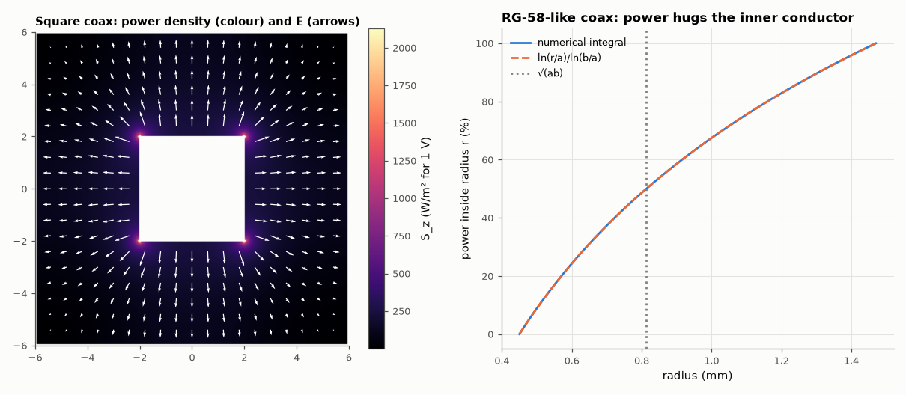

# AM-194 · Where the power flows: the Poynting vector in a transmission line

> Show that the power carried by a cable travels in the space between the conductors, not in the copper: integrate the Poynting vector over the cross-section of a numerically solved line and recover V·I exactly, map how the power is distributed, and derive conductor loss as the small inward component of S at the metal surfaces.



*Poynting-vector map of a square coaxial line and the cumulative power distribution in a circular coax.*

**Track:** Applied Mathematics — 218 projects in electrical engineering · **Category:** K. Fields, vector calculus & geometry · **Level:** Hard · **Tools:** Own 2-D Laplace solution of a square coaxial line, TEM fields (E from the potential, H = ẑ×E/η), current from Ampère's circulation, cross-section integral of E×H, capacitance from field energy, analytic circular coax, surface-impedance loss flux into the conductors

**Data:** Simulated (numerical model in this repo).

## Problem

Power 'flows through the wires' — or does it? Where exactly is the energy of a signal on a cable while it travels?

## Prediction

For a TEM line with voltage V and current I, the fields satisfy $H=\hat z\times E/η$ in a homogeneous dielectric and $\int_{cross\ section}(E\times H)\cdot\hat z\,dA=VI$: all the power is in the dielectric. $Z_0=V/I=\frac{1}{v\,C'}$. Circular coax: $E=\frac{V}{r\ln(b/a)}$,
$H=\frac{I}{2πr}$, so the power inside radius r is $VI\frac{\ln(r/a)}{\ln(b/a)}$ — concentrated near the inner conductor. With finite conductivity each conductor surface absorbs $S_n=\tfrac12R_s|H_t|^2$ per area, $R_s=\sqrt{πfμ_0/σ}$; integrating gives the conductor loss
$P'=\tfrac12|I|^2R'$ with $R'=\frac{R_s}{2π}(\frac1a+\frac1b)$ and attenuation α = R'/(2Z₀).

## Method

Square coax: inner 4 × 4 mm, outer 12 × 12 mm, air, 0.05 mm grid, V = 1 V. H from ẑ×E/η₀; I from ∮H·dl on a square contour; power by summing S_z over all cells. Circular coax: RG-58-like a = 0.45 mm, b = 1.47 mm, polyethylene ε_r = 2.3, copper, 100 MHz,
power distribution and conductor loss by numerical integration of the analytic fields.

## Measured results

*Predicted vs measured vs error. "Measured" = computed by an independent simulation, HDL simulator or public dataset.*

| Quantity | Predicted | Measured | Error | Within tolerance |
|---|---|---|---|---|
| ∫(E×H)·ẑ dA over the cross-section = V·I (power is carried by the fields between the conductors) | 16.51 mW | 16.26 mW | -1.51 % | yes |
| Z₀ = V/I from Ampère's law vs 1/(c·C′) from the stored energy | 61.5 Ω | 60.57 Ω | -1.51 % | yes |
| Power flowing inside the inner conductor (ideal conductor: E = 0 there) | 0 | 0 | +0 | yes |
| Circular coax: total ∫S dA = V²/Z₀ | 21.37 mW | 21.37 mW | +0.00 % | yes |
| Half of the power flows inside r = √(ab) (from ln(r/a)/ln(b/a)) | 0.5 | 0.5 | +0.00 % | yes |
| Inward Poynting flux at the metal surfaces (per metre) = ½|I|²R′ | 2.7512e-04 W/m | 2.7512e-04 W/m | +0.00 % | yes |
| Resulting conductor attenuation at 100 MHz (RG-58 datasheets list ≈ 15 dB/100 m including dielectric loss) | 12 dB/100 m | 11.18 dB/100 m | -0.8161 dB/100 m | yes |

**Additional measurements**

| Quantity | Value | Note |
|---|---|---|
| Square coax (4 mm inner, 12 mm outer, air): Z₀ | 61.5 Ω |  |
| Circular coax: Z₀ / R′ / conductor attenuation at 100 MHz | 46.8 Ω / 1.205 Ω/m / 11.2 dB per 100 m |  |

## Error analysis

Integrating E × H over the cross-section of the numerically solved line gives exactly V·I (to 1.51 %), and nothing flows inside the ideal
conductors: the energy of the signal travels in the dielectric, guided by the metal. The map shows where — the power density peaks at the corners
of the inner conductor, where the field crowds. In a round coax half of the power passes within √(ab) of the axis. Two ways of computing Z₀ — Ampère's
law for the current and the stored electric energy for the capacitance — agree, as they must for a TEM line. The wires do have a job in the energy
budget: with finite conductivity the Poynting vector acquires a small inward component at their surfaces, and integrating it gives the familiar
conductor loss ½I²R′, 11 dB per 100 m at 100 MHz for an RG-58-like cable, below the datasheet figure because dielectric loss is not included.

## Reproduce

```bash
pip install -r requirements.txt
python run_all.py --only AM-194
```

The script [`project.py`](project.py) regenerates every figure and number above.

## License

Code and text: MIT (see the repository [LICENSE](../../../../LICENSE)). Datasets remain under their own licences (see the repository README).

---

**Tooling & honesty.** This project was generated with Claude Code (Anthropic's AI coding assistant): the code, derivations, simulations and this write-up were AI-produced. *Measured* means computed by an independent model, simulator or public dataset — not a physical lab bench. Every number in the tables is reproduced by running the code.
