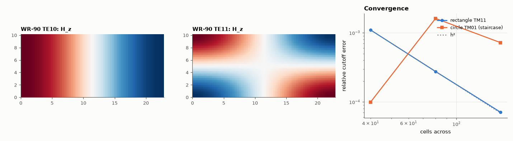

# AM-195 · Waveguide modes as a Helmholtz eigenvalue problem

> Find the cutoff frequencies and field patterns of hollow metal waveguides by solving ∇²ψ + k_c²ψ = 0 as a matrix eigenproblem, check them against the analytic WR-90 and circular-guide results, and measure how the discretisation error converges — quickly for a rectangle, slowly when a round wall is approximated by steps.



*Two WR-90 mode patterns from the eigen-solver and the convergence of computed cutoffs.*

**Track:** Applied Mathematics — 218 projects in electrical engineering · **Category:** K. Fields, vector calculus & geometry · **Level:** Hard · **Tools:** Finite-difference Laplacian with Dirichlet (TM) and Neumann (TE) boundary conditions on cell-centred grids, sparse shift-invert eigen-solver, analytic rectangular cutoffs, Bessel-zero cutoffs of the circular guide, convergence orders for smooth and staircased boundaries, guide wavelength

**Data:** Simulated (numerical model in this repo).

## Problem

Why does a waveguide have a cutoff frequency, and how are the modes of a guide with an arbitrary cross-section computed?

## Prediction

Inside a hollow conductor the transverse field of each mode obeys $\nabla_t^2ψ+k_c^2ψ=0$, with ψ = E_z = 0 on the wall (TM) or ∂H_z/∂n = 0 (TE). Propagation needs $k>k_c$: $f_c=\frac{c\,k_c}{2π}$. Rectangle a × b: $k_c^2=(mπ/a)^2+(nπ/b)^2$; WR-90 (22.86 × 10.16 mm):
TE₁₀ 6.557 GHz, TE₂₀ 13.114, TE₀₁ 14.754, TE₁₁/TM₁₁ 16.145 GHz. Circle of radius R: TE₁₁ at $p'_{11}c/(2πR)$, TM₀₁ at $p_{01}c/(2πR)$ with $p'_{11}$ = 1.8412, $p_{01}$ = 2.4048. Guide wavelength $λ_g=λ/\sqrt{1-(f_c/f)^2}$. A second-order stencil converges as h² on a rectangle; a
staircased round wall limits convergence to about first order.

## Method

Cell-centred grids with mirror (Neumann) or antimirror (Dirichlet) ghost cells; eigsh in shift-invert mode for the 8 smallest eigenvalues. WR-90 at h = a/40, a/80, a/160; circle R = 10 mm with 40…160 cells across, staircased.

## Measured results

*Predicted vs measured vs error. "Measured" = computed by an independent simulation, HDL simulator or public dataset.*

| Quantity | Predicted | Measured | Error | Within tolerance |
|---|---|---|---|---|
| WR-90 TE10 cutoff (h = a/160) | 6.557 GHz | 6.557 GHz | -0.00 % | yes |
| WR-90 TE20 cutoff (h = a/160) | 13.11 GHz | 13.11 GHz | -0.01 % | yes |
| WR-90 TE01 cutoff (h = a/160) | 14.75 GHz | 14.75 GHz | -0.01 % | yes |
| WR-90 TE11 cutoff (h = a/160) | 16.15 GHz | 16.14 GHz | -0.01 % | yes |
| WR-90 TM11 cutoff (h = a/160) | 16.15 GHz | 16.14 GHz | -0.01 % | yes |
| Rectangle: error of the TM11 cutoff falls as h² (order from a/80 → a/160) | 2 | 1.961 | -0.03894 | yes |
| Circular guide R = 10 mm: TE11 cutoff p′₁₁c/(2πR), 160 cells across | 8.785 GHz | 8.772 GHz | -0.15 % | yes |
| Circular guide: TM01 cutoff p₀₁c/(2πR), 160 cells across | 11.47 GHz | 11.48 GHz | +0.07 % | yes |
| Staircased round wall: TM01 convergence order from the last two grids (≈ 1, and erratic — not 2) | 1 | 1.165 | +0.1653 | yes |

**Additional measurements**

| Quantity | Value | Note |
|---|---|---|
| TE10 cutoff error, h = a/40 / a/80 / a/160 | 2.6e-04 / 6.4e-05 / 1.6e-05 | second order: the error falls four-fold per halving of h |
| TM01 relative error at 40 / 80 / 160 cells across | 0.01 % / 0.16 % / 0.07 % |  |
| WR-90 at 10 GHz: free-space / guide wavelength (TE10) | 30.0 mm / 39.7 mm | single-mode band 6.56–13.11 GHz |

## Error analysis

The modes of a hollow guide are the eigenvectors of a discrete Laplacian, and the cutoff frequencies are its eigenvalues: for WR-90 the solver
finds TE₁₀, TE₂₀, TE₀₁ and the degenerate TE₁₁/TM₁₁ pair at the analytic frequencies, and the error of a mode that the stencil does not
represent exactly falls as h² (observed order 1.96). The same code handles any cross-section, which is the point: for a round guide the
staircase wall still gives TE₁₁ and TM₀₁ within a fraction of a percent at 160 cells, but the error no longer falls smoothly — it jumps as cells
enter or leave the staircase (0.01 %, 0.16 %, 0.07 % at 40, 80, 160 cells) — because the geometry error, not the stencil, now dominates. Conformal or finite-element meshes exist to fix exactly that. The physics of cutoff is visible in
the eigenvalue itself: below f_c the axial wavenumber √(k² − k_c²) is imaginary and the mode decays instead of propagating.

## Reproduce

```bash
pip install -r requirements.txt
python run_all.py --only AM-195
```

The script [`project.py`](project.py) regenerates every figure and number above.

## License

Code and text: MIT (see the repository [LICENSE](../../../../LICENSE)). Datasets remain under their own licences (see the repository README).

---

**Tooling & honesty.** This project was generated with Claude Code (Anthropic's AI coding assistant): the code, derivations, simulations and this write-up were AI-produced. *Measured* means computed by an independent model, simulator or public dataset — not a physical lab bench. Every number in the tables is reproduced by running the code.
