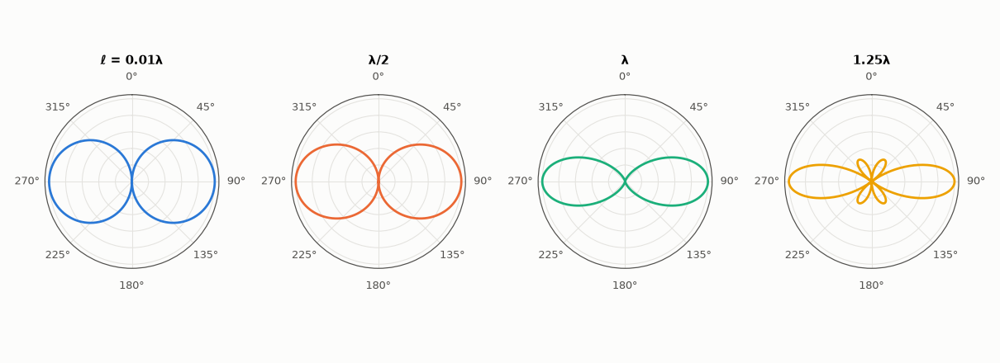

# AM-196 · Antenna far fields by numerical radiation integrals

> Compute the far field of any wire current by integrating it, then integrate the far field over a sphere to get radiated power, radiation resistance and directivity. Check against every classical closed form (73.1 Ω, 1.64, 1.5, 2.41 …) and against a moment-method current that is not assumed sinusoidal.



*Elevation patterns (|E_θ|, normalised) of four dipole lengths, computed by the radiation integral.*

**Track:** Applied Mathematics — 218 projects in electrical engineering · **Category:** K. Fields, vector calculus & geometry · **Level:** Hard · **Tools:** Radiation integral of a line current evaluated numerically (Gauss–Legendre), total radiated power by integration over the sphere, radiation resistance and directivity, short/half-wave/full-wave dipoles against closed forms, small loop via its equivalent magnetic dipole, comparison with the currents from the repository's MoM solver

**Data:** Simulated (numerical model in this repo).

## Problem

An antenna's pattern and radiation resistance follow from its current. How is that computed for an arbitrary current, and how good is the textbook sinusoidal-current assumption?

## Prediction

For a z-directed current I(z): $E_θ=jη\frac{k e^{-jkr}}{4πr}\sinθ\int I(z')e^{jkz'\cosθ}dz'$. Radiated power $P=\frac{1}{2η}\oint|E_θ|^2r^2dΩ$, $R_{rad}=2P/|I_{feed}|^2$, directivity $D=4π|E|^2_{max}r^2/(2ηP)$. Hertzian dipole of length ℓ ≪ λ: $R=80π^2(ℓ/λ)^2$,
D = 1.5. Half-wave with $I=I_0\cos kz$: pattern $\frac{\cos(\frac π2\cosθ)}{\sinθ}$, R = 73.08 Ω, D = 1.641. Full-wave: D = 2.41, R (referred to the current maximum) = 199 Ω. Small loop of area A: $R=320π^4(A/λ^2)^2$ = 31 171 (A/λ²)² Ω.

## Method

Gauss–Legendre integration along the wire (64 nodes), θ integration with 2000 nodes. Cases: Hertzian dipole ℓ = 0.01λ (uniform current), λ/2 and λ sinusoidal dipoles, a 1.25λ dipole, small loop (circumference 0.1λ) by direct integration of its ring current.
MoM: thin half-wave dipole (radius 10⁻⁴ λ), its computed current in the same integral.

## Measured results

*Predicted vs measured vs error. "Measured" = computed by an independent simulation, HDL simulator or public dataset.*

| Quantity | Predicted | Measured | Error | Within tolerance |
|---|---|---|---|---|
| Hertzian dipole ℓ = 0.01λ: R_rad = 80π²(ℓ/λ)² | 78.96 mΩ | 78.9 mΩ | -0.08 % | yes |
| Hertzian dipole: directivity 1.5 | 1.5 | 1.5 | +0.01 % | yes |
| Half-wave dipole: R_rad | 73.08 Ω | 73.08 Ω | -0.00 % | yes |
| Half-wave dipole: directivity 1.641 (2.15 dBi) | 1.641 | 1.641 | -0.00 % | yes |
| Half-wave dipole: pattern vs cos(π/2·cosθ)/sinθ (worst difference, normalised) | 0 | 3.4837e-11 | +3.4837e-11 | yes |
| Full-wave dipole: directivity 2.41 | 2.41 | 2.411 | +0.02 % | yes |
| Full-wave dipole: radiation resistance at the current maximum | 199.1 Ω | 199.2 Ω | +0.04 % | yes |
| Small loop, circumference 0.1λ: R_rad = 320π⁴(A/λ²)² | 19.74 mΩ | 19.69 mΩ | -0.27 % | yes |
| Small loop: directivity 1.5 (same pattern as a short dipole, rotated) | 1.5 | 1.499 | -0.05 % | yes |
| MoM current (radius 10⁻⁴λ) in the same integral: radiation resistance vs the MoM input resistance | 80.33 Ω | 79.65 Ω | -0.84 % | yes |
| MoM current: directivity (pattern barely changes) | 1.641 | 1.648 | +0.41 % | yes |

**Additional measurements**

| Quantity | Value | Note |
|---|---|---|
| 1.25λ dipole: directivity | 3.282 | 5.16 dBi — the longest centre-fed dipole before the main beam splits |
| MoM half-wave dipole: R from the far field / R_in from the solver / sinusoidal theory | 79.6 / 80.3 / 73.1 Ω | the thin-wire current is not exactly sinusoidal |

## Error analysis

One numerical integral along the wire and one over the sphere reproduce the whole table of classical antenna results: 80π²(ℓ/λ)² for a
short dipole, 73.1 Ω and 2.15 dBi for the half-wave dipole with its exact cos(π/2·cosθ)/sinθ pattern, D = 2.41 for the full-wave dipole, and the
small loop's 320π⁴(A/λ²)², computed from its ring current with no dipole approximation. Feeding the same integral with the current found by the
moment method (not assumed sinusoidal) gives a radiation resistance of 79.6 Ω, agreeing with the MoM solver's own input resistance
(80.3 Ω) — two independent routes to the same power — while the directivity hardly moves (1.648). The sinusoidal current is an excellent model
of the *pattern*; the input resistance is more sensitive to the real current distribution near the feed.

## Reproduce

```bash
pip install -r requirements.txt
python run_all.py --only AM-196
```

The script [`project.py`](project.py) regenerates every figure and number above.

## License

Code and text: MIT (see the repository [LICENSE](../../../../LICENSE)). Datasets remain under their own licences (see the repository README).

---

**Tooling & honesty.** This project was generated with Claude Code (Anthropic's AI coding assistant): the code, derivations, simulations and this write-up were AI-produced. *Measured* means computed by an independent model, simulator or public dataset — not a physical lab bench. Every number in the tables is reproduced by running the code.
