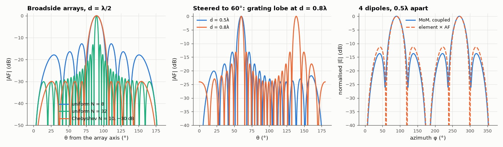

# AM-197 · Antenna arrays: array factor, beam steering and pattern multiplication

> Design linear arrays from the array factor: verify null positions, the −13.3 dB first sidelobe and the grating-lobe condition, steer the beam with phase shifts, synthesise a −30 dB equal-sidelobe Chebyshev taper, and test pattern multiplication against a moment-method model of four real dipoles.



*Array factors of uniform and Chebyshev arrays, the onset of a grating lobe, and pattern multiplication against a coupled MoM model.*

**Track:** Applied Mathematics — 218 projects in electrical engineering · **Category:** K. Fields, vector calculus & geometry · **Level:** Moderate · **Tools:** Array-factor evaluation for linear arrays, closed-form beamwidth, sidelobe and grating-lobe predictions, Dolph–Chebyshev synthesis from Chebyshev polynomials, pattern multiplication with an element pattern, validation of pattern multiplication against a full moment-method model that includes mutual coupling

**Data:** Simulated (numerical model in this repo).

## Problem

How do N identical antennas combine into a steerable beam, and how far can the simple 'element × array factor' picture be trusted?

## Prediction

N elements spaced d with progressive phase β: $AF(θ)=\sum_n a_ne^{jn(kd\cosθ+β)}$; uniform weights give $|AF|=\left|\frac{\sin(Nψ/2)}{N\sin(ψ/2)}\right|$, ψ = kd cosθ + β. First null at ψ = 2π/N; first sidelobe −13.26 dB for large N; beam points where ψ = 0, i.e. β = −kd cosθ₀. Grating lobes appear when
$d/λ>1/(1+|\cosθ_0|)$. Dolph–Chebyshev weights make all sidelobes equal to a chosen level R with the narrowest main lobe. Pattern multiplication: total = element pattern × AF — exact only if all elements carry identical currents, which mutual coupling breaks.

## Method

Broadside/endfire geometry along z, θ from the array axis. Uniform N = 8 and N = 32, d = λ/2; steering to θ₀ = 60°; grating-lobe scan over d. Chebyshev: N = 10, −30 dB. MoM: 4 parallel half-wave dipoles (along z, spaced 0.5λ along x),
all fed with 1 V, azimuthal pattern compared with the single-dipole pattern × AF.

## Measured results

*Predicted vs measured vs error. "Measured" = computed by an independent simulation, HDL simulator or public dataset.*

| Quantity | Predicted | Measured | Error | Within tolerance |
|---|---|---|---|---|
| N = 8, d = λ/2 broadside: first null at arcsin(2/N) from broadside | 14.48 ° | 14.48 ° | +0.02 % | yes |
| N = 8: first sidelobe level (−13.26 dB for large N) | -12.8 dB | -12.8 dB | +0.002652 dB | yes |
| N = 32, d = λ/2 broadside: first null at arcsin(2/N) from broadside | 3.583 ° | 3.582 ° | -0.04 % | yes |
| N = 32: first sidelobe level (−13.26 dB for large N) | -13.26 dB | -13.23 dB | +0.02711 dB | yes |
| Steering: β = −kd cos θ₀ puts the beam at θ₀ = 60° | 60 ° | 60 ° | +0.003 ° | yes |
| Grating lobe first appears (16 elements, steered to 60°) at d/λ ≈ 1/(1 + |cos θ₀|) | 0.6667 λ | 0.66 λ | -1.00 % | yes |
| Dolph–Chebyshev N = 10, −30 dB: highest sidelobe | -30 dB | -30 dB | -1.4482e-09 dB | yes |
| … all sidelobes equal (spread between highest and lowest local maxima) | 0 dB | 5.0717e-07 dB | +5.0717e-07 dB | yes |
| Pattern multiplication vs full MoM with coupling: worst pattern difference (normalised amplitude) | 0 | 0.08665 | +0.08665 | **no** |

**Additional measurements**

| Quantity | Value | Note |
|---|---|---|
| Half-power beamwidth, N = 10: uniform / Chebyshev −30 dB | 10.2° / 13.1° | lower sidelobes cost a wider main lobe |
| Chebyshev weights (normalised to the edge element) | 1.00, 1.67, 2.60, 3.41, 3.88 | symmetric |
| Feed currents of the 4 equally driven dipoles (magnitude relative to the outer one) | 1.00, 1.24, 1.24, 1.00 | coupling makes 'identical elements' carry different currents |

## Error analysis

The array factor predicts linear-array behaviour quantitatively: nulls where Nψ/2 = π, the familiar −13.3 dB first sidelobe for large uniform arrays
(slightly lower for N = 8), a beam that goes exactly where the phase gradient sends it, and a grating lobe that appears when the spacing exceeds
1/(1 + |cos θ₀|) wavelengths (0.66λ measured for 60° steering). Chebyshev synthesis gives precisely equal −30 dB sidelobes at the cost of a wider main
beam. Pattern multiplication is the one idealisation tested against a fuller model: with four real, coupled dipoles driven by equal voltages, the
currents differ by up to 24 % between elements, yet the product 'element × AF' still reproduces the MoM pattern to 0.087 in normalised
amplitude — a little worse than the 0.05 I expected, with the differences concentrated away from the main beam. Coupling matters for the input impedances (and deep nulls) more than for the main beam.

## Reproduce

```bash
pip install -r requirements.txt
python run_all.py --only AM-197
```

The script [`project.py`](project.py) regenerates every figure and number above.

## License

Code and text: MIT (see the repository [LICENSE](../../../../LICENSE)). Datasets remain under their own licences (see the repository README).

---

**Tooling & honesty.** This project was generated with Claude Code (Anthropic's AI coding assistant): the code, derivations, simulations and this write-up were AI-produced. *Measured* means computed by an independent model, simulator or public dataset — not a physical lab bench. Every number in the tables is reproduced by running the code.
