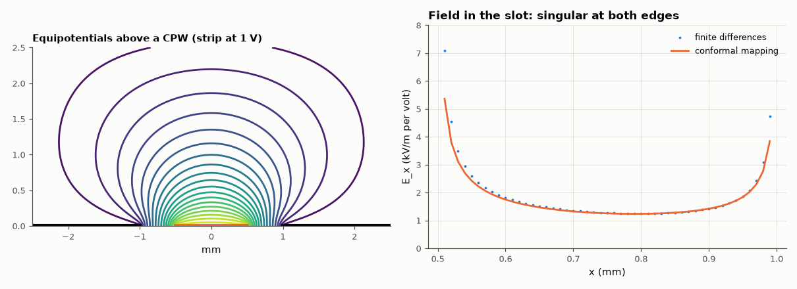

# AM-198 · Conformal mapping for coplanar lines: exact answers from complex analysis

> Use a conformal map to turn the awkward geometry of a coplanar waveguide into a parallel-plate capacitor, obtain its impedance, the field distribution in the slots and the edge singularity in closed form, and confirm all three with a finite-difference solver that knows nothing about complex analysis.



*Equipotentials of a coplanar waveguide and the slot field from the mapping and from finite differences.*

**Track:** Applied Mathematics — 218 projects in electrical engineering · **Category:** K. Fields, vector calculus & geometry · **Level:** Hard · **Tools:** Schwarz–Christoffel mapping of the slotted plane onto a rectangle (complete elliptic integrals), closed-form capacitance and impedance of coplanar waveguide, the analytic slot field and its r^(−½) edge singularity, partial-capacitance substrate correction, finite-difference field solver with Richardson extrapolation as the independent check

**Data:** Simulated (numerical model in this repo).

## Problem

Why do so many transmission-line formulas contain elliptic integrals, and how exact are they?

## Prediction

Laplace's equation is invariant under analytic maps. The Schwarz–Christoffel map $w(z)=\int_0^z\frac{dt}{\sqrt{(t^2-a^2)(t^2-b^2)}}$ takes the upper half-plane with a centre strip |x| < a and grounds |x| > b onto a rectangle whose side ratio is K(k)/K(k′), k = a/b:
the capacitance per length of CPW in air is $4ε_0K(k)/K(k')$, so $Z_0=30π\,K(k')/K(k)$. The same map gives the slot field $E_x(x)=\frac{Vb}{K(k')\sqrt{(x^2-a^2)(b^2-x^2)}}$ for a < x < b, which diverges as $d^{-1/2}$ at each edge (a 2π corner). A substrate of thickness h adds a partial capacitance with
$k_1=\sinh(πa/2h)/\sinh(πb/2h)$: $ε_{eff}=1+\frac{ε_r-1}{2}\frac{K(k_1)K(k_0')}{K(k_1')K(k_0)}$.

## Method

Zero-thickness conductors: centre strip w = 1 mm (a = 0.5 mm), slots s = 0.5 mm (b = 1 mm), grounds to the walls of a 30 × 30 mm grounded box. Finite differences at 0.1, 0.05, 0.025 mm (grid-aligned with the slot edges) with Richardson extrapolation. Slot field from a potential solution at 0.01 mm in a 6 × 6 mm box.
Substrate case: FR-4 (ε_r = 4.4), h = 0.8 mm, far from any ground plane.

## Measured results

*Predicted vs measured vs error. "Measured" = computed by an independent simulation, HDL simulator or public dataset.*

| Quantity | Predicted | Measured | Error | Within tolerance |
|---|---|---|---|---|
| CPW in air: Z₀ = 30π·K(k′)/K(k) vs extrapolated finite-difference solution | 120.6 Ω | 120.3 Ω | -0.23 % | yes |
| Slot field between the edges vs the conformal-mapping expression (median ratio in the middle 0.4 mm) | 1 | 1.016 | +1.56 % | yes |
| Edge singularity: E ∝ d^slope near the strip edge (theory −½) | -0.5 | -0.5777 | -0.07772 | yes |
| CPW on 0.8 mm FR-4: ε_eff from the partial-capacitance mapping vs field solver | 2.382 | 2.418 | +1.50 % | yes |
| … and Z₀ = 30π·K(k′)/(√ε_eff·K(k)) | 78.11 Ω | 77.35 Ω | -0.97 % | yes |

**Additional measurements**

| Quantity | Value | Note |
|---|---|---|
| Finite-difference Z₀ at 0.1 / 0.05 / 0.025 mm and observed order | 112.98 / 116.63 / 118.46 Ω, order 1.00 | ≈ 1 rather than 2: the field is singular at the strip edges |
| Simple estimate ε_eff ≈ (ε_r + 1)/2 for an infinitely thick substrate | 2.7 | the 0.8 mm substrate gives 2.38: part of the field is in the air below |

## Error analysis

The conformal map delivers the answers exactly where a grid struggles. Its impedance for CPW in air, 30π·K(k′)/K(k) = 120.57 Ω, is confirmed by the
finite-difference solver after extrapolation (120.29 Ω) — and the solver's slow, roughly first-order convergence is itself explained by the mapping: the
field at a thin conductor's edge diverges as d^(−½) (measured exponent -0.58), a singularity no finite grid resolves. Between the edges the whole slot
field follows the closed form b/(K(k′)√((x²−a²)(b²−x²))). The substrate correction, also a conformal-mapping result, predicts ε_eff = 2.38 for
0.8 mm FR-4 against 2.42 from the solver. Elliptic integrals appear in these formulas because the Schwarz–Christoffel map of a slotted plane onto
a rectangle *is* an elliptic integral.

## Reproduce

```bash
pip install -r requirements.txt
python run_all.py --only AM-198
```

The script [`project.py`](project.py) regenerates every figure and number above.

## License

Code and text: MIT (see the repository [LICENSE](../../../../LICENSE)). Datasets remain under their own licences (see the repository README).

---

**Tooling & honesty.** This project was generated with Claude Code (Anthropic's AI coding assistant): the code, derivations, simulations and this write-up were AI-produced. *Measured* means computed by an independent model, simulator or public dataset — not a physical lab bench. Every number in the tables is reproduced by running the code.
