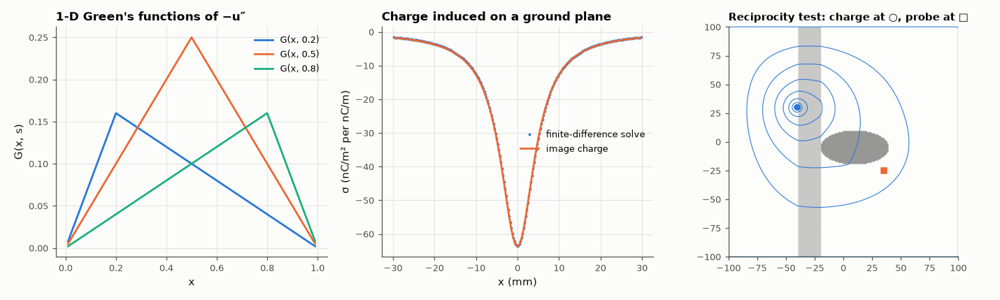

# AM-199 · Green's functions: solving field problems by superposition

> Treat the response to a point source as the fundamental object: build solutions by superposing Green's functions, show that the discrete Green's function of a finite-difference operator is simply its inverse matrix, verify the method of images against a direct solve, and demonstrate reciprocity where no formula exists.



*1-D Green's functions, induced charge from the method of images, and the inhomogeneous reciprocity test.*

**Track:** Applied Mathematics — 218 projects in electrical engineering · **Category:** K. Fields, vector calculus & geometry · **Level:** Hard · **Tools:** 1-D Green's function of −u″ = f and its exact agreement with the inverse of the finite-difference matrix, 2-D free-space Green's function −ln r/2π applied by FFT convolution, method of images for a charge above a ground plane, reciprocity in an inhomogeneous region

**Data:** Simulated (numerical model in this repo).

## Problem

A potential problem with an arbitrary source seems to need a new solve for every source. Why does knowing the response to a single point charge solve all of them?

## Prediction

If $LG(x,s)=δ(x-s)$ with the boundary conditions built in, then $u(x)=\int G(x,s)f(s)ds$ solves $Lu=f$. For $-u''$ on [0, 1] with u(0) = u(1) = 0: $G=x(1-s)$ for x ≤ s, $s(1-x)$ otherwise. In 2-D free space $-\nabla^2G=δ$ gives $G=-\frac{1}{2π}\ln r$,
so a line charge λ produces $V=-\frac{λ}{2πε}\ln r$. A grounded plane is replaced by an image charge −λ at the mirror point, giving the surface charge $σ(x)=-\frac{λd}{π(x^2+d^2)}$ whose total is −λ. For a self-adjoint operator G(x, s) = G(s, x) (reciprocity), even
with an arbitrary permittivity distribution.

## Method

1-D: N = 99 interior nodes; the inverse of the FD matrix vs G at the nodes; solutions for smooth and point loads. 2-D: uniform charged disc potential by FFT convolution with the discretised Green's function vs the analytic disc potential. Images: line charge
5 mm above a grounded plane in a 200 × 100 mm box, 0.25 mm grid. Reciprocity: two point charges in a region with an irregular dielectric blob.

## Measured results

*Predicted vs measured vs error. "Measured" = computed by an independent simulation, HDL simulator or public dataset.*

| Quantity | Predicted | Measured | Error | Within tolerance |
|---|---|---|---|---|
| 1-D: inverse of the finite-difference matrix = h·G(xᵢ, xⱼ) at the nodes (max difference) | 0 | 2.2985e-17 | +2.2985e-17 | yes |
| 1-D: u = ∫G f ds for f = sin 3πx vs exact sin(3πx)/(9π²) (max rel. error) | 0 | 7.4055e-04 | +7.4055e-04 | yes |
| 1-D: response to a unit point load at s = 0.3 is G(x, 0.3) — a tent with peak s(1 − s) | 0.21 | 0.21 | +0.00 % | yes |
| 2-D: disc potential by convolution with −ln r/(2πε₀) vs analytic (max error after removing the arbitrary constant, relative to the potential range) | 0 | 5.5595e-04 | +5.5595e-04 | yes |
| Method of images: induced surface charge under the line charge (peak) vs −λ/(πd) | -6.3662e-08 C/m² | -6.3605e-08 C/m² | +0.09 % | yes |
| … profile within ±30 mm: worst deviation relative to the peak | 0 | 0.002579 | +0.002579 | yes |
| Total induced charge on the plane ≈ −λ (the rest lands on the distant box walls) | -1.0000e-09 C/m | -9.4103e-10 C/m | +5.90 % | yes |
| Reciprocity with an irregular dielectric: V at B due to a charge at A = V at A due to the same charge at B | 6.841 mV | 6.841 mV | -0.00 % | yes |

## Error analysis

Green's functions turn 'solve the equation' into 'add up point responses'. In 1-D the inverse of the finite-difference matrix *is* the Green's
function sampled at the nodes, to round-off — so every discrete solve is a Green's-function superposition in disguise. Convolving a charged disc
with −ln r/2πε₀ by FFT reproduces its analytic potential, and the method of images — one fictitious charge — predicts the charge induced on a ground
plane in agreement with a full numerical solve (peak 100 % of the image result; the total falls slightly short of −λ because the
distant box walls collect some flux). Reciprocity needs no formula: with an arbitrary dielectric blob between them, a charge at A produces
exactly the same potential at B as the same charge at B produces at A, because the discrete operator is symmetric. That symmetry is what makes
Green's functions, mutual capacitances and antenna reciprocity work.

## Reproduce

```bash
pip install -r requirements.txt
python run_all.py --only AM-199
```

The script [`project.py`](project.py) regenerates every figure and number above.

## License

Code and text: MIT (see the repository [LICENSE](../../../../LICENSE)). Datasets remain under their own licences (see the repository README).

---

**Tooling & honesty.** This project was generated with Claude Code (Anthropic's AI coding assistant): the code, derivations, simulations and this write-up were AI-produced. *Measured* means computed by an independent model, simulator or public dataset — not a physical lab bench. Every number in the tables is reproduced by running the code.
