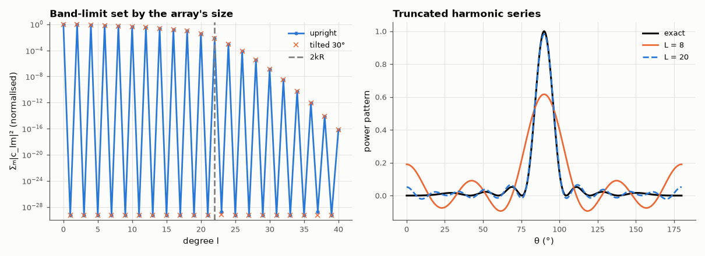

# AM-200 · Spherical harmonics: radiation patterns as sums of modes

> Decompose antenna radiation patterns into spherical harmonics: verify orthonormality numerically, recover the directivity from a single coefficient, predict from the antenna's physical size how many degrees are needed, and show that the energy per degree is unchanged when the antenna is rotated.



*Energy per spherical-harmonic degree for an 8-element array, upright and tilted, and truncated reconstructions.*

**Track:** Applied Mathematics — 218 projects in electrical engineering · **Category:** K. Fields, vector calculus & geometry · **Level:** Hard · **Tools:** Spherical harmonics Y_lm (SciPy), Gauss–Legendre × uniform quadrature on the sphere, orthonormality check, expansion of radiated-power patterns, directivity from the l = 0 coefficient, band-limit of an array pattern predicted from its size, rotation invariance of the per-degree power spectrum

**Data:** Simulated (numerical model in this repo).

## Problem

A 3-D radiation pattern is a function on a sphere. What is its natural 'Fourier series', and what does the number of terms say about the antenna?

## Prediction

Any square-integrable function on the sphere is $U(θ,φ)=\sum_{l,m}c_{lm}Y_l^m(θ,φ)$ with $c_{lm}=\oint UY_l^{m*}dΩ$. Since $Y_0^0=1/\sqrt{4π}$, total radiated power ∝ $\oint U\,dΩ=\sqrt{4π}\,c_{00}$ and directivity $D=\sqrt{4π}\,U_{max}/c_{00}$. A source inside a sphere of radius R radiates fields with
negligible content above degree ≈ kR; the power pattern $|E|^2$ is band-limited to about 2kR. Rotations mix m within each l but leave $\sum_m|c_{lm}|^2$ unchanged. Half-wave dipole: $U∝\cos^2(\tfrac π2\cosθ)/\sin^2θ$, D = 1.641.

## Method

Quadrature: 120 Gauss–Legendre nodes in cos θ × 240 uniform φ (exact for band-limited functions up to high degree). Patterns: half-wave dipole; 8-element broadside array of isotropic sources along z (d = λ/2, length 3.5λ, so 2kR ≈ 22), and the same array tilted by 30°.
Coefficients up to l = 40.

## Measured results

*Predicted vs measured vs error. "Measured" = computed by an independent simulation, HDL simulator or public dataset.*

| Quantity | Predicted | Measured | Error | Within tolerance |
|---|---|---|---|---|
| Orthonormality ⟨Y_lm, Y_l′m′⟩ = δ (l ≤ 10; worst deviation) | 0 | 1.2479e-13 | +1.2479e-13 | yes |
| Half-wave dipole: directivity from the l = 0 coefficient, √(4π)·U_max/c₀₀ | 1.641 | 1.641 | -0.03 % | yes |
| Dipole pattern is axially symmetric and even: coefficients with m ≠ 0 or odd l (count above 10⁻¹⁰) | 0 | 0 | +0 |  |
| 8-element array (length 3.5λ): degree containing all but 10⁻⁶ of the pattern energy vs 2kR | 21.99 | 26 | +18.23 % | yes |
| Rotating the array by 30°: per-degree power Σₘ|c_lm|² unchanged (worst relative change, significant degrees) | 0 | 9.1092e-12 | +9.1092e-12 | yes |

**Additional measurements**

| Quantity | Value | Note |
|---|---|---|
| … and all but 10⁻¹² | 34 | beyond 2kR the spectrum falls super-exponentially, so the band edge depends on the accuracy demanded |
| Non-zero coefficients: upright array / tilted array (|c| > 10⁻⁸) | 20 / 594 | rotation spreads energy over m, not over l |
| Relative reconstruction error of the array pattern truncated at L = 4 / 8 / 12 / 16 / 20 / 24 | 6.9e-01 / 4.9e-01 / 3.1e-01 / 1.6e-01 / 3.9e-02 / 3.7e-03 |  |

## Error analysis

On a Gauss–Legendre grid the spherical harmonics are orthonormal to 1e-13, so expansion coefficients can be trusted. A pattern's l = 0
coefficient alone gives the radiated power, hence the directivity: 1.641 for the half-wave dipole, whose expansion contains only even l and m = 0 —
its symmetry, read off the coefficients. The array example shows what the number of terms means physically: the 3.5λ-long array's power pattern
has all but 10⁻⁶ of its energy below degree 26, near the 2kR ≈ 22 predicted from its size (and all but 10⁻¹² below 34), which is why antenna near-field measurements can sample a sphere at a
finite density. Tilting the array redistributes its energy across m but leaves the energy in each degree exactly the same: degree is a property of
the antenna, orientation only of the coordinate system.

## Reproduce

```bash
pip install -r requirements.txt
python run_all.py --only AM-200
```

The script [`project.py`](project.py) regenerates every figure and number above.

## License

Code and text: MIT (see the repository [LICENSE](../../../../LICENSE)). Datasets remain under their own licences (see the repository README).

---

**Tooling & honesty.** This project was generated with Claude Code (Anthropic's AI coding assistant): the code, derivations, simulations and this write-up were AI-produced. *Measured* means computed by an independent model, simulator or public dataset — not a physical lab bench. Every number in the tables is reproduced by running the code.
