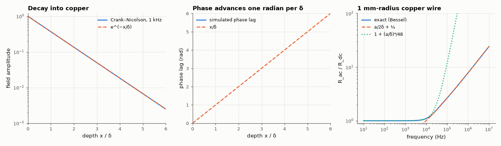

# AM-201 · Skin depth from Maxwell's equations, verified by solving the diffusion equation

> Derive the skin effect instead of quoting it: inside a good conductor Maxwell's equations become a diffusion equation. Solve that equation in the time domain and watch the field settle into a decaying, phase-shifted wave whose decay length is √(2/ωμσ); then compute a wire's AC resistance exactly and check the usual approximations.



*Amplitude and phase of the field inside copper from a time-domain diffusion solve, and a wire's exact AC resistance.*

**Track:** Applied Mathematics — 218 projects in electrical engineering · **Category:** K. Fields, vector calculus & geometry · **Level:** Moderate · **Tools:** Magneto-quasistatic reduction of Maxwell's equations to a diffusion equation, Crank–Nicolson time stepping in a copper half-space driven sinusoidally, fits of amplitude decay and phase lag, step response against the erfc similarity solution, exact AC resistance of a round wire from Bessel functions of complex argument

**Data:** Simulated (numerical model in this repo).

## Problem

Why does AC current crowd to the surface of a conductor, and where does δ = √(2/ωμσ) come from?

## Prediction

In a conductor with σ ≫ ωε, Ampère's law loses the displacement current: $\nabla\times H=σE$, and with Faraday's law $\partial_tH=\frac{1}{μσ}\nabla^2H$ — diffusion with diffusivity D = 1/(μσ). For a boundary field $H_0\cos ωt$ on a half-space the periodic solution is
$H=H_0e^{-x/δ}\cos(ωt-x/δ)$ with $δ=\sqrt{2/(ωμσ)}$ (copper: 9.3 mm at 50 Hz, 2.06 mm at 1 kHz, 0.21 mm at 100 kHz). A suddenly applied field penetrates as $H_0\,\mathrm{erfc}(x/2\sqrt{Dt})$. Round wire of radius a: internal impedance
$Z=\frac{k}{2πaσ}\frac{J_0(ka)}{J_1(ka)}$, $k=(1-j)/δ$; limits $R/R_{dc}\approx1+\frac{(a/δ)^4}{48}$ (low f) and $\frac{a}{2δ}+\frac14$ (high f).

## Method

1-D copper slab 30 mm deep (far side insulated), 0.02 mm cells, Crank–Nicolson with 400 steps per period, run for 8 periods at 1 kHz, amplitude and phase from a sine/cosine projection over the last period. Also 100 kHz (0.002 mm cells, 3 mm depth).
Step response at t = 5 ms by backward Euler with 0.2 µs steps (Crank–Nicolson rings after a discontinuous start). Wire: 1 mm radius, 10 Hz – 10 MHz.

## Measured results

*Predicted vs measured vs error. "Measured" = computed by an independent simulation, HDL simulator or public dataset.*

| Quantity | Predicted | Measured | Error | Within tolerance |
|---|---|---|---|---|
| 1 kHz: decay length of the amplitude vs δ = √(2/ωμσ) | 2.09 mm | 2.09 mm | -0.00 % | yes |
| 1 kHz: phase lag rate 1/δ (distance per radian) | 2.09 mm | 2.09 mm | -0.01 % | yes |
| 100 kHz: decay length of the amplitude vs δ = √(2/ωμσ) | 209 µm | 209 µm | -0.00 % | yes |
| 100 kHz: phase lag rate 1/δ (distance per radian) | 209 µm | 209 µm | -0.01 % | yes |
| Step response after 5 ms vs erfc(x/2√(Dt)) (max difference) | 0 | 5.5305e-06 | +5.5305e-06 | yes |
| Round wire, a = 1 mm, low frequency: exact R/R_dc vs 1 + (a/δ)⁴/48 (worst relative difference for a < δ) | 0 | 2.3217e-04 | +2.3217e-04 | yes |
| High frequency (a > 10δ): exact vs a/(2δ) + ¼ (worst relative difference) | 0 | 0.001548 | +0.001548 | yes |

**Additional measurements**

| Quantity | Value | Note |
|---|---|---|
| Frequency at which a 2 mm copper wire's resistance has doubled | 63.1 kHz | δ there = 0.26 mm |

## Error analysis

Dropping the displacement current turns Maxwell's equations inside copper into a diffusion equation, and solving that equation in the time domain —
no complex exponentials assumed — produces the skin effect by itself: after a few periods the field decays with a length of 2.090 mm at 1 kHz and
209.0 µm at 100 kHz, matching √(2/ωμσ), and its phase lags by exactly one radian per skin depth, i.e. the field inside is a heavily damped wave
travelling inward. A suddenly applied field follows the erfc diffusion profile, which shows the same physics from the transient side (penetration
∝ √t). For a round wire the exact Bessel-function impedance confirms both textbook limits, and shows the practical consequence: a 2 mm copper wire
already has double its DC resistance at about 63 kHz.

## Reproduce

```bash
pip install -r requirements.txt
python run_all.py --only AM-201
```

The script [`project.py`](project.py) regenerates every figure and number above.

## License

Code and text: MIT (see the repository [LICENSE](../../../../LICENSE)). Datasets remain under their own licences (see the repository README).

---

**Tooling & honesty.** This project was generated with Claude Code (Anthropic's AI coding assistant): the code, derivations, simulations and this write-up were AI-produced. *Measured* means computed by an independent model, simulator or public dataset — not a physical lab bench. Every number in the tables is reproduced by running the code.
